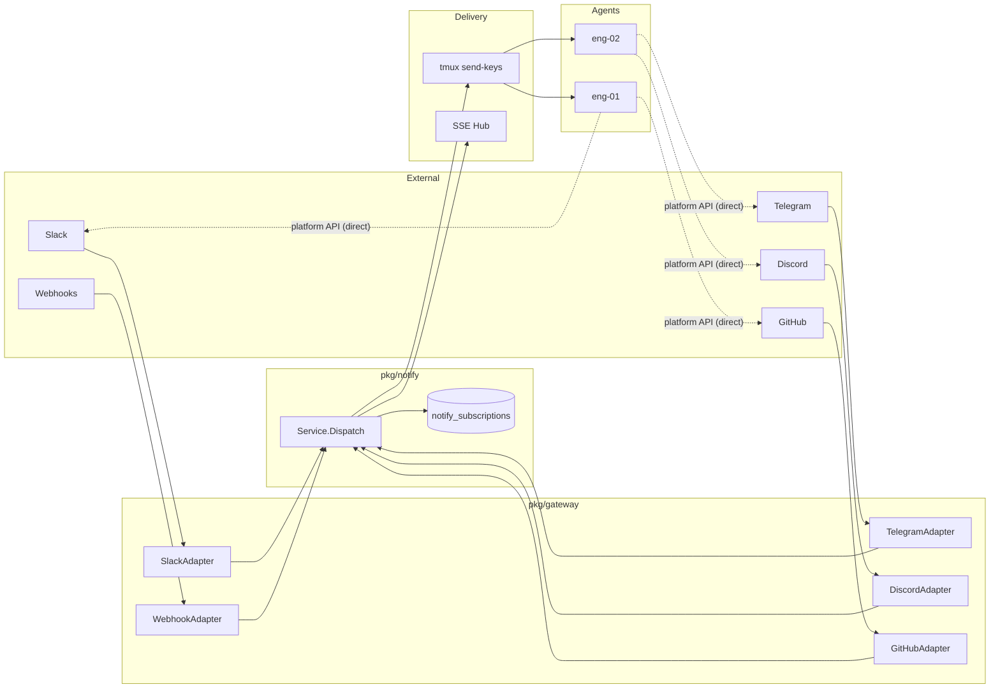
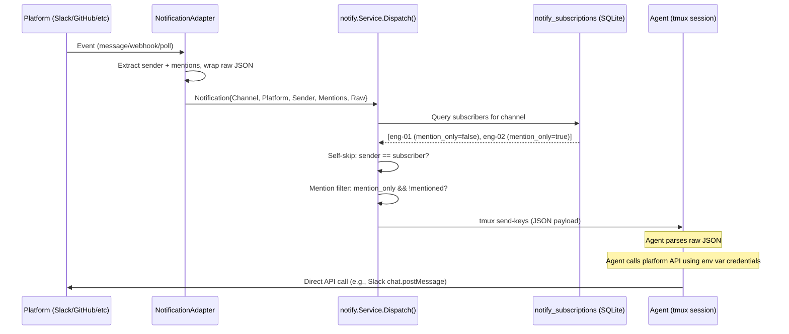
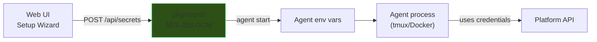
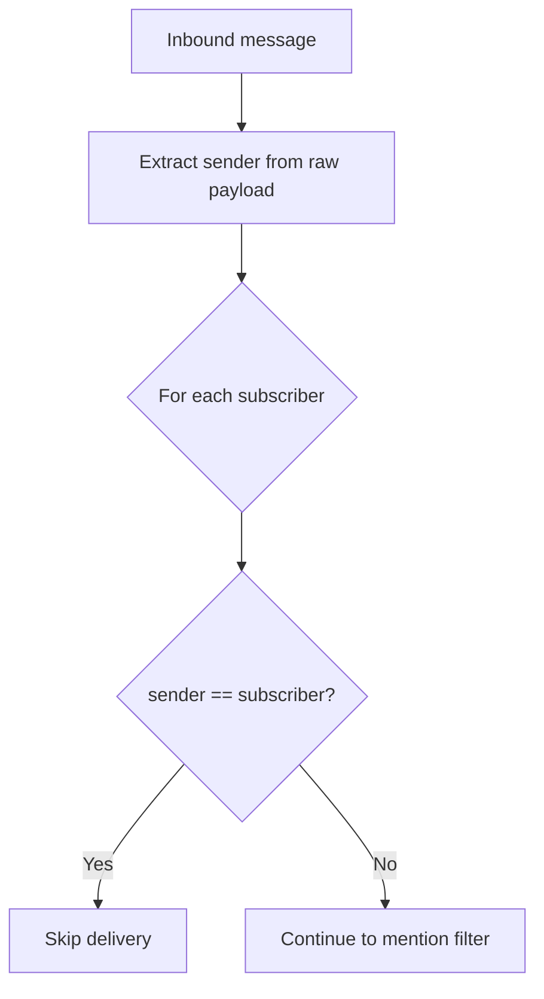
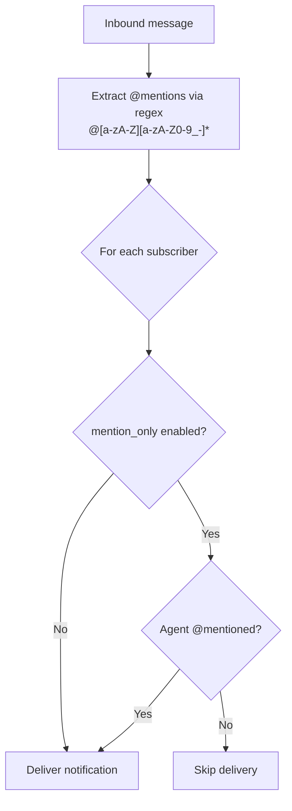
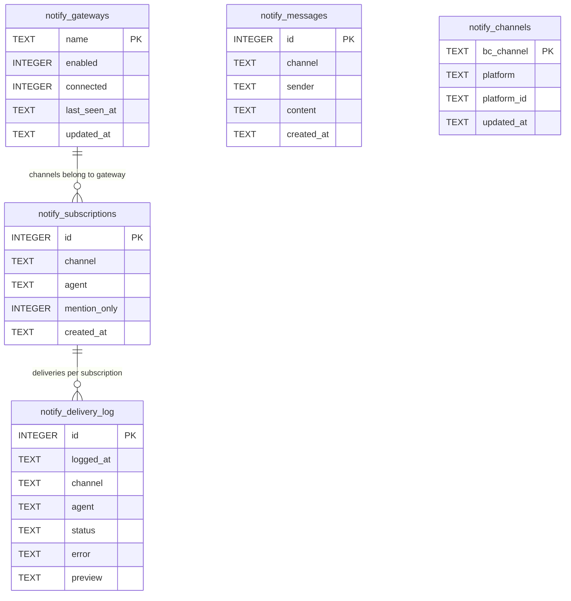

# Channel Architecture

Channels are **inbound-only notification gateways** that bridge external platforms (Slack, GitHub, Telegram, etc.) to bc agents. bc never sends outbound messages on behalf of agents -- agents receive raw platform payloads and respond directly using injected credentials and platform APIs.

This document is the canonical reference for the channel system. It covers the interface contracts, data flow, credential injection, subscription model, and instructions for adding new platform integrations.

---

## Architecture Overview



**Key insight**: bc is a notification router, not a messaging proxy. Agents are programs with API access -- they call platform APIs themselves.

---

## Message Flow



---

## NotificationAdapter Interface

Every platform adapter implements this interface. The design is intentionally minimal -- adapters are thin wrappers that connect to a platform and forward raw events.

```go
// NotificationAdapter connects to an external platform and forwards
// inbound events as Notification values. It has no outbound/send capability.
//
// Located in: pkg/gateway/gateway.go
type NotificationAdapter interface {
    // Name returns the adapter identifier used in channel keys.
    // Examples: "slack", "telegram", "discord", "github"
    Name() string

    // Start connects to the platform and begins forwarding events.
    // Calls handler for each inbound event. Blocks until ctx is canceled.
    Start(ctx context.Context, handler func(Notification)) error

    // Stop gracefully disconnects from the platform.
    Stop() error

    // Channels returns all channels/groups the bot can see.
    // Called on startup for channel discovery.
    Channels() []ChannelInfo
}
```

**What adapters do NOT have**: `Send()`, `SendFile()`, `React()`. All outbound communication is the agent's responsibility.

Each adapter is typically 50-100 lines: connect to platform, set up event listener, extract sender for self-skip, forward raw JSON.

---

## Notification Data Model

```go
// Notification is the envelope around a raw platform event.
// Located in: pkg/notify/notify.go
type Notification struct {
    Channel   string          `json:"channel"`    // "slack:engineering", "github:bc"
    Platform  string          `json:"platform"`   // "slack", "github", "telegram"
    Sender    string          `json:"sender"`     // extracted for self-skip filtering
    Mentions  []string        `json:"mentions"`   // extracted for mention_only filtering
    Timestamp time.Time       `json:"timestamp"`
    Raw       json.RawMessage `json:"raw"`        // entire platform payload, unparsed
}
```

| Field | Purpose |
|-------|---------|
| `Channel` | Canonical key in format `<platform>:<channel_name>`. Used for subscription lookup. |
| `Platform` | Platform identifier, matches adapter `Name()`. |
| `Sender` | Extracted from raw payload per-adapter. Used only for self-skip (don't echo agent's own messages back). |
| `Mentions` | Extracted via regex `@[a-zA-Z][a-zA-Z0-9_-]*` across raw JSON bytes. Used for `mention_only` subscription filter. |
| `Timestamp` | When the event was received by bc. |
| `Raw` | The complete, unmodified platform payload. The agent parses this directly. |

**Why raw JSON?** Each platform has a unique event schema. Parsing into a normalized format loses information and creates maintenance burden. Agents are LLMs -- they parse JSON natively.

---

## Platform Integration Table

### Tier 1 -- Chat Platforms (Bidirectional Messaging)

| # | Platform | Transport | SDK/Library | Credential Env Var | Identity Method | Status |
|---|----------|-----------|-------------|-------------------|-----------------|--------|
| 1 | **Slack** | Socket Mode (WS) | slack-go/slack | `SLACK_BOT_TOKEN`, `SLACK_APP_TOKEN` | `username` param in chat.postMessage | Implemented |
| 2 | **Telegram** | Bot API long-polling | go-telegram-bot-api | `TELEGRAM_BOT_TOKEN` | Prefix `[agent-name]: message` | Implemented |
| 3 | **Discord** | Gateway WebSocket | bwmarrin/discordgo | `DISCORD_BOT_TOKEN` or `DISCORD_WEBHOOK_URL` | `username` param in webhook execute | Implemented |
| 4 | WhatsApp | Cloud API webhooks | Meta Business API | `WHATSAPP_TOKEN` | Prefix text (fixed number) | Planned |
| 5 | Signal | signal-cli bridge | signal-cli REST API | `SIGNAL_CLI_URL` | Prefix text (fixed number) | Planned |
| 6 | iMessage | BlueBubbles server | BlueBubbles HTTP API | `BLUEBUBBLES_URL`, `BLUEBUBBLES_PASSWORD` | Prefix text (fixed Apple ID) | Planned |
| 7 | Matrix | Client-Server API | mautrix-go | `MATRIX_HOMESERVER`, `MATRIX_TOKEN` | Bot display name | Planned |
| 8 | Microsoft Teams | Bot Framework | MS Bot SDK | `TEAMS_APP_ID`, `TEAMS_APP_SECRET` | Bot identity | Planned |
| 9 | Google Chat | Chat API + Pub/Sub | Google Chat REST API | `GOOGLE_CHAT_SA_KEY` | Bot identity | Planned |
| 10 | LINE | Messaging API | LINE Bot SDK | `LINE_CHANNEL_TOKEN` | Bot identity | Planned |
| 11 | Feishu/Lark | Event Subscription | Feishu Open API | `FEISHU_APP_ID`, `FEISHU_APP_SECRET` | Bot identity | Planned |
| 12 | Mattermost | WebSocket + REST | Mattermost Go driver | `MATTERMOST_URL`, `MATTERMOST_TOKEN` | `username` param | Planned |
| 13 | IRC | IRC protocol | go-irc | `IRC_SERVER`, `IRC_NICK`, `IRC_PASSWORD` | Nick per agent | Planned |
| 14 | Nostr | NIP-04 DMs | go-nostr | `NOSTR_PRIVATE_KEY` | Public key identity | Planned |
| 15 | Twitch | IRC + EventSub | Twitch IRC / Helix API | `TWITCH_OAUTH_TOKEN` | Bot username | Planned |

### Tier 2 -- Event/Webhook Platforms (Inbound Notifications)

| # | Platform | Event Types | Transport | Credential Env Var | Status |
|---|----------|-------------|-----------|-------------------|--------|
| 16 | **GitHub** | PR, issue, push, CI, review, release, deployment | Webhooks | `GITHUB_TOKEN`, `GITHUB_WEBHOOK_SECRET` | Planned |
| 17 | GitLab | MR, pipeline, issue, push | Webhooks | `GITLAB_TOKEN`, `GITLAB_WEBHOOK_SECRET` | Planned |
| 18 | Bitbucket | PR, push, pipeline | Webhooks | `BITBUCKET_TOKEN` | Planned |
| 19 | Gmail | Email received | Google Pub/Sub | `GMAIL_SA_KEY` | Planned |
| 20 | Outlook | Email received | Graph API webhooks | `OUTLOOK_CLIENT_ID`, `OUTLOOK_CLIENT_SECRET` | Planned |
| 21 | Jira | Issue CRUD, transitions | Webhooks | `JIRA_TOKEN`, `JIRA_WEBHOOK_SECRET` | Planned |
| 22 | Linear | Issue CRUD, cycle changes | Webhooks | `LINEAR_API_KEY`, `LINEAR_WEBHOOK_SECRET` | Planned |
| 23 | Sentry | Error/exception alerts | Webhooks | `SENTRY_DSN` | Planned |
| 24 | PagerDuty | Incident triggered/resolved | Webhooks | `PAGERDUTY_TOKEN` | Planned |
| 25 | Datadog | Alert triggered | Webhooks | `DATADOG_API_KEY` | Planned |
| 26 | Grafana | Alert firing/resolved | Webhooks | `GRAFANA_API_KEY` | Planned |
| 27 | Vercel | Deployment events | Webhooks | `VERCEL_TOKEN` | Planned |
| 28 | Netlify | Deploy events | Webhooks | `NETLIFY_TOKEN` | Planned |
| 29 | AWS SNS | Any SNS topic | HTTP subscription | `AWS_ACCESS_KEY_ID`, `AWS_SECRET_ACCESS_KEY` | Planned |
| 30 | Stripe | Payment, subscription events | Webhooks | `STRIPE_WEBHOOK_SECRET` | Planned |
| 31 | Notion | Page/database changes | Polling | `NOTION_TOKEN` | Planned |
| 32 | Generic Webhook | Any HTTP POST with JSON | HTTP endpoint | None (public endpoint) | Planned |

### Tier 3 -- IoT & Smart Home

| # | Platform | Events | Transport | Credential Env Var | Status |
|---|----------|--------|-----------|-------------------|--------|
| 33 | Home Assistant | Device state changes | WebSocket + REST | `HASS_URL`, `HASS_TOKEN` | Planned |
| 34 | MQTT | IoT topic messages | MQTT protocol | `MQTT_BROKER`, `MQTT_USERNAME`, `MQTT_PASSWORD` | Planned |

### Tier 4 -- Social & Media

| # | Platform | Events | Transport | Credential Env Var | Status |
|---|----------|--------|-----------|-------------------|--------|
| 35 | Twitter/X | Mentions, DMs | Twitter API v2 | `TWITTER_BEARER_TOKEN` | Planned |
| 36 | Reddit | Posts/comments | Reddit API | `REDDIT_CLIENT_ID`, `REDDIT_CLIENT_SECRET` | Planned |
| 37 | RSS/Atom | New feed entries | HTTP polling | None | Planned |

---

## Credential Injection Flow



**Step by step:**

1. User enters platform credentials in the web UI setup wizard
2. Credentials stored via `POST /api/secrets` -- encrypted with AES-256-GCM in `pkg/secret`
3. When an agent starts, bc reads workspace secrets and injects them as environment variables
4. Agent system prompt / CLAUDE.md includes instructions on which env vars are available and how to use them
5. Agent calls platform APIs directly using those credentials

**Secret naming convention:**

| Platform | Secret Name(s) |
|----------|---------------|
| Slack | `SLACK_BOT_TOKEN`, `SLACK_APP_TOKEN` |
| Telegram | `TELEGRAM_BOT_TOKEN` |
| Discord | `DISCORD_BOT_TOKEN` |
| GitHub | `GITHUB_TOKEN`, `GITHUB_WEBHOOK_SECRET` |

Secrets are never stored in `settings.json` or transmitted via SSE events.

---

## Agent Identity

How agents identify themselves when responding on each platform:

| Platform | Per-message identity? | Mechanism |
|----------|----------------------|-----------|
| Slack | Yes | `username` parameter in `chat.postMessage` API call |
| Discord | Yes | `username` parameter in webhook execute |
| Mattermost | Yes | Bot API username parameter |
| Telegram | No (fixed bot name) | Agent prefixes message with `[agent-name]: ` |
| WhatsApp | No (fixed number) | Agent prefixes message text |
| Signal | No (fixed number) | Agent prefixes message text |
| GitHub | App-level | Comments appear as the GitHub App / token owner |
| Gmail | No (account holder) | Sends as authenticated user |

Identity instructions are injected into the agent's system prompt at startup:

```markdown
## Platform Credentials
You have access to these platform credentials via environment variables:
- SLACK_BOT_TOKEN: Use Slack API. Set `username` param to your agent name
  (available as BC_AGENT_ID env var) for identity.
- TELEGRAM_BOT_TOKEN: Use Telegram Bot API. Prefix messages with your agent name.
```

---

## Self-Skip and Mention Filtering

### Self-Skip

Prevents agents from receiving their own outbound messages echoed back:



Each adapter extracts the sender with a single field lookup per platform:
- Slack: `event.User` or `event.BotID`
- Telegram: `message.From.UserName`
- Discord: `message.Author.ID`

### Mention Filtering

The `mention_only` flag on subscriptions controls whether an agent receives all messages or only those that mention it by name.



| Setting | Behavior | Use Case |
|---------|----------|----------|
| `mention_only = false` (default) | Agent receives all messages in the channel | Small/focused channels |
| `mention_only = true` | Agent only receives when `@<agent-name>` appears in content | Noisy channels |

Per-agent, per-channel. Example: `eng-01` has `mention_only=true` for `slack:all-bc` but `mention_only=false` for `slack:engineering`.

---

## Subscription Model

### Database Schema



**Key tables:**

| Table | Purpose |
|-------|---------|
| `notify_subscriptions` | Maps agents to channels with `mention_only` flag. UNIQUE(channel, agent). |
| `notify_delivery_log` | Records every delivery attempt (delivered/failed/pending). Pruned to 1000 per channel. |
| `notify_messages` | Stores inbound messages for the web UI activity feed. |
| `notify_gateways` | Tracks gateway connection state (enabled, connected, last_seen_at). |
| `notify_channels` | Persists channel discovery mappings (`bc_channel` to `platform_id`). |

### REST API

```
# Gateway management
GET    /api/gateways                                              -- list all gateways + status
POST   /api/gateways                                              -- connect a new gateway
PATCH  /api/gateways/{gateway}                                    -- update tokens/settings
DELETE /api/gateways/{gateway}                                    -- disconnect gateway
GET    /api/gateways/{gateway}/health                             -- live connection probe
GET    /api/gateways/{gateway}/setup                              -- platform setup instructions

# Channel discovery
GET    /api/gateways/{gateway}/channels                           -- discovered channels
GET    /api/gateways/{gateway}/channels/{channel}                 -- channel detail + agents

# Agent subscription management
POST   /api/gateways/{gateway}/channels/{channel}/agents          -- subscribe agent
DELETE /api/gateways/{gateway}/channels/{channel}/agents/{agent}  -- unsubscribe agent
PATCH  /api/gateways/{gateway}/channels/{channel}/agents/{agent}  -- toggle mention_only

# Activity feed
GET    /api/gateways/{gateway}/channels/{channel}/activity        -- delivery log
```

---

## Web UI

### Channels Settings Page

```
+-------------------+------------------------------------------+----------------------+
| GATEWAYS          |  slack:engineering                        | AGENTS               |
|                   |                                          |                      |
| > Slack       (3) |  10:32  alice                            | * eng-01  (engineer) |
|   #engineering  <-|  Can someone review PR #428?             |   [x] @mention only  |
|   #all-bc         |                                          |   [Remove]           |
|   #infra          |  10:32  bob                              |                      |
|                   |  @eng-01 take a look                     | * eng-02  (engineer) |
| > Telegram    (1) |  -> delivered to eng-01                  |   [ ] all messages   |
|   bc-dev          |                                          |   [Remove]           |
|                   |  10:35  eng-01                            |                      |
| > Discord     (1) |  Looking now, will review                | o lead-01 (lead)     |
|   #general        |  -> relayed to eng-02                    |   [Add]              |
|                   |                                          |                      |
| > GitHub      (0) |                                          | o root    (manager)  |
|   [Setup ->]      |                                          |   [Add]              |
|                   |                                          |                      |
| + Connect app     |                                          | * = online  o = off  |
+-------------------+------------------------------------------+----------------------+
```

| Panel | Content |
|-------|---------|
| Left sidebar | Gateway dropdowns with channel lists. Unconnected gateways show "Setup" link. |
| Main area | Activity feed -- all messages with delivery status badges. |
| Right panel | Agent list with online dots, role badges, @mention toggle. |

### WebSocket Events (via SSE Hub)

| Event | Trigger |
|-------|---------|
| `gateway.message` | New inbound message -- append to activity feed |
| `gateway.delivery` | Delivery status update (delivered/failed) |
| `gateway.connected` | Gateway adapter connected to platform |
| `gateway.disconnected` | Gateway lost connection |

---

## How to Add a New Channel Adapter

### 1. Create the adapter file

```
pkg/gateway/<platform>/<platform>.go
```

### 2. Implement NotificationAdapter

```go
package myplatform

import (
    "context"
    "encoding/json"

    "github.com/rpuneet/bc/pkg/gateway"
)

type Adapter struct {
    token string
    // platform-specific client
}

func New(token string) *Adapter {
    return &Adapter{token: token}
}

func (a *Adapter) Name() string { return "myplatform" }

func (a *Adapter) Start(ctx context.Context, handler func(gateway.Notification)) error {
    // 1. Connect to platform (WebSocket, long-poll, webhook server, etc.)
    // 2. For each inbound event:
    //    - Skip bot's own messages (self-filter)
    //    - Extract sender name for self-skip
    //    - Marshal entire event payload as json.RawMessage
    //    - Call handler(Notification{...})
    // 3. Block until ctx.Done()
    return nil
}

func (a *Adapter) Stop() error {
    // Graceful disconnect
    return nil
}

func (a *Adapter) Channels() []gateway.ChannelInfo {
    // Return discovered channels/groups the bot can see
    return nil
}
```

### 3. Register in gateway.Manager

In `server/server.go` (or wherever adapters are wired):

```go
adapter := myplatform.New(token)
gatewayMgr.Register(adapter)
```

### 4. Add credential env vars

Document the required secrets in this file's platform table and add them to the setup wizard.

### 5. Add identity instructions

Update the agent system prompt template to include instructions for the new platform's identity mechanism.

---

## Migration from Old System

The channel system has evolved through several iterations:

| Version | Architecture | Status |
|---------|-------------|--------|
| v0.1 | `pkg/channel/` -- SQLite-backed messaging with reactions, FTS, message types | Deleted |
| v0.2 | `pkg/gateway/` + `pkg/notify/` -- bidirectional gateway with `Adapter.Send()` | Current |
| v0.3 | `pkg/gateway/` + `pkg/notify/` -- notification-only, no Send, raw JSON passthrough | Target |

### What changes from v0.2 to v0.3

| Component | v0.2 (Current) | v0.3 (Target) |
|-----------|---------------|---------------|
| `Adapter` interface | `Send()`, `SendFile()` methods | No outbound methods |
| `InboundMessage` | Parsed fields (Content, Sender, ChannelName) | `Notification` with `Raw json.RawMessage` |
| `gateway.Manager.Send()` | Routes outbound messages to platform | Removed |
| `gateway.Manager.SendFile()` | Routes file uploads to platform | Removed |
| `FileSender` interface | Optional adapter capability | Removed |
| Agent response | Via `gateway.Manager.Send()` or MCP | Direct platform API calls using env var credentials |
| `SeedChannel` | Complex channel mapping persistence | Simplified -- adapters discover channels |

### What stays the same

- `notify_subscriptions` table schema
- `notify_delivery_log` table schema
- `notify.Service.Dispatch()` core logic (self-skip, mention filter, tmux send-keys)
- Subscription REST API routes
- Web UI subscription panel

---

## Package Reference

- **`pkg/gateway/`** -- Adapter interface, Manager, platform adapters (Slack, Telegram, Discord). See [`pkg/gateway/README.md`](../../pkg/gateway/README.md).
- **`pkg/notify/`** -- Notification types, Store (SQLite/Postgres), Service (dispatch + subscription management). See [`pkg/notify/README.md`](../../pkg/notify/README.md).
- **`pkg/secret/`** -- AES-256-GCM encrypted credential storage.
- **`server/handlers/`** -- REST API handlers for gateway and subscription management.
