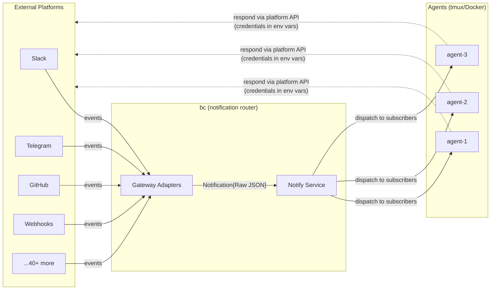
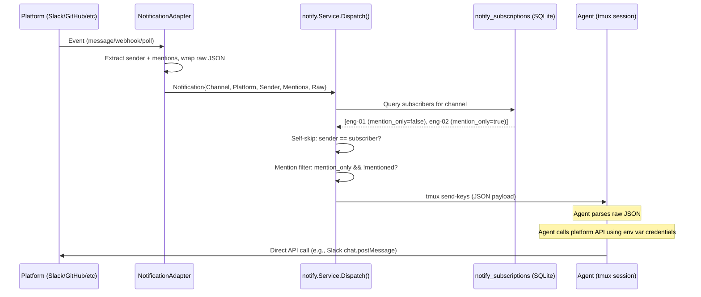
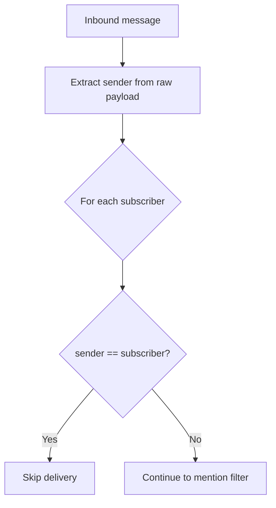
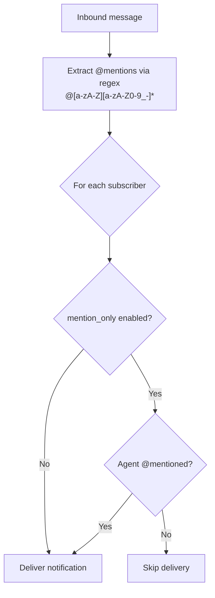
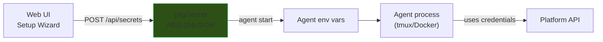
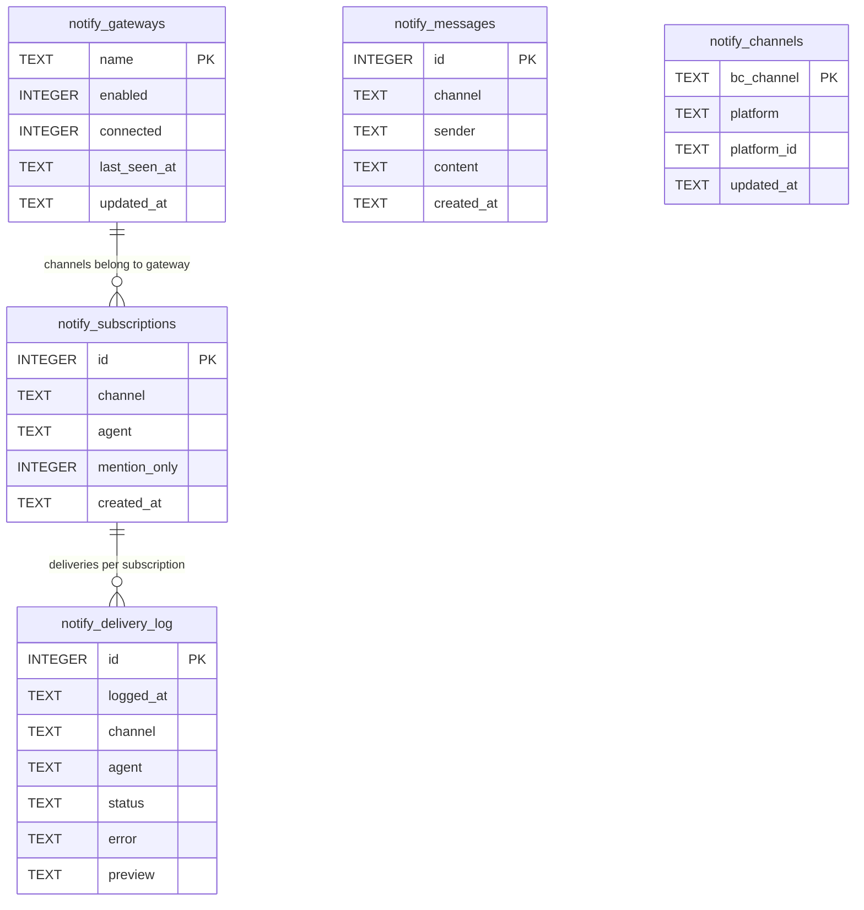
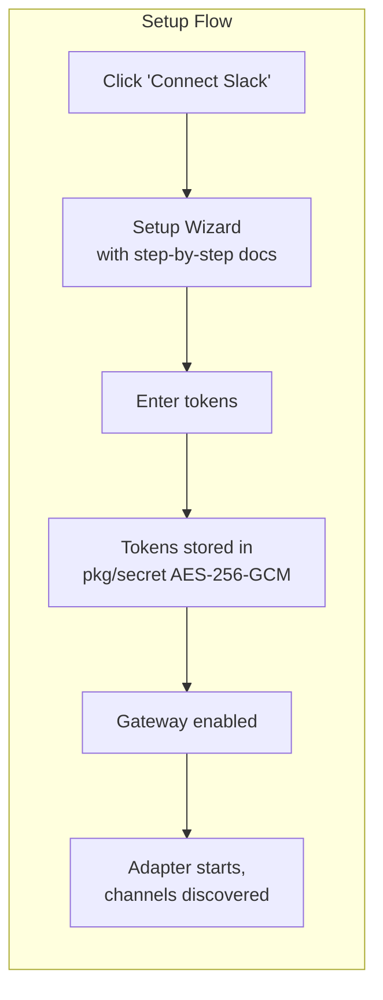
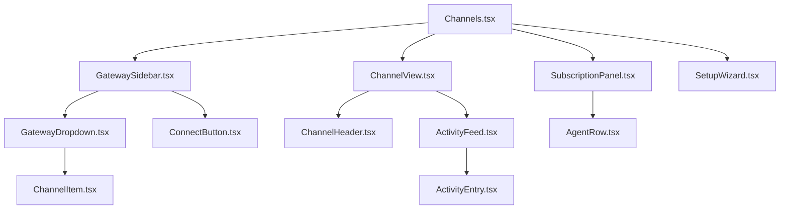
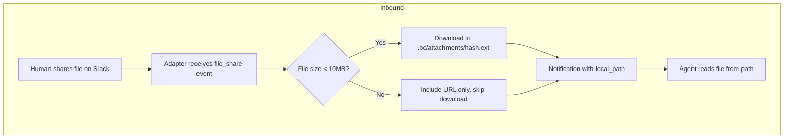
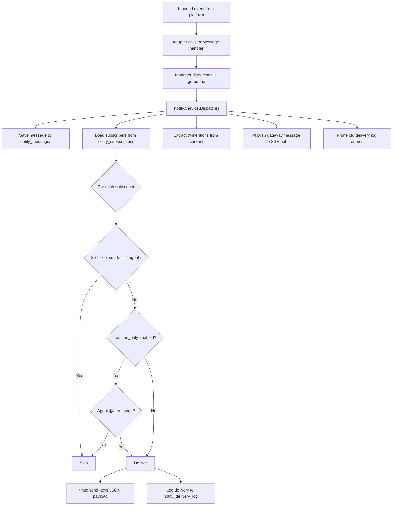

# Channels

Channels are **inbound-only notification gateways** that bridge external platforms (Slack, GitHub, Telegram, etc.) to bc agents. bc routes platform events to subscribed agents. Agents respond directly using injected credentials and platform APIs -- bc never sends outbound messages on behalf of agents.

This document is the canonical reference for the channel system. It covers architecture, data flow, interfaces, credential injection, subscriptions, the web UI, file handling, and platform setup.

---

## Overview

bc acts as a notification router, not a messaging proxy. External platforms push events into bc via adapter connections. bc dispatches those events to subscribed agents based on channel subscriptions and filtering rules. Agents are programs with API access -- they call platform APIs themselves using environment variable credentials.



**Why inbound-only?** Agents are LLMs with full API access. They can parse raw JSON natively and call any platform SDK. Proxying outbound messages through bc adds complexity, maintenance burden, and surface area for bugs -- with no benefit. Each agent calls the platform API directly, the same way a human developer would.

---

## How It Works

### Inbound Flow

Every notification follows the same path: platform to adapter to dispatch to agent.



### Agent Response

Agents respond to platform events using injected credentials. No bc middleware is involved:

1. Agent receives JSON notification via `tmux send-keys`
2. Agent parses the notification to understand the event
3. Agent calls the platform API directly (e.g., Slack `chat.postMessage`, GitHub `POST /repos/.../comments`)
4. Agent identifies itself per-platform (see [Agent Identity](#agent-identity))

### Self-Skip and Mention Filtering

Two filters prevent noise before delivery.

**Self-skip** prevents agents from receiving their own outbound messages echoed back by the platform:



Each adapter extracts the sender with a single field lookup:
- Slack: `event.User` or `event.BotID`
- Telegram: `message.From.UserName`
- Discord: `message.Author.ID`

The sender string is stripped of the `[platform] ` prefix (e.g., `[slack] eng-01` becomes `eng-01`) before comparison.

**Mention filtering** controls whether an agent receives all messages or only those that `@mention` it:



| Setting | Behavior | Use Case |
|---------|----------|----------|
| `mention_only = false` (default) | Agent receives all messages in the channel | Small or focused channels |
| `mention_only = true` | Agent receives only when `@<agent-name>` appears in content | Noisy channels |

Settings are per-agent, per-channel. Example: `eng-01` has `mention_only=true` for `slack:all-bc` but `mention_only=false` for `slack:engineering`.

---

## NotificationAdapter Interface

Every platform adapter implements this interface. The design is intentionally minimal -- adapters are thin wrappers that connect to a platform and forward raw events.

All 37+ platforms fall into exactly three connection patterns:

| Pattern | Adapters | How it works |
|---------|----------|--------------|
| **Socket** | Slack, Discord, Telegram, Matrix, IRC, Mattermost, Twitch, MQTT | Long-lived connection (WebSocket/polling). `Start()` blocks, events pushed in. |
| **Webhook** | GitHub, GitLab, Stripe, Sentry, PagerDuty, Datadog, Generic | bc exposes HTTP endpoint. Platform POSTs events. `HTTPHandler()` returns handler. |
| **Poll** | RSS, Notion, Reddit, Gmail (polling mode) | Timer-based fetch. `Start()` polls on interval, forwards new items. |

```go
// Located in: pkg/gateway/gateway.go

// AdapterType identifies the connection pattern.
type AdapterType string

const (
    AdapterSocket  AdapterType = "socket"   // long-lived connection (WebSocket, polling loop)
    AdapterWebhook AdapterType = "webhook"  // HTTP endpoint — platform POSTs events to bc
    AdapterPoll    AdapterType = "poll"     // timer-based polling — bc fetches new events
)

// NotificationAdapter handles the platform connection lifecycle.
// Each adapter is ~50-100 lines: connect, extract sender, forward raw JSON.
type NotificationAdapter interface {
    // Name returns the adapter identifier ("slack", "github", "telegram").
    Name() string

    // Type returns the connection pattern. Determines how bc wires the adapter:
    //   socket  → goroutine running Start()
    //   webhook → HTTPHandler() mounted on bcd HTTP mux at /hooks/{name}
    //   poll    → goroutine running Start() with internal ticker
    Type() AdapterType

    // Start connects to the platform and begins receiving notifications.
    // Calls handler for each inbound event with raw JSON payload.
    // Blocks until ctx is canceled. For webhook adapters, this is a no-op.
    Start(ctx context.Context, handler func(Notification)) error

    // Stop gracefully disconnects from the platform.
    Stop() error

    // HTTPHandler returns an http.Handler for webhook-based adapters.
    // Socket and poll adapters return nil.
    // The handler is mounted at /hooks/{name} on the bcd HTTP server.
    HTTPHandler() http.Handler

    // Channels returns discovered channels/groups the bot has access to.
    Channels() []ChannelInfo

    // Status returns the adapter's connection state for the web UI.
    Status() AdapterStatus
}

// AdapterStatus is reported to the web UI for observability.
type AdapterStatus struct {
    Connected     bool      `json:"connected"`
    Error         string    `json:"error,omitempty"`
    LastMessageAt time.Time `json:"last_message_at,omitempty"`
    MessageCount  int64     `json:"message_count"`
}

// ChannelInfo represents a discovered channel on a platform.
type ChannelInfo struct {
    ID       string `json:"id"`       // platform channel ID
    Name     string `json:"name"`     // human-readable name
    Platform string `json:"platform"` // adapter name
}
```

### Multi-Bot Support

A single platform can have **multiple adapter instances**, each with its own credentials and channels. The adapter `Name()` uses a `platform:label` convention:

```
telegram              → default Telegram bot
telegram:trade_research → trade research bot
telegram:kognivida    → kognivida bot
slack                 → main workspace bot
slack:personal        → personal workspace bot
github:bc             → bc repo webhooks
github:trade          → trade repo webhooks
```

The gateway manager registers each as a separate adapter. Subscriptions reference the full name (`telegram:trade_research:chat_group`), so agents can subscribe to specific bots. Credentials are stored per-instance in workspace secrets.

### Notification Data Model

The JSON payload delivered to agents via `tmux send-keys`:

```go
// Located in: pkg/notify/notify.go

type Notification struct {
    Channel   string          `json:"channel"`   // "engineering", "bc-repo", "general"
    Platform  string          `json:"platform"`  // "slack", "github", "telegram"
    Sender    string          `json:"sender"`    // extracted for self-skip filtering
    Mentions  []string        `json:"mentions"`  // extracted @mentions for mention_only filter
    Timestamp time.Time       `json:"timestamp"` // when bc received the event
    Raw       json.RawMessage `json:"raw"`       // ENTIRE platform payload — no parsing
}
```

| Field | Purpose |
|-------|---------|
| `Channel` | Channel name within the platform (e.g. `"engineering"`, `"bc-repo"`). Combined with `Platform` for subscription lookup as `platform:channel`. |
| `Platform` | Platform identifier, matches adapter `Name()`. |
| `Sender` | Extracted from raw payload (one field per adapter). Used for self-skip — don't echo agent's own messages back. |
| `Mentions` | Extracted via regex `@[a-zA-Z][a-zA-Z0-9_-]*` across the raw JSON bytes. Used for `mention_only` subscription filter. |
| `Timestamp` | When bc received the event. |
| `Raw` | **Complete platform payload as-is.** No parsing, no field mapping. The agent receives the full JSON from Slack/GitHub/Telegram and parses what it needs. This avoids maintaining platform-specific data models and ensures agents get full context (files, reactions, threads, metadata — everything the platform sent). |

Example notification delivered to an agent:

```json
{
  "timestamp": "2026-04-18T10:32:15Z",
  "channel": "engineering",
  "platform": "slack",
  "sender": "bob",
  "mentions": ["eng-01"],
  "raw": {
    "type": "message",
    "channel": "C0ABC123",
    "user": "U0DEF456",
    "text": "@eng-01 take a look at PR #428",
    "ts": "1712657535.000200",
    "team": "T0GHI789"
  }
}
```

### Supporting Types

```go
type Attachment struct {
    Filename  string `json:"filename"`
    MimeType  string `json:"mime_type"`
    URL       string `json:"url,omitempty"`
    LocalPath string `json:"local_path,omitempty"`
    Size      int64  `json:"size"`
}

type Subscription struct {
    CreatedAt   time.Time `json:"created_at"`
    Channel     string    `json:"channel"`
    Agent       string    `json:"agent"`
    ID          int64     `json:"id"`
    MentionOnly bool      `json:"mention_only"`
}

type DeliveryEntry struct {
    LoggedAt time.Time      `json:"logged_at"`
    Channel  string         `json:"channel"`
    Agent    string         `json:"agent"`
    Status   DeliveryStatus `json:"status"`    // "delivered", "failed", "pending"
    Error    string         `json:"error,omitempty"`
    Preview  string         `json:"preview"`
    ID       int64          `json:"id"`
}

type GatewayInfo struct {
    LastSeenAt *time.Time `json:"last_seen_at,omitempty"`
    UpdatedAt  time.Time  `json:"updated_at"`
    Name       string     `json:"name"`
    Enabled    bool       `json:"enabled"`
    Connected  bool       `json:"connected"`
}
```

---

## Platform Integrations

### Tier 1 -- Chat Platforms

Bidirectional messaging platforms where agents both receive and respond.

| # | Platform | Transport | Credential Env Vars | Identity Method | Status |
|---|----------|-----------|---------------------|-----------------|--------|
| 1 | **Slack** | Socket Mode (WebSocket) | `SLACK_BOT_TOKEN`, `SLACK_APP_TOKEN` | `username` param in `chat.postMessage` | Implemented |
| 2 | **Telegram** | Bot API long-polling | `TELEGRAM_BOT_TOKEN` | Prefix `[agent-name]: message` | Implemented |
| 3 | **Discord** | Gateway WebSocket | `DISCORD_BOT_TOKEN` or `DISCORD_WEBHOOK_URL` | `username` param in webhook execute | Implemented |
| 4 | WhatsApp | Cloud API webhooks | `WHATSAPP_TOKEN` | Prefix text (fixed number) | Planned |
| 5 | Signal | signal-cli bridge | `SIGNAL_CLI_URL` | Prefix text (fixed number) | Planned |
| 6 | iMessage | BlueBubbles server | `BLUEBUBBLES_URL`, `BLUEBUBBLES_PASSWORD` | Prefix text (fixed Apple ID) | Planned |
| 7 | Matrix | Client-Server API | `MATRIX_HOMESERVER`, `MATRIX_TOKEN` | Bot display name | Planned |
| 8 | Microsoft Teams | Bot Framework | `TEAMS_APP_ID`, `TEAMS_APP_SECRET` | Bot identity | Planned |
| 9 | Google Chat | Chat API + Pub/Sub | `GOOGLE_CHAT_SA_KEY` | Bot identity | Planned |
| 10 | LINE | Messaging API | `LINE_CHANNEL_TOKEN` | Bot identity | Planned |
| 11 | Feishu/Lark | Event Subscription | `FEISHU_APP_ID`, `FEISHU_APP_SECRET` | Bot identity | Planned |
| 12 | Mattermost | WebSocket + REST | `MATTERMOST_URL`, `MATTERMOST_TOKEN` | `username` param | Planned |
| 13 | IRC | IRC protocol | `IRC_SERVER`, `IRC_NICK`, `IRC_PASSWORD` | Nick per agent | Planned |
| 14 | Nostr | NIP-04 DMs | `NOSTR_PRIVATE_KEY` | Public key identity | Planned |
| 15 | Twitch | IRC + EventSub | `TWITCH_OAUTH_TOKEN` | Bot username | Planned |

### Tier 2 -- Event/Webhook Platforms

Inbound-only platforms that push structured events (CI results, issue updates, deployments).

| # | Platform | Event Types | Transport | Credential Env Vars | Status |
|---|----------|-------------|-----------|---------------------|--------|
| 16 | **GitHub** | PR, issue, push, CI, review, release, deployment | Webhooks | `GITHUB_TOKEN`, `GITHUB_WEBHOOK_SECRET` | Planned |
| 17 | GitLab | MR, pipeline, issue, push | Webhooks | `GITLAB_TOKEN`, `GITLAB_WEBHOOK_SECRET` | Planned |
| 18 | Bitbucket | PR, push, pipeline | Webhooks | `BITBUCKET_TOKEN` | Planned |
| 19 | Gmail | Email received | Google Pub/Sub | `GMAIL_SA_KEY` | Planned |
| 20 | Outlook | Email received | Graph API webhooks | `OUTLOOK_CLIENT_ID`, `OUTLOOK_CLIENT_SECRET` | Planned |
| 21 | Jira | Issue CRUD, transitions | Webhooks | `JIRA_TOKEN`, `JIRA_WEBHOOK_SECRET` | Planned |
| 22 | Linear | Issue CRUD, cycle changes | Webhooks | `LINEAR_API_KEY`, `LINEAR_WEBHOOK_SECRET` | Planned |
| 23 | Sentry | Error/exception alerts | Webhooks | `SENTRY_DSN` | Planned |
| 24 | PagerDuty | Incident triggered/resolved | Webhooks | `PAGERDUTY_TOKEN` | Planned |
| 25 | Datadog | Alert triggered | Webhooks | `DATADOG_API_KEY` | Planned |
| 26 | Grafana | Alert firing/resolved | Webhooks | `GRAFANA_API_KEY` | Planned |
| 27 | Vercel | Deployment events | Webhooks | `VERCEL_TOKEN` | Planned |
| 28 | Netlify | Deploy events | Webhooks | `NETLIFY_TOKEN` | Planned |
| 29 | AWS SNS | Any SNS topic | HTTP subscription | `AWS_ACCESS_KEY_ID`, `AWS_SECRET_ACCESS_KEY` | Planned |
| 30 | Stripe | Payment, subscription events | Webhooks | `STRIPE_WEBHOOK_SECRET` | Planned |
| 31 | Notion | Page/database changes | Polling | `NOTION_TOKEN` | Planned |
| 32 | Generic Webhook | Any HTTP POST with JSON | HTTP endpoint | None (public endpoint) | Planned |

### Tier 3 -- IoT and Smart Home

| # | Platform | Events | Transport | Credential Env Vars | Status |
|---|----------|--------|-----------|---------------------|--------|
| 33 | Home Assistant | Device state changes | WebSocket + REST | `HASS_URL`, `HASS_TOKEN` | Planned |
| 34 | MQTT | IoT topic messages | MQTT protocol | `MQTT_BROKER`, `MQTT_USERNAME`, `MQTT_PASSWORD` | Planned |

### Tier 4 -- Social and Media

| # | Platform | Events | Transport | Credential Env Vars | Status |
|---|----------|--------|-----------|---------------------|--------|
| 35 | Twitter/X | Mentions, DMs | Twitter API v2 | `TWITTER_BEARER_TOKEN` | Planned |
| 36 | Reddit | Posts/comments | Reddit API | `REDDIT_CLIENT_ID`, `REDDIT_CLIENT_SECRET` | Planned |
| 37 | RSS/Atom | New feed entries | HTTP polling | None | Planned |

---

## Credential Management

### How Tokens Flow



1. User enters platform credentials in the web UI setup wizard
2. Credentials are stored via `POST /api/secrets` -- encrypted with AES-256-GCM in `pkg/secret`
3. When an agent starts, bc reads workspace secrets and injects them as environment variables
4. The agent's system prompt includes instructions on which env vars are available and how to use them
5. Agent calls platform APIs directly using those credentials

Secrets are never stored in `settings.json`, never transmitted via SSE events, and never exposed in API responses.

### Secret Naming Convention

| Platform | Secret Name(s) |
|----------|---------------|
| Slack | `SLACK_BOT_TOKEN`, `SLACK_APP_TOKEN` |
| Telegram | `TELEGRAM_BOT_TOKEN` |
| Discord | `DISCORD_BOT_TOKEN` |
| GitHub | `GITHUB_TOKEN`, `GITHUB_WEBHOOK_SECRET` |

### Per-Platform Setup

| Platform | Setup Steps |
|----------|-------------|
| **Slack** | Create app at api.slack.com > Enable Socket Mode > Add scopes (`channels:read`, `chat:write`, `connections:write`) > Copy bot token + app token > Invite bot to channels |
| **Telegram** | Message @BotFather `/newbot` > Copy bot token > Add bot to groups > Disable privacy mode (optional, allows reading all group messages) |
| **Discord** | Create app at discord.com/developers > Enable `MESSAGE_CONTENT` intent > Copy bot token > Generate invite URL with required permissions > Add bot to server |
| **GitHub** | Create GitHub App or configure repository webhook > Select events (PR comments, reviews, issues, pushes) > Copy token and webhook secret |

---

## Agent Identity

How agents identify themselves when responding on each platform:

| Platform | Per-message identity? | Mechanism |
|----------|----------------------|-----------|
| Slack | Yes | `username` parameter in `chat.postMessage` API call |
| Discord | Yes | `username` parameter in webhook execute |
| Mattermost | Yes | Bot API username parameter |
| Telegram | No (fixed bot name) | Agent prefixes message with `[agent-name]: ` |
| WhatsApp | No (fixed number) | Agent prefixes message text |
| Signal | No (fixed number) | Agent prefixes message text |
| GitHub | App-level | Comments appear as the GitHub App / token owner |
| Gmail | No (account holder) | Sends as authenticated user |

Identity instructions are injected into the agent's system prompt at startup:

```markdown
## Platform Credentials
You have access to these platform credentials via environment variables:
- SLACK_BOT_TOKEN: Use Slack API. Set `username` param to your agent name
  (available as BC_AGENT_ID env var) for identity.
- TELEGRAM_BOT_TOKEN: Use Telegram Bot API. Prefix messages with your agent name.
```

---

## Subscription Model

### Database Schema



### Full SQL

```sql
CREATE TABLE IF NOT EXISTS notify_subscriptions (
    id           INTEGER PRIMARY KEY AUTOINCREMENT,
    channel      TEXT NOT NULL,          -- "slack:engineering"
    agent        TEXT NOT NULL,
    mention_only INTEGER NOT NULL DEFAULT 0,
    created_at   TEXT NOT NULL DEFAULT (strftime('%Y-%m-%dT%H:%M:%SZ', 'now')),
    UNIQUE(channel, agent)
);

CREATE TABLE IF NOT EXISTS notify_delivery_log (
    id        INTEGER PRIMARY KEY AUTOINCREMENT,
    logged_at TEXT NOT NULL DEFAULT (strftime('%Y-%m-%dT%H:%M:%SZ', 'now')),
    channel   TEXT NOT NULL,
    agent     TEXT NOT NULL,
    status    TEXT NOT NULL CHECK(status IN ('delivered', 'failed', 'pending')),
    error     TEXT,
    preview   TEXT  -- first 120 chars, for debugging
);

CREATE TABLE IF NOT EXISTS notify_gateways (
    name         TEXT PRIMARY KEY,
    enabled      INTEGER NOT NULL DEFAULT 0,
    connected    INTEGER NOT NULL DEFAULT 0,
    last_seen_at TEXT,
    updated_at   TEXT NOT NULL DEFAULT (strftime('%Y-%m-%dT%H:%M:%SZ', 'now'))
);
```

> Tables prefixed `notify_` to avoid collision during migration. Delivery log is pruned to the last 1000 entries per channel.

### Key Tables

| Table | Purpose |
|-------|---------|
| `notify_subscriptions` | Maps agents to channels with `mention_only` flag. UNIQUE(channel, agent). |
| `notify_delivery_log` | Records every delivery attempt (delivered/failed/pending). Pruned to 1000 per channel. |
| `notify_messages` | Stores inbound messages for the web UI activity feed. |
| `notify_gateways` | Tracks gateway connection state (enabled, connected, last_seen_at). |
| `notify_channels` | Persists channel discovery mappings (`bc_channel` to `platform_id`). |

### What Is Not Stored

| Not Stored | Why |
|-----------|-----|
| Full message content in DB | Platforms keep their own history; `notify_messages` stores only activity feed previews |
| Reactions | Agents react via direct API calls |
| FTS indexes | No search needed |
| File content | Stored in `.bc/attachments/`, not in the database |

### Shared Database Pattern

All notification stores use the `db.SharedWrapped()` singleton -- no separate database files:

```go
func OpenStore(workspacePath string) (*Store, error) {
    driver := db.SharedDriver()  // "sqlite" or "timescale"
    if driver == "timescale" {
        pg := NewPostgresStore(db.Shared())
        _ = pg.InitSchema()
        return &Store{pg: pg}, nil
    }
    return &Store{db: db.SharedWrapped()}, nil
}

func (s *Store) Close() error { return nil } // no-op: shared DB
```

---

## Web UI

### Channels Settings Page

```
+-------------------+------------------------------------------+----------------------+
| GATEWAYS          |  slack:engineering                        | AGENTS               |
|                   |                                          |                      |
| > Slack       (3) |  10:32  alice                            | * eng-01  (engineer) |
|   #engineering  <-|  Can someone review PR #428?             |   [x] @mention only  |
|   #all-bc         |                                          |   [Remove]           |
|   #infra          |  10:32  bob                              |                      |
|                   |  @eng-01 take a look                     | * eng-02  (engineer) |
| > Telegram    (1) |  -> delivered to eng-01                  |   [ ] all messages   |
|   bc-dev          |                                          |   [Remove]           |
|                   |  10:35  eng-01                            |                      |
| > Discord     (1) |  Looking now, will review                | o lead-01 (lead)     |
|   #general        |  -> relayed to eng-02                    |   [Add]              |
|                   |                                          |                      |
| > GitHub      (0) |                                          | o root    (manager)  |
|   [Setup ->]      |                                          |   [Add]              |
|                   |                                          |                      |
| + Connect app     |                                          | * = online  o = off  |
+-------------------+------------------------------------------+----------------------+
```

| Panel | Content |
|-------|---------|
| **Left sidebar** | Gateway dropdowns with channel lists. Unconnected gateways show "Setup" link. |
| **Main area** | Activity feed -- all messages with delivery status badges. |
| **Right panel** | Agent list with online dots, role badges, `@mention` toggle. |

### Agent Subscription Management

| Action | Description |
|--------|-------------|
| **Add** | Subscribe agent to channel -- starts receiving notifications |
| **Remove** | Unsubscribe agent -- stops receiving notifications |
| **@mention toggle** | Switch between all-messages and mention-only mode |

### Empty State

When no gateways are connected:

```
+----------------------------------------------+
|                                              |
|        Connect your first app                |
|                                              |
|   +--------+  +----------+  +---------+     |
|   | Slack  |  | Telegram |  | Discord |     |
|   +--------+  +----------+  +---------+     |
|   +--------+  +----------+                   |
|   | GitHub |  |  Gmail   |                   |
|   +--------+  +----------+                   |
|                                              |
|   Click to connect and start receiving       |
|   notifications in your agents.              |
+----------------------------------------------+
```

### Setup Wizard Flow



### Web UI Component Tree



| Component | Responsibility |
|-----------|---------------|
| `GatewaySidebar` | Collapsible gateway sections with channel lists |
| `ActivityFeed` | Chatroom-style messages, polls every 5s + live WebSocket |
| `SubscriptionPanel` | Agent list with online dots, role badges, `@mention` toggle |
| `SetupWizard` | Platform-specific token input + step-by-step docs |

### SSE Events

Real-time updates pushed to the web UI via the existing SSE hub:

| Event | Trigger |
|-------|---------|
| `gateway.message` | New inbound message -- append to activity feed |
| `gateway.delivery` | Delivery status update (delivered/failed) |
| `gateway.connected` | Gateway adapter connected to platform |
| `gateway.disconnected` | Gateway lost connection |

---

## File and Attachment Handling

### Inbound File Flow



File notification payload:

```json
{
  "channel": "slack:engineering",
  "sender": "alice",
  "content": "[shared a file]",
  "attachments": [{
    "filename": "screenshot.png",
    "mime_type": "image/png",
    "size": 245760,
    "url": "https://files.slack.com/...",
    "local_path": ".bc/attachments/a1b2c3d4.png"
  }]
}
```

For Docker agents, `.bc/attachments/` is mounted as a shared volume so agents can access downloaded files.

---

## Adding a New Channel Adapter

### Step 1: Create the adapter file

```
pkg/gateway/<platform>/<platform>.go
```

### Step 2: Implement the Adapter interface

```go
package myplatform

import (
    "context"
    "github.com/rpuneet/bc/pkg/gateway"
)

type Adapter struct {
    token string
    // platform-specific client
}

func New(token string) *Adapter {
    return &Adapter{token: token}
}

func (a *Adapter) Name() string { return "myplatform" }

func (a *Adapter) Start(ctx context.Context, handler func(gateway.InboundMessage)) error {
    // 1. Connect to platform (WebSocket, long-poll, webhook server, etc.)
    // 2. For each inbound event:
    //    - Skip bot's own messages (self-filter)
    //    - Extract sender name for self-skip
    //    - Build InboundMessage with content, sender, channel info
    //    - Call handler(msg)
    // 3. Block until ctx.Done()
    return nil
}

func (a *Adapter) Stop(ctx context.Context) error {
    // Graceful disconnect
    return nil
}

func (a *Adapter) Send(ctx context.Context, channelID, sender, content string) error {
    // Send message to platform channel (v0.2 relay; removed in v0.3)
    return nil
}

func (a *Adapter) Channels(ctx context.Context) ([]gateway.ExternalChannel, error) {
    // Return discovered channels/groups the bot can see
    return nil, nil
}

func (a *Adapter) Health(ctx context.Context) error {
    // Live API probe -- must make an actual API call, not a nil-check
    return nil
}
```

### Step 3: Register in the server

In `server/server.go` (or wherever adapters are wired):

```go
adapter := myplatform.New(token)
gatewayMgr.Register(adapter)
```

### Step 4: Add credential env vars

Document the required secrets in the [Platform Integrations](#platform-integrations) table and add them to the setup wizard.

### Step 5: Add identity instructions

Update the agent system prompt template to include instructions for the new platform's identity mechanism.

---

## API Reference

All endpoints are served by bcd at `http://127.0.0.1:9374`. No authentication (localhost-only).

### Gateway Management

```
GET    /api/gateways                                              -- list all gateways + connection status
POST   /api/gateways                                              -- connect a new gateway
PATCH  /api/gateways/{gateway}                                    -- update tokens/settings
DELETE /api/gateways/{gateway}                                    -- disconnect and remove gateway
GET    /api/gateways/{gateway}/health                             -- live connection probe
GET    /api/gateways/{gateway}/setup                              -- platform setup instructions
```

**`POST /api/gateways`** request body:

```json
{
  "platform": "slack",
  "tokens": {
    "bot_token": "xoxb-...",
    "app_token": "xapp-..."
  }
}
```

### Channel Discovery

```
GET    /api/gateways/{gateway}/channels                           -- discovered channels
GET    /api/gateways/{gateway}/channels/{channel}                 -- channel detail + subscribed agents
```

### Agent Subscription Management

```
POST   /api/gateways/{gateway}/channels/{channel}/agents          -- subscribe agent
DELETE /api/gateways/{gateway}/channels/{channel}/agents/{agent}  -- unsubscribe agent
PATCH  /api/gateways/{gateway}/channels/{channel}/agents/{agent}  -- toggle mention_only
```

**`POST .../agents`** request body:

```json
{
  "agent": "eng-01",
  "mention_only": false
}
```

**`PATCH .../agents/{agent}`** request body:

```json
{
  "mention_only": true
}
```

### Activity Feed

```
GET    /api/gateways/{gateway}/channels/{channel}/activity        -- delivery log entries
```

**Frontend routes mirror the API:** `/channels/slack/engineering` maps to `/api/gateways/slack/channels/engineering`.

---

## Dispatch Internals

The full dispatch flow inside `notify.Service`:



Key implementation details:
- Dispatch runs in its own goroutine -- never blocks the adapter
- Panics are recovered and logged
- Delivery log is pruned to 1000 entries per channel after each dispatch
- The `[platform] ` prefix is stripped from sender names before self-skip comparison

---

## CLI Commands

```
bc channel list         -- all channels across gateways with subscriber counts
bc channel subscribe    -- subscribe agent to channel
bc channel unsubscribe  -- unsubscribe agent
bc channel status       -- gateway connection status + health
```

All other operations (gateway setup, token management, `@mention` toggle) are done through the web UI.

---

## Migration from v0.2

The channel system has evolved through three iterations:

| Version | Architecture | Status |
|---------|-------------|--------|
| v0.1 | `pkg/channel/` -- SQLite-backed messaging with reactions, FTS, message types | Deleted |
| v0.2 | `pkg/gateway/` + `pkg/notify/` -- bidirectional gateway with `Adapter.Send()` | Current |
| v0.3 | `pkg/gateway/` + `pkg/notify/` -- notification-only, no Send, raw JSON passthrough | Target |

### What Changes from v0.2 to v0.3

| Component | v0.2 (Current) | v0.3 (Target) |
|-----------|---------------|---------------|
| `Adapter` interface | Includes `Send()`, `SendFile()` methods | No outbound methods |
| `InboundMessage` | Parsed fields (Content, Sender, ChannelName) | `Notification` with raw JSON passthrough |
| `gateway.Manager.Send()` | Routes outbound messages to platform | Removed |
| `gateway.Manager.SendFile()` | Routes file uploads to platform | Removed |
| `FileSender` interface | Optional adapter capability | Removed |
| Agent response | Via `gateway.Manager.Send()` or MCP | Direct platform API calls using env var credentials |

### What Stays the Same

- `notify_subscriptions` table schema
- `notify_delivery_log` table schema
- `notify.Service.Dispatch()` core logic (self-skip, mention filter, tmux send-keys)
- Subscription REST API routes
- Web UI subscription panel

---

## Package Reference

| Package | Purpose |
|---------|---------|
| [`pkg/gateway/`](../../pkg/gateway/README.md) | Adapter interface, Manager, platform adapters (Slack, Telegram, Discord) |
| [`pkg/notify/`](../../pkg/notify/README.md) | Notification types, Store (SQLite/Postgres), Service (dispatch + subscription management) |
| `pkg/secret/` | AES-256-GCM encrypted credential storage |
| `server/handlers/` | REST API handlers for gateway and subscription management |
