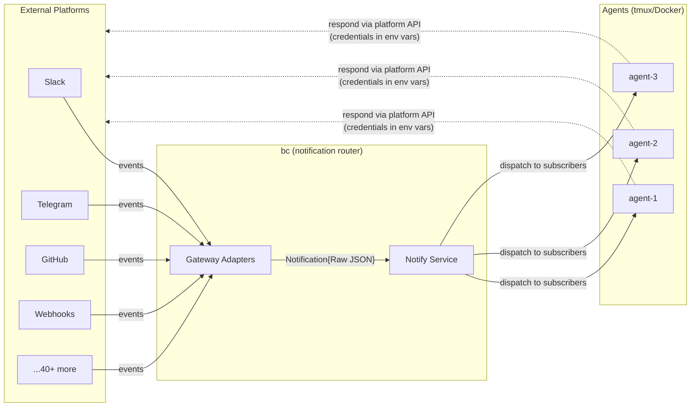
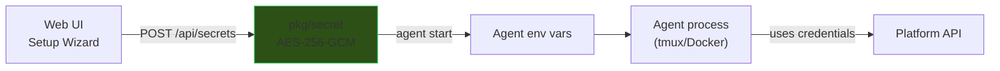
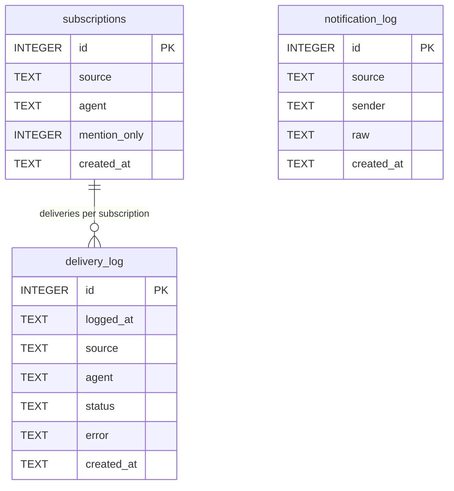
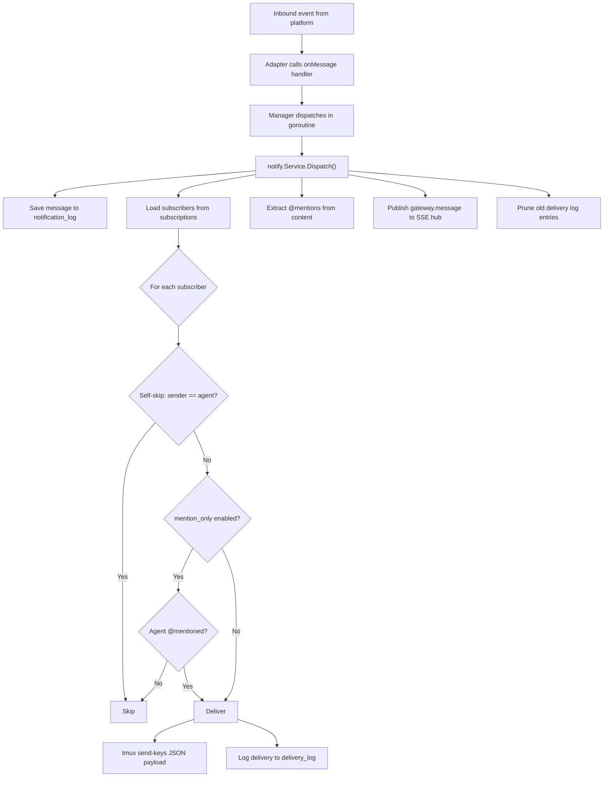
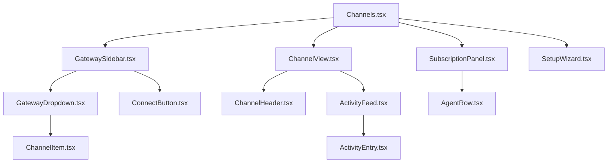

# Notifications

Notifications are inbound-only gateways that bridge external platforms (Slack, GitHub, Telegram, and 30+ others) to bc agents. bc routes platform events to subscribed agents, who respond directly using injected credentials and platform APIs.

## Architecture

bc acts as a notification router, not a messaging proxy. External platforms push events into bc through adapter connections. bc dispatches those events to subscribed agents based on filtering rules. Agents call platform APIs themselves using environment variable credentials.



All 37+ platform adapters follow one of three connection patterns:

| Pattern | Examples | Mechanism |
|---------|----------|-----------|
| **Socket** | Slack, Discord, Telegram, Matrix, IRC, Mattermost, Twitch, MQTT | Long-lived connection. `Start()` blocks, events stream in. |
| **Webhook** | GitHub, GitLab, Stripe, Sentry, PagerDuty, Datadog, Generic | bc exposes an HTTP endpoint. The platform POSTs events. |
| **Poll** | RSS, Notion, Reddit, Gmail | Timer-based fetch. `Start()` polls on interval, forwards new items. |

## NotificationAdapter Interface

Every platform adapter implements this interface. Adapters are thin wrappers (~50-100 lines) that connect to a platform and forward raw events.

```go
// Located in: pkg/gateway/gateway.go

// AdapterType identifies the connection pattern.
type AdapterType string

const (
    AdapterSocket  AdapterType = "socket"   // long-lived connection (WebSocket, polling loop)
    AdapterWebhook AdapterType = "webhook"  // HTTP endpoint — platform POSTs events to bc
    AdapterPoll    AdapterType = "poll"     // timer-based polling — bc fetches new events
)

// NotificationAdapter handles the platform connection lifecycle.
type NotificationAdapter interface {
    // Name returns the adapter identifier ("slack", "github", "telegram").
    Name() string

    // Type returns the connection pattern. Determines how bc wires the adapter:
    //   socket  → goroutine running Start()
    //   webhook → HTTPHandler() mounted on bcd HTTP mux at /hooks/{name}
    //   poll    → goroutine running Start() with internal ticker
    Type() AdapterType

    // Start connects to the platform and begins receiving notifications.
    // Calls handler for each inbound event with raw JSON payload.
    // Blocks until ctx is canceled. For webhook adapters, this is a no-op.
    Start(ctx context.Context, handler func(Notification)) error

    // Stop gracefully disconnects from the platform.
    Stop() error

    // HTTPHandler returns an http.Handler for webhook-based adapters.
    // Socket and poll adapters return nil.
    // The handler is mounted at /hooks/{name} on the bcd HTTP server.
    HTTPHandler() http.Handler

    // Channels returns discovered channels/groups the bot has access to.
    Channels() []ChannelInfo

    // Status returns the adapter's connection state for the web UI.
    Status() AdapterStatus
}

// AdapterStatus is reported to the web UI for observability.
type AdapterStatus struct {
    Connected     bool      `json:"connected"`
    Error         string    `json:"error,omitempty"`
    LastMessageAt time.Time `json:"last_message_at,omitempty"`
    MessageCount  int64     `json:"message_count"`
}

// ChannelInfo represents a discovered channel on a platform.
type ChannelInfo struct {
    ID       string `json:"id"`       // platform channel ID
    Name     string `json:"name"`     // human-readable name
    Platform string `json:"platform"` // adapter name
}
```

## Notification Data Model

Each notification wraps the complete platform payload as raw JSON. Agents parse what they need. This avoids maintaining platform-specific data models and gives agents full context (files, reactions, threads, metadata).

```go
// Located in: pkg/notify/notify.go

type Notification struct {
    Channel   string          `json:"channel"`   // "engineering", "bc-repo", "general"
    Platform  string          `json:"platform"`  // "slack", "github", "telegram"
    Sender    string          `json:"sender"`    // extracted for self-skip filtering
    Mentions  []string        `json:"mentions"`  // extracted @mentions for mention_only filter
    Timestamp time.Time       `json:"timestamp"` // when bc received the event
    Raw       json.RawMessage `json:"raw"`       // ENTIRE platform payload — no parsing
}
```

| Field | Purpose |
|-------|---------|
| `Channel` | Channel name within the platform (e.g., `"engineering"`). Combined with `Platform` for subscription lookup as `platform:channel`. |
| `Platform` | Platform identifier. Matches adapter `Name()`. |
| `Sender` | Extracted from raw payload (one field per adapter). Used for self-skip filtering. |
| `Mentions` | Extracted via regex `@[a-zA-Z][a-zA-Z0-9_-]*` across the raw JSON bytes. Used for `mention_only` filtering. |
| `Timestamp` | When bc received the event. |
| `Raw` | Complete platform payload, unmodified. The agent receives the full JSON and parses what it needs. |

Example notification delivered to an agent:

```json
{
  "timestamp": "2026-04-18T10:32:15Z",
  "channel": "engineering",
  "platform": "slack",
  "sender": "bob",
  "mentions": ["eng-01"],
  "raw": {
    "type": "message",
    "channel": "C0ABC123",
    "user": "U0DEF456",
    "text": "@eng-01 take a look at PR #428",
    "ts": "1712657535.000200",
    "team": "T0GHI789"
  }
}
```

## Multi-Bot Support

A single platform supports multiple adapter instances, each with its own credentials and channels. The adapter `Name()` uses a `platform:label` convention:

```
telegram              → default Telegram bot
telegram:trade        → trade research bot
slack                 → main workspace bot
slack:personal        → personal workspace bot
github:bc             → bc repo webhooks
github:trade          → trade repo webhooks
```

The gateway manager registers each as a separate adapter. Subscriptions reference the full name (e.g., `telegram:trade:chat_group`), so agents subscribe to specific bots. Credentials are stored per-instance in workspace secrets.

## Platform Integrations

### Tier 1: Chat Platforms

Bidirectional messaging platforms where agents receive and respond.

| # | Platform | Transport | Credential Env Vars | Identity Method | Status |
|---|----------|-----------|---------------------|-----------------|--------|
| 1 | **Slack** | Socket Mode (WebSocket) | `SLACK_BOT_TOKEN`, `SLACK_APP_TOKEN` | `username` param in `chat.postMessage` | Implemented |
| 2 | **Telegram** | Bot API long-polling | `TELEGRAM_BOT_TOKEN` | Prefix `[agent-name]: message` | Implemented |
| 3 | **Discord** | Gateway WebSocket | `DISCORD_BOT_TOKEN` or `DISCORD_WEBHOOK_URL` | `username` param in webhook execute | Implemented |
| 4 | WhatsApp | Cloud API webhooks | `WHATSAPP_TOKEN` | Prefix text (fixed number) | Planned |
| 5 | Signal | signal-cli bridge | `SIGNAL_CLI_URL` | Prefix text (fixed number) | Planned |
| 6 | iMessage | BlueBubbles server | `BLUEBUBBLES_URL`, `BLUEBUBBLES_PASSWORD` | Prefix text (fixed Apple ID) | Planned |
| 7 | Matrix | Client-Server API | `MATRIX_HOMESERVER`, `MATRIX_TOKEN` | Bot display name | Planned |
| 8 | Microsoft Teams | Bot Framework | `TEAMS_APP_ID`, `TEAMS_APP_SECRET` | Bot identity | Planned |
| 9 | Google Chat | Chat API + Pub/Sub | `GOOGLE_CHAT_SA_KEY` | Bot identity | Planned |
| 10 | LINE | Messaging API | `LINE_CHANNEL_TOKEN` | Bot identity | Planned |
| 11 | Feishu/Lark | Event Subscription | `FEISHU_APP_ID`, `FEISHU_APP_SECRET` | Bot identity | Planned |
| 12 | Mattermost | WebSocket + REST | `MATTERMOST_URL`, `MATTERMOST_TOKEN` | `username` param | Planned |
| 13 | IRC | IRC protocol | `IRC_SERVER`, `IRC_NICK`, `IRC_PASSWORD` | Nick per agent | Planned |
| 14 | Nostr | NIP-04 DMs | `NOSTR_PRIVATE_KEY` | Public key identity | Planned |
| 15 | Twitch | IRC + EventSub | `TWITCH_OAUTH_TOKEN` | Bot username | Planned |

### Tier 2: Event and Webhook Platforms

Inbound-only platforms that push structured events (CI results, issue updates, deployments).

| # | Platform | Event Types | Transport | Credential Env Vars | Status |
|---|----------|-------------|-----------|---------------------|--------|
| 16 | **GitHub** | PR, issue, push, CI, review, release, deployment | Webhooks | `GITHUB_TOKEN`, `GITHUB_WEBHOOK_SECRET` | Planned |
| 17 | GitLab | MR, pipeline, issue, push | Webhooks | `GITLAB_TOKEN`, `GITLAB_WEBHOOK_SECRET` | Planned |
| 18 | Bitbucket | PR, push, pipeline | Webhooks | `BITBUCKET_TOKEN` | Planned |
| 19 | Gmail | Email received | Google Pub/Sub | `GMAIL_SA_KEY` | Planned |
| 20 | Outlook | Email received | Graph API webhooks | `OUTLOOK_CLIENT_ID`, `OUTLOOK_CLIENT_SECRET` | Planned |
| 21 | Jira | Issue CRUD, transitions | Webhooks | `JIRA_TOKEN`, `JIRA_WEBHOOK_SECRET` | Planned |
| 22 | Linear | Issue CRUD, cycle changes | Webhooks | `LINEAR_API_KEY`, `LINEAR_WEBHOOK_SECRET` | Planned |
| 23 | Sentry | Error/exception alerts | Webhooks | `SENTRY_DSN` | Planned |
| 24 | PagerDuty | Incident triggered/resolved | Webhooks | `PAGERDUTY_TOKEN` | Planned |
| 25 | Datadog | Alert triggered | Webhooks | `DATADOG_API_KEY` | Planned |
| 26 | Grafana | Alert firing/resolved | Webhooks | `GRAFANA_API_KEY` | Planned |
| 27 | Vercel | Deployment events | Webhooks | `VERCEL_TOKEN` | Planned |
| 28 | Netlify | Deploy events | Webhooks | `NETLIFY_TOKEN` | Planned |
| 29 | AWS SNS | Any SNS topic | HTTP subscription | `AWS_ACCESS_KEY_ID`, `AWS_SECRET_ACCESS_KEY` | Planned |
| 30 | Stripe | Payment, subscription events | Webhooks | `STRIPE_WEBHOOK_SECRET` | Planned |
| 31 | Notion | Page/database changes | Polling | `NOTION_TOKEN` | Planned |
| 32 | Generic Webhook | Any HTTP POST with JSON | HTTP endpoint | None (public endpoint) | Planned |

### Tier 3: IoT and Smart Home

| # | Platform | Events | Transport | Credential Env Vars | Status |
|---|----------|--------|-----------|---------------------|--------|
| 33 | Home Assistant | Device state changes | WebSocket + REST | `HASS_URL`, `HASS_TOKEN` | Planned |
| 34 | MQTT | IoT topic messages | MQTT protocol | `MQTT_BROKER`, `MQTT_USERNAME`, `MQTT_PASSWORD` | Planned |

### Tier 4: Social and Media

| # | Platform | Events | Transport | Credential Env Vars | Status |
|---|----------|--------|-----------|---------------------|--------|
| 35 | Twitter/X | Mentions, DMs | Twitter API v2 | `TWITTER_BEARER_TOKEN` | Planned |
| 36 | Reddit | Posts/comments | Reddit API | `REDDIT_CLIENT_ID`, `REDDIT_CLIENT_SECRET` | Planned |
| 37 | RSS/Atom | New feed entries | HTTP polling | None | Planned |

## Credential Management

Credentials flow from the web UI through encrypted storage into agent environment variables.



1. The user enters platform credentials in the web UI setup wizard.
2. `POST /api/secrets` encrypts them with AES-256-GCM via `pkg/secret`.
3. When an agent starts, bc reads workspace secrets and injects them as environment variables.
4. The agent's system prompt includes instructions on which env vars are available.
5. The agent calls platform APIs directly using those credentials.

Secrets are never stored in `settings.json`, never transmitted via SSE events, and never exposed in API responses.

| Platform | Setup Steps |
|----------|-------------|
| **Slack** | Create app at api.slack.com > Enable Socket Mode > Add scopes (`channels:read`, `chat:write`, `connections:write`) > Copy bot token + app token > Invite bot to channels |
| **Telegram** | Message @BotFather `/newbot` > Copy bot token > Add bot to groups > Disable privacy mode (optional, for reading all group messages) |
| **Discord** | Create app at discord.com/developers > Enable `MESSAGE_CONTENT` intent > Copy bot token > Generate invite URL with required permissions > Add bot to server |
| **GitHub** | Create GitHub App or configure repository webhook > Select events (PR comments, reviews, issues, pushes) > Copy token and webhook secret |

## Agent Identity

Each platform has different support for per-message identity. Some allow setting a username per API call; others require the agent to prefix its name in the message body.

| Platform | Per-Message Identity? | Mechanism |
|----------|----------------------|-----------|
| Slack | Yes | `username` parameter in `chat.postMessage` |
| Discord | Yes | `username` parameter in webhook execute |
| Mattermost | Yes | Bot API username parameter |
| Telegram | No (fixed bot name) | Agent prefixes message with `[agent-name]: ` |
| WhatsApp | No (fixed number) | Agent prefixes message text |
| Signal | No (fixed number) | Agent prefixes message text |
| GitHub | App-level | Comments appear as the GitHub App / token owner |
| Gmail | No (account holder) | Sends as authenticated user |

Identity instructions are injected into the agent's system prompt at startup:

```markdown
## Platform Credentials
You have access to these platform credentials via environment variables:
- SLACK_BOT_TOKEN: Use Slack API. Set `username` param to your agent name
  (available as BC_AGENT_ID env var) for identity.
- TELEGRAM_BOT_TOKEN: Use Telegram Bot API. Prefix messages with your agent name.
```

## Subscriptions

### Database Schema

Three tables track subscriptions and delivery. Adapter status lives in memory, not in the database. Adapters discover channels dynamically.



### SQL DDL

```sql
CREATE TABLE IF NOT EXISTS subscriptions (
    id           INTEGER PRIMARY KEY AUTOINCREMENT,
    source       TEXT NOT NULL,          -- "slack:engineering", "github:bc"
    agent        TEXT NOT NULL,
    mention_only INTEGER NOT NULL DEFAULT 0,
    created_at   TEXT NOT NULL DEFAULT (strftime('%Y-%m-%dT%H:%M:%SZ', 'now')),
    UNIQUE(source, agent)
);

CREATE TABLE IF NOT EXISTS notification_log (
    id         INTEGER PRIMARY KEY AUTOINCREMENT,
    source     TEXT NOT NULL,
    sender     TEXT NOT NULL,
    raw        TEXT,                     -- full platform JSON payload
    created_at TEXT NOT NULL DEFAULT (strftime('%Y-%m-%dT%H:%M:%SZ', 'now'))
);

CREATE TABLE IF NOT EXISTS delivery_log (
    id         INTEGER PRIMARY KEY AUTOINCREMENT,
    source     TEXT NOT NULL,
    agent      TEXT NOT NULL,
    status     TEXT NOT NULL CHECK(status IN ('delivered', 'failed', 'pending')),
    error      TEXT,
    created_at TEXT NOT NULL DEFAULT (strftime('%Y-%m-%dT%H:%M:%SZ', 'now'))
);
```

| Table | Purpose |
|-------|---------|
| `subscriptions` | Maps agents to notification sources. `UNIQUE(source, agent)`. |
| `notification_log` | Stores raw inbound events for the web UI feed. |
| `delivery_log` | Records every delivery attempt per agent (delivered/failed). |

### Retention Policy

| Rule | Value |
|------|-------|
| Max entries per source | 1,000 (oldest pruned on insert) |
| TTL | 7 days (entries older than 7d pruned on schedule) |
| `delivery_log` retention | 1,000 per source, same TTL |

Pruning runs on a periodic timer (every hour). Both limits apply -- whichever triggers first.

## Dispatch

The dispatch pipeline handles self-skip filtering, mention filtering, and delivery logging in a single pass.



**Self-skip** prevents agents from receiving their own messages echoed back by the platform. Each adapter extracts the sender with a single field lookup (`event.User` for Slack, `message.From.UserName` for Telegram, `message.Author.ID` for Discord). The `[platform] ` prefix is stripped before comparison.

**Mention filtering** controls whether an agent receives all messages or only those containing `@agent-name`:

| Setting | Behavior | Use Case |
|---------|----------|----------|
| `mention_only = false` (default) | Agent receives all messages in the channel | Small or focused channels |
| `mention_only = true` | Agent receives messages containing `@<agent-name>` | Noisy channels |

Settings are per-agent, per-channel.

## Web UI

### Notifications Settings Page

```
+-------------------+------------------------------------------+----------------------+
| GATEWAYS          |  slack:engineering                        | AGENTS               |
|                   |                                          |                      |
| > Slack       (3) |  10:32  alice                            | * eng-01  (engineer) |
|   #engineering  <-|  Can someone review PR #428?             |   [x] @mention only  |
|   #all-bc         |                                          |   [Remove]           |
|   #infra          |  10:32  bob                              |                      |
|                   |  @eng-01 take a look                     | * eng-02  (engineer) |
| > Telegram    (1) |  -> delivered to eng-01                  |   [ ] all messages   |
|   bc-dev          |                                          |   [Remove]           |
|                   |  10:35  eng-01                            |                      |
| > Discord     (1) |  Looking now, will review                | o lead-01 (lead)     |
|   #general        |  -> relayed to eng-02                    |   [Add]              |
|                   |                                          |                      |
| > GitHub      (0) |                                          | o root    (manager)  |
|   [Setup ->]      |                                          |   [Add]              |
|                   |                                          |                      |
| + Connect app     |                                          | * = online  o = off  |
+-------------------+------------------------------------------+----------------------+
```

| Panel | Content |
|-------|---------|
| **Left sidebar** | Gateway dropdowns with channel lists. Unconnected gateways show a "Setup" link. |
| **Main area** | Activity feed with delivery status badges. Polls every 5s and receives live WebSocket updates. |
| **Right panel** | Agent list with online indicators, role badges, and `@mention` toggle. |

### SSE Events

| Event | Trigger |
|-------|---------|
| `gateway.message` | New inbound message -- appends to activity feed |
| `gateway.delivery` | Delivery status update (delivered/failed) |
| `gateway.connected` | Adapter connected to platform |
| `gateway.disconnected` | Adapter lost connection |

### Component Tree



## Adding a New Adapter

1. Create the adapter file at `pkg/gateway/<platform>/<platform>.go`.

2. Implement `NotificationAdapter`:

```go
package myplatform

import (
    "context"
    "github.com/rpuneet/bc/pkg/gateway"
)

type Adapter struct {
    token string
}

func New(token string) *Adapter {
    return &Adapter{token: token}
}

func (a *Adapter) Name() string { return "myplatform" }

func (a *Adapter) Start(ctx context.Context, handler func(gateway.Notification)) error {
    for {
        select {
        case <-ctx.Done():
            return nil
        case event := <-a.events:
            raw, _ := json.Marshal(event)
            handler(gateway.Notification{
                Channel:   extractChannel(event),
                Platform:  "myplatform",
                Sender:    extractSender(event),
                Timestamp: time.Now(),
                Raw:       raw,
            })
        }
    }
}

func (a *Adapter) Stop() error              { return a.conn.Close() }
func (a *Adapter) HTTPHandler() http.Handler { return nil }
func (a *Adapter) Channels() []gateway.ChannelInfo { return a.discovered }
func (a *Adapter) Status() gateway.AdapterStatus {
    return gateway.AdapterStatus{Connected: a.connected, MessageCount: a.count}
}
```

3. Register the adapter in `server/server.go`:

```go
adapter := myplatform.New(token)
gatewayMgr.Register(adapter)
```

4. Add credential env vars to the [Platform Integrations](#platform-integrations) table and the setup wizard.

5. Update the agent system prompt template with identity instructions for the new platform.

## API Reference

All endpoints are served by bcd at `http://127.0.0.1:9374`. No authentication (localhost-only).

### Gateway Management

```
GET    /api/gateways                                              -- list all gateways + status
POST   /api/gateways                                              -- connect a new gateway
PATCH  /api/gateways/{gateway}                                    -- update tokens/settings
DELETE /api/gateways/{gateway}                                    -- disconnect and remove
GET    /api/gateways/{gateway}/health                             -- live connection probe
GET    /api/gateways/{gateway}/setup                              -- platform setup instructions
```

### Notification Discovery

```
GET    /api/gateways/{gateway}/channels                           -- discovered channels
GET    /api/gateways/{gateway}/channels/{channel}                 -- channel detail + subscribers
```

### Agent Subscription Management

```
POST   /api/gateways/{gateway}/channels/{channel}/agents          -- subscribe agent
DELETE /api/gateways/{gateway}/channels/{channel}/agents/{agent}  -- unsubscribe agent
PATCH  /api/gateways/{gateway}/channels/{channel}/agents/{agent}  -- toggle mention_only
```

### Activity Feed

```
GET    /api/gateways/{gateway}/channels/{channel}/activity        -- delivery log entries
```

## Package Reference

| Package | Purpose |
|---------|---------|
| [`pkg/gateway/`](../../pkg/gateway/README.md) | Adapter interface, Manager, platform adapters (Slack, Telegram, Discord) |
| [`pkg/notify/`](../../pkg/notify/README.md) | Notification types, Store (SQLite/Postgres), Service (dispatch + subscription management) |
| `pkg/secret/` | AES-256-GCM encrypted credential storage |
| `server/handlers/` | REST API handlers for gateway and subscription management |

## What's Next

- [Channels Architecture](channels.md) -- internal agent-to-agent messaging
- [Agent Lifecycle](agents.md) -- how agents start, receive credentials, and run
- [MCP Protocol](mcp.md) -- Model Context Protocol integration
