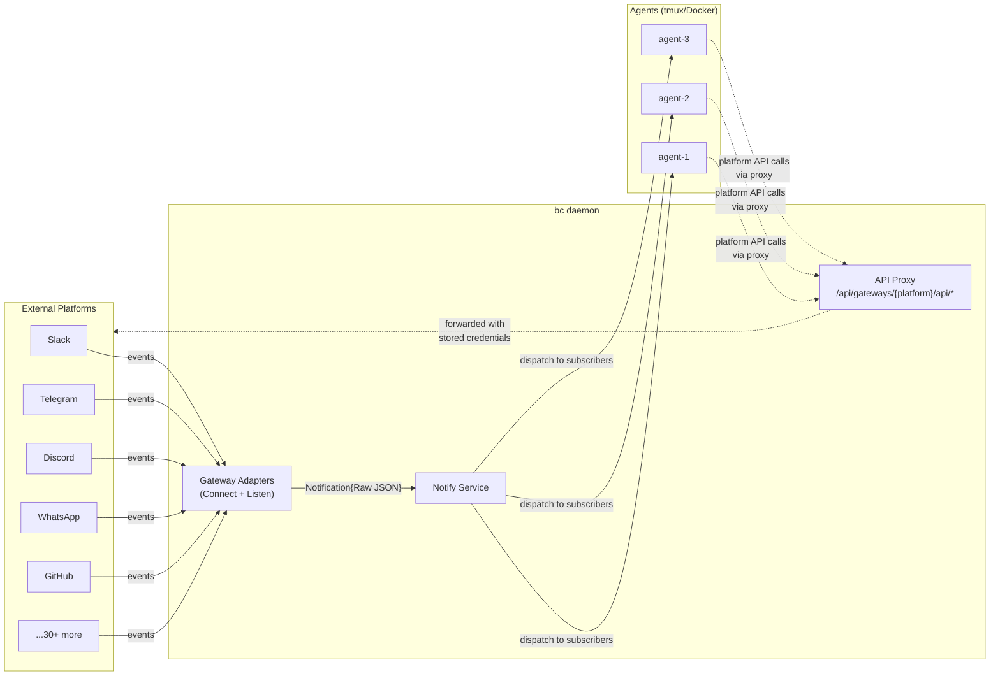
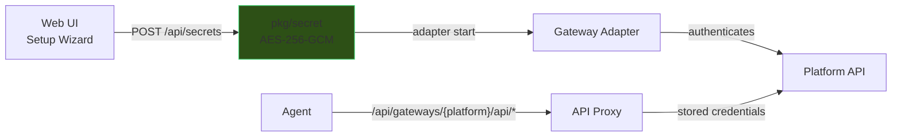
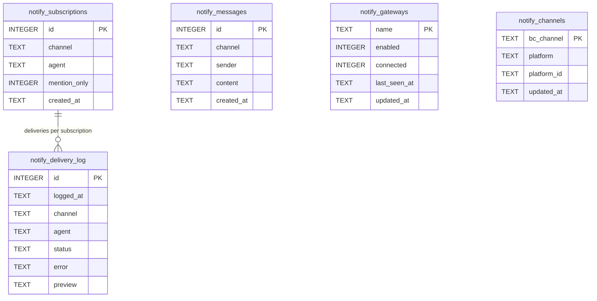
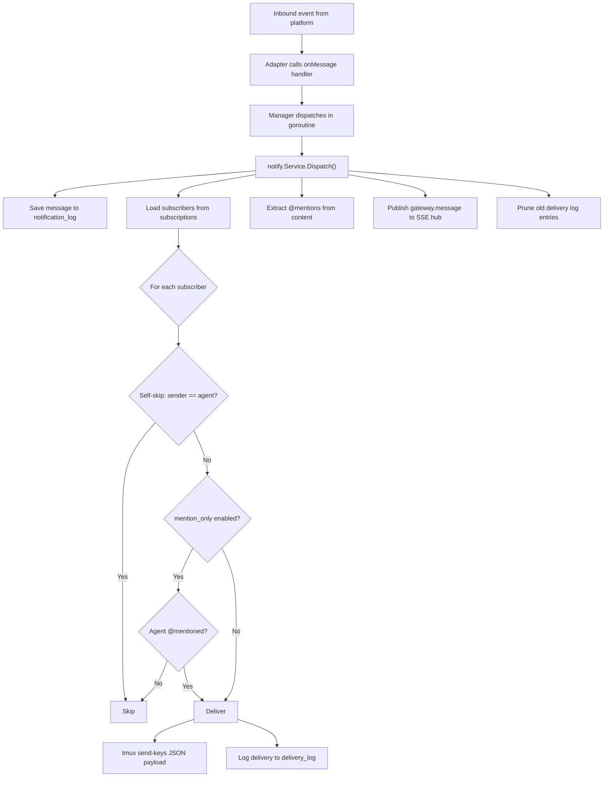
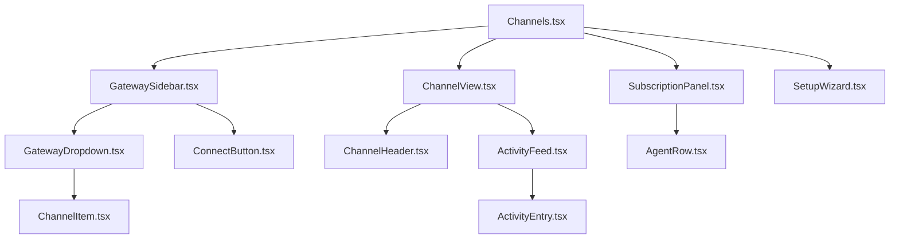

# Notifications

Notifications bridge external platforms (Slack, Telegram, Discord, WhatsApp, GitHub, and 30+ others) to bc agents. Each adapter follows a three-part pattern: **Connect** (authenticate with the platform), **Listen** (receive real-time events), and **API Proxy** (expose the platform's native API to agents).

## Architecture

Each adapter follows a simple 3-part pattern:

### 1. Connect

Authenticate with the platform (token, QR code, OAuth). The adapter stores only credentials and session state. Everything else comes from the platform API at runtime.

### 2. Listen

Receive real-time events via one of three transport patterns. Forward each event as `Notification{Raw JSON}` -- no parsing, no platform-specific data models. The agent gets the full platform payload.

### 3. API Proxy

Expose the platform's native API via `/api/gateways/{platform}/api/*`. Agents call platform APIs through this proxy (send messages, upload files, list channels, etc.). There are no `Send`/`SendFile`/`React` methods on the adapter interface. The proxy passes through auth headers from stored credentials.



All adapters follow one of three transport patterns:

| Pattern | Examples | Mechanism |
|---------|----------|-----------|
| **Socket** | Slack, Discord, Telegram, WhatsApp, IRC, Mattermost, MQTT | Long-lived connection. `Start()` blocks, events stream in. |
| **Webhook** | GitHub, Generic Webhook | bc exposes an HTTP endpoint. The platform POSTs events. |
| **Poll** | RSS, Matrix, Reddit, Twitter | Timer-based fetch. `Start()` polls on interval, forwards new items. |

## NotificationAdapter Interface

Every platform adapter implements this interface. The interface is intentionally minimal -- adapters connect, listen, and expose an HTTP handler for webhooks and API proxy. There are no platform-specific send/reply methods.

```go
// Located in: pkg/gateway/gateway.go

type AdapterType string

const (
    AdapterSocket  AdapterType = "socket"   // long-lived connection (WebSocket, polling loop)
    AdapterWebhook AdapterType = "webhook"  // HTTP endpoint -- platform POSTs events to bc
    AdapterPoll    AdapterType = "poll"      // timer-based polling -- bc fetches new events
)

type NotificationAdapter interface {
    Name() string                                            // adapter identifier ("slack", "github", "telegram")
    Type() AdapterType                                       // socket, webhook, or poll
    Start(ctx context.Context, handler func(Notification)) error  // connect + listen; blocks until ctx canceled
    Stop() error                                             // graceful disconnect
    Channels() []ChannelInfo                                 // from platform API, not stored history
    Status() AdapterStatus                                   // connection state for web UI
    HTTPHandler() http.Handler                               // for webhooks + API proxy
}

type AdapterStatus struct {
    Connected     bool      `json:"connected"`
    Error         string    `json:"error,omitempty"`
    BotName       string    `json:"bot_name,omitempty"`
    LastMessageAt time.Time `json:"last_message_at,omitempty"`
    MessageCount  int64     `json:"message_count"`
}

type ChannelInfo struct {
    ID       string `json:"id"`       // platform channel ID
    Name     string `json:"name"`     // human-readable name
    Platform string `json:"platform"` // adapter name
}
```

Key design decisions:

- **No Send/SendFile/React methods.** Agents interact with platforms through the API proxy at `/api/gateways/{platform}/api/*`, which forwards requests using stored credentials.
- **Channels() queries the platform API live**, not a stored message history. The web UI sidebar shows channels/groups from this method.
- **HTTPHandler() serves double duty** for webhook adapters (receiving inbound events) and all adapters (API proxy pass-through).

## Notification Data Model

Each notification wraps the complete platform payload as raw JSON. Agents parse what they need. This avoids maintaining platform-specific data models and gives agents full context (files, reactions, threads, metadata).

```go
// Located in: pkg/gateway/gateway.go

type Notification struct {
    Timestamp time.Time       `json:"timestamp"` // when bc received the event
    Raw       json.RawMessage `json:"raw"`       // ENTIRE platform payload — no parsing
    Channel   string          `json:"channel"`   // "engineering", "bc-repo", "general"
    Platform  string          `json:"platform"`  // "slack", "github", "telegram"
    Sender    string          `json:"sender"`    // extracted for self-skip filtering
    Content   string          `json:"content"`   // human-readable text for display/storage
    Mentions  []string        `json:"mentions"`  // extracted @mentions for mention_only filter
}
```

| Field | Purpose |
|-------|---------|
| `Channel` | Channel name within the platform (e.g., `"engineering"`). Combined with `Platform` for subscription lookup as `platform:channel`. |
| `Platform` | Platform identifier. Matches adapter `Name()`. |
| `Sender` | Extracted from raw payload (one field per adapter). Used for self-skip filtering. |
| `Content` | Human-readable text extracted by the adapter for display and storage. Falls back to raw JSON. |
| `Mentions` | Extracted via regex `@[a-zA-Z][a-zA-Z0-9_-]*` across the raw JSON bytes. Used for `mention_only` filtering. |
| `Timestamp` | When bc received the event. |
| `Raw` | Complete platform payload, unmodified. The agent receives the full JSON and parses what it needs. |

Example notification delivered to an agent:

```json
{
  "timestamp": "2026-04-18T10:32:15Z",
  "channel": "engineering",
  "platform": "slack",
  "sender": "bob",
  "mentions": ["eng-01"],
  "raw": {
    "type": "message",
    "channel": "C0ABC123",
    "user": "U0DEF456",
    "text": "@eng-01 take a look at PR #428",
    "ts": "1712657535.000200",
    "team": "T0GHI789"
  }
}
```

## Multi-Bot Support

A single platform supports multiple adapter instances, each with its own credentials and channels. The adapter `Name()` uses a `platform:label` convention:

```
telegram              → default Telegram bot
telegram:trade        → trade research bot
slack                 → main workspace bot
slack:personal        → personal workspace bot
github:bc             → bc repo webhooks
github:trade          → trade repo webhooks
```

The gateway manager registers each as a separate adapter. Subscriptions reference the full name (e.g., `telegram:trade:chat_group`), so agents subscribe to specific bots. Credentials are stored per-instance in workspace secrets.

## Platform Integrations

### Working Adapters

These adapters use real platform SDKs and are fully functional.

| # | Platform | Transport | SDK / Library | Status |
|---|----------|-----------|---------------|--------|
| 1 | **Slack** | Socket Mode (WebSocket) | `slack-go/slack` | Working |
| 2 | **Telegram** | Bot API long-polling | `go-telegram-bot-api` | Working |
| 3 | **Discord** | Gateway WebSocket | `bwmarrin/discordgo` | Working |
| 4 | **WhatsApp** | Multi-device protocol | `whatsmeow` (QR pairing) | Working |
| 5 | **IRC** | IRC protocol | `ergochat/irc-go` | Working |
| 6 | **MQTT** | MQTT 3.1.1/5.0 | `eclipse/paho.mqtt.golang` | Working |
| 7 | **Mattermost** | WebSocket + REST | `gorilla/websocket` | Working |
| 8 | **GitHub** | Webhooks | Webhook handler | Working |
| 9 | **Generic Webhook** | HTTP POST | Webhook receiver | Working |
| 10 | **RSS/Atom** | HTTP polling | HTTP client | Working |
| 11 | **Matrix** | Client-Server API polling | HTTP client | Working |
| 12 | **Reddit** | Reddit API polling | HTTP client | Working |
| 13 | **Twitter/X** | Twitter API v2 polling | HTTP client | Working |

### Coming Soon

These adapters have scaffolding but are not yet connected to real platform SDKs.

| Platform | Transport | Notes |
|----------|-----------|-------|
| Signal | signal-cli bridge | Stub |
| Line | Messaging API | Stub |
| Feishu/Lark | Event Subscription | Stub |
| Google Chat | Chat API + Pub/Sub | Stub |
| Microsoft Teams | Bot Framework | Stub |
| GitLab | Webhooks | Stub |
| Bitbucket | Webhooks | Stub |
| Jira | Webhooks | Stub |
| Linear | Webhooks | Stub |
| Sentry | Webhooks | Stub |
| PagerDuty | Webhooks | Stub |
| Datadog | Webhooks | Stub |
| Grafana | Webhooks | Stub |
| Stripe | Webhooks | Stub |
| Vercel | Webhooks | Stub |
| Netlify | Webhooks | Stub |
| Notion | Polling | Stub |
| Twitch | IRC + EventSub | Stub |
| Home Assistant | WebSocket + REST | Stub |
| Nostr | NIP-04 DMs | Stub |
| iMessage | BlueBubbles | Stub |

## Credential Management

Credentials flow from the web UI through encrypted storage into the adapter. Agents access platform APIs through the API proxy -- they do not need credentials in their environment.



1. The user enters platform credentials in the web UI setup wizard.
2. `POST /api/secrets` encrypts them with AES-256-GCM via `pkg/secret`.
3. When the adapter starts, it authenticates with the platform using stored credentials.
4. Agents call platform APIs through the API proxy at `/api/gateways/{platform}/api/*`.
5. The proxy injects stored credentials into outbound requests.

Secrets are never stored in `settings.json`, never transmitted via SSE events, and never exposed in API responses.

| Platform | Setup Steps |
|----------|-------------|
| **Slack** | Create app at api.slack.com > Enable Socket Mode > Add scopes (`channels:read`, `chat:write`, `connections:write`) > Copy bot token + app token > Invite bot to channels |
| **Telegram** | Message @BotFather `/newbot` > Copy bot token > Add bot to groups > Disable privacy mode (optional, for reading all group messages) |
| **Discord** | Create app at discord.com/developers > Enable `MESSAGE_CONTENT` intent > Copy bot token > Generate invite URL with required permissions > Add bot to server |
| **WhatsApp** | Scan QR code in the web UI to pair via whatsmeow multi-device protocol |
| **GitHub** | Create GitHub App or configure repository webhook > Select events (PR comments, reviews, issues, pushes) > Copy token and webhook secret |

## Agent Identity

Agents interact with platforms through the API proxy. Per-message identity depends on what the platform API supports:

| Platform | Per-Message Identity? | Mechanism |
|----------|----------------------|-----------|
| Slack | Yes | `username` parameter in `chat.postMessage` |
| Discord | Yes | `username` parameter in webhook execute |
| Mattermost | Yes | Bot API username parameter |
| Telegram | No (fixed bot name) | Agent prefixes message with `[agent-name]: ` |
| WhatsApp | No (fixed number) | Agent prefixes message text |
| GitHub | App-level | Comments appear as the GitHub App / token owner |

Identity instructions are injected into the agent's system prompt at startup. Agents know their own name via the `BC_AGENT_ID` environment variable and use it when calling the API proxy.

## Subscriptions

### Database Schema

Five tables track subscriptions, delivery, gateway state, and channel mappings.



### SQL DDL

```sql
CREATE TABLE IF NOT EXISTS notify_subscriptions (
    id           INTEGER PRIMARY KEY AUTOINCREMENT,
    channel      TEXT NOT NULL,          -- "slack:engineering", "telegram:bc-dev"
    agent        TEXT NOT NULL,
    mention_only INTEGER NOT NULL DEFAULT 0,
    created_at   TEXT NOT NULL DEFAULT (strftime('%Y-%m-%dT%H:%M:%SZ', 'now')),
    UNIQUE(channel, agent)
);

CREATE TABLE IF NOT EXISTS notify_messages (
    id         INTEGER PRIMARY KEY AUTOINCREMENT,
    channel    TEXT NOT NULL,
    sender     TEXT NOT NULL,
    content    TEXT NOT NULL,
    created_at TEXT NOT NULL DEFAULT (strftime('%Y-%m-%dT%H:%M:%SZ', 'now'))
);

CREATE TABLE IF NOT EXISTS notify_delivery_log (
    id        INTEGER PRIMARY KEY AUTOINCREMENT,
    logged_at TEXT NOT NULL DEFAULT (strftime('%Y-%m-%dT%H:%M:%SZ', 'now')),
    channel   TEXT NOT NULL,
    agent     TEXT NOT NULL,
    status    TEXT NOT NULL CHECK(status IN ('delivered', 'failed', 'pending')),
    error     TEXT,
    preview   TEXT
);

CREATE TABLE IF NOT EXISTS notify_gateways (
    name         TEXT PRIMARY KEY,
    enabled      INTEGER NOT NULL DEFAULT 0,
    connected    INTEGER NOT NULL DEFAULT 0,
    last_seen_at TEXT,
    updated_at   TEXT NOT NULL DEFAULT (strftime('%Y-%m-%dT%H:%M:%SZ', 'now'))
);

CREATE TABLE IF NOT EXISTS notify_channels (
    bc_channel   TEXT PRIMARY KEY,
    platform     TEXT NOT NULL,
    platform_id  TEXT NOT NULL,
    updated_at   TEXT NOT NULL DEFAULT (strftime('%Y-%m-%dT%H:%M:%SZ', 'now'))
);
```

| Table | Purpose |
|-------|---------|
| `notify_subscriptions` | Maps agents to notification channels. `UNIQUE(channel, agent)`. |
| `notify_messages` | Stores inbound messages for the web UI activity feed. |
| `notify_delivery_log` | Records every delivery attempt per agent (delivered/failed/pending). |
| `notify_gateways` | Persists gateway adapter state (enabled, connected) across restarts. |
| `notify_channels` | Maps bc channel names to platform channel IDs for routing. |

### Retention Policy

| Rule | Value |
|------|-------|
| Max entries per source | 1,000 (oldest pruned on insert) |
| TTL | 7 days (entries older than 7d pruned on schedule) |
| `delivery_log` retention | 1,000 per source, same TTL |

Pruning runs on a periodic timer (every hour). Both limits apply -- whichever triggers first.

## Dispatch

The dispatch pipeline handles self-skip filtering, mention filtering, and delivery logging in a single pass.



**Self-skip** prevents agents from receiving their own messages echoed back by the platform. Each adapter extracts the sender with a single field lookup (`event.User` for Slack, `message.From.UserName` for Telegram, `message.Author.ID` for Discord). The `[platform] ` prefix is stripped before comparison.

**Mention filtering** controls whether an agent receives all messages or only those containing `@agent-name`:

| Setting | Behavior | Use Case |
|---------|----------|----------|
| `mention_only = false` (default) | Agent receives all messages in the channel | Small or focused channels |
| `mention_only = true` | Agent receives messages containing `@<agent-name>` | Noisy channels |

Settings are per-agent, per-channel.

## Web UI

### Notifications Settings Page

```
+-------------------+------------------------------------------+----------------------+
| GATEWAYS          |  slack:engineering                        | AGENTS               |
|                   |                                          |                      |
| > Slack       (3) |  10:32  alice                            | * eng-01  (engineer) |
|   #engineering  <-|  Can someone review PR #428?             |   [x] @mention only  |
|   #all-bc         |                                          |   [Remove]           |
|   #infra          |  10:32  bob                              |                      |
|                   |  @eng-01 take a look                     | * eng-02  (engineer) |
| > Telegram    (1) |  -> delivered to eng-01                  |   [ ] all messages   |
|   bc-dev          |                                          |   [Remove]           |
|                   |  10:35  eng-01                            |                      |
| > Discord     (1) |  Looking now, will review                | o lead-01 (lead)     |
|   #general        |  -> relayed to eng-02                    |   [Add]              |
|                   |                                          |                      |
| > GitHub      (0) |                                          | o root    (manager)  |
|   [Setup ->]      |                                          |   [Add]              |
|                   |                                          |                      |
| + Connect app     |                                          | * = online  o = off  |
+-------------------+------------------------------------------+----------------------+
```

| Panel | Content |
|-------|---------|
| **Left sidebar** | Connected apps listed by platform icon + bot/server name (from `adapter.Channels()`). Channels/groups come from the platform API, not stored message history. Per-platform UI renderers for activity (WhatsApp shows contacts/groups, Slack shows threads, Discord shows servers). Unconnected gateways show a "Setup" link. |
| **Main area** | Activity feed with delivery status badges. Polls every 5s and receives live SSE updates via `/api/events`. |
| **Right panel** | Agent list with online indicators, role badges, and `@mention` toggle. |

### SSE Events

| Event | Trigger |
|-------|---------|
| `gateway.message` | New inbound message -- appends to activity feed |
| `gateway.delivery` | Delivery status update (delivered/failed) |
| `gateway.connected` | Adapter connected to platform |
| `gateway.disconnected` | Adapter lost connection |

### Component Tree



## Adding a New Adapter

1. Create the adapter file at `pkg/gateway/<platform>/<platform>.go`.

2. Implement the three-part pattern:

```go
package myplatform

import (
    "context"
    "net/http"
    "github.com/rpuneet/bc/pkg/gateway"
)

type Adapter struct {
    token     string
    connected bool
    count     int64
}

func New(token string) *Adapter {
    return &Adapter{token: token}
}

func (a *Adapter) Name() string          { return "myplatform" }
func (a *Adapter) Type() gateway.AdapterType { return gateway.AdapterSocket }

// Connect + Listen: authenticate, then forward raw events
func (a *Adapter) Start(ctx context.Context, handler func(gateway.Notification)) error {
    // Connect to the platform using a.token
    // ...
    for {
        select {
        case <-ctx.Done():
            return nil
        case event := <-a.events:
            raw, _ := json.Marshal(event)
            handler(gateway.Notification{
                Channel:   extractChannel(event),
                Platform:  "myplatform",
                Sender:    extractSender(event),
                Timestamp: time.Now(),
                Raw:       raw,  // full platform payload, no parsing
            })
        }
    }
}

func (a *Adapter) Stop() error { return a.conn.Close() }

// Channels from the platform API (live query, not stored history)
func (a *Adapter) Channels() []gateway.ChannelInfo { return a.queryPlatformChannels() }

func (a *Adapter) Status() gateway.AdapterStatus {
    return gateway.AdapterStatus{Connected: a.connected, MessageCount: a.count}
}

// API Proxy: forward /api/gateways/myplatform/api/* to the platform
func (a *Adapter) HTTPHandler() http.Handler {
    mux := http.NewServeMux()
    mux.HandleFunc("/api/", a.proxyToPlatform)
    return mux
}
```

3. Register the adapter in `server/server.go`:

```go
adapter := myplatform.New(token)
gatewayMgr.Register(adapter)
```

4. Add the platform to the [Platform Integrations](#platform-integrations) table and the setup wizard.

## API Reference

All endpoints are served by bcd at `http://127.0.0.1:9374`. No authentication (localhost-only).

### Gateway Management

```
GET    /api/gateways                                              -- list all gateways + status
PATCH  /api/gateways/{platform}                                   -- update tokens/settings
GET    /api/gateways/{platform}/health                            -- live connection probe
GET    /api/gateways/{platform}/channels                          -- discovered channels (from platform API)
GET    /api/gateways/{platform}/channels/{channel}                -- channel detail + subscribers
*      /api/gateways/{platform}/api/*                             -- API proxy (pass-through to platform)
```

### Agent Subscription Management

Gateway-scoped routes:

```text
GET    /api/notify/subscriptions                         -- list all subscriptions
POST   /api/notify/subscriptions                         -- subscribe agent {channel, agent, mention_only}
GET    /api/notify/subscriptions/{channel}               -- list subscribers for channel
DELETE /api/notify/subscriptions/{channel}?agent={agent} -- unsubscribe agent
PATCH  /api/notify/subscriptions/{channel}               -- update subscription (toggle mention_only)
GET    /api/notify/activity/{channel}                    -- delivery log entries
GET    /api/gateways/activity                            -- aggregated activity across all gateways
```

### Activity Feed

```
GET    /api/gateways/activity                                     -- aggregate activity across all gateway channels
GET    /api/channels                                              -- legacy channel list (gateway + subscribed)
GET    /api/channels/{name}/history                               -- legacy message history
```

## Package Reference

| Package | Purpose |
|---------|---------|
| [`pkg/gateway/`](../../pkg/gateway/README.md) | Adapter interface, Manager, 34 platform adapters (13 working, 21 coming soon) |
| [`pkg/notify/`](../../pkg/notify/README.md) | Notification types, Store (SQLite/Postgres), Service (dispatch + subscription management) |
| `pkg/secret/` | AES-256-GCM encrypted credential storage |
| `server/handlers/` | REST API handlers for gateway and subscription management |

## What's Next

- [Agent Lifecycle](../explanation/agents.md) -- how agents start, receive credentials, and run
- [MCP Protocol](../explanation/mcp.md) -- Model Context Protocol integration
