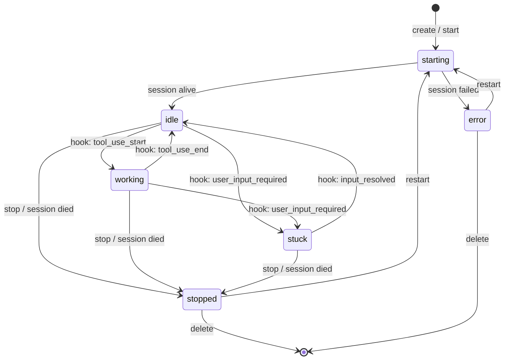
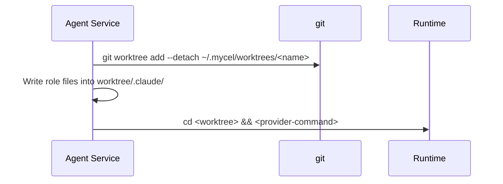
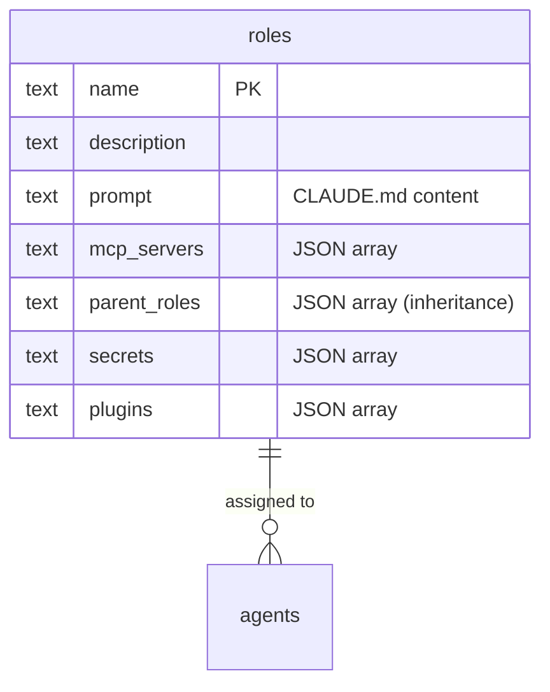

# Agent Architecture

## What is an Agent?

An AI coding assistant running in an isolated tmux session or Docker container with its own git worktree. Each agent has a globally unique name, a role (defining its prompt and tool access), a repo (the absolute path of the git repository it works on), and optionally belongs to teams.

## State Machine



| State | Meaning |
|-------|---------|
| starting | Session being created, provider launching |
| idle | Running, waiting for input |
| working | Actively using a tool (edit, search, bash) |
| stuck | Waiting for user input (permission prompt, question) |
| stopped | Session terminated |
| error | Failed to start or unrecoverable |

## Runtime Backends

### Tmux

Local tmux sessions. Named with the `mycel-` prefix plus a short hash of
the repo path, so agents on different repos never collide:

```
mycel-<repo-hash6>-<agent>
Example: mycel-a3f2c1-eng-01
```

| Operation | Implementation |
|-----------|---------------|
| Create | `tmux new-session -d -s <name> -x 200 -y 50` |
| Send | `tmux send-keys -l -- <text>` (literal, safe) |
| Read | `tmux capture-pane -p -t <name> -S -<lines>` |
| Log | `tmux pipe-pane -t <name> 'cat >> <logfile>'` |
| Stop | `tmux kill-session -t <name>` |

Messages >500 chars use `load-buffer` + `paste-buffer`.

### Docker

Isolated containers with tmux inside. Same naming:

```
mycel-<repo-hash6>-<agent>
```

| Setting | Default |
|---------|---------|
| Image | `mycel-agent-<tool>:latest` (default: `mycel-agent-claude:latest`) |
| CPUs | 2.0 |
| Memory | 2048 MB |
| Network | bridge |
| Volumes | repo (rw), auth dir -> `/home/agent/.claude/` |

Communication: `docker exec ... tmux send-keys`.

## Worktree Management

mycel creates and manages git worktrees for ALL providers uniformly. No provider uses its own worktree flag (avoids nesting).

Worktrees live at `~/.mycel/worktrees/<agent-name>/`, checked out from
the agent's repo. Agent state (Claude config, session logs) lives
separately at `~/.mycel/agents/<agent-name>/`. Agent names are globally
unique (database primary key), so flat name-keyed directories are safe.
Worktrees are created with `--detach`, so the agent checks out a
detached HEAD and no branch is created for it.

Agents created under the previous nested layout
(`~/.mycel/workspaces/<id>/agents/<name>/bc-<repo>-<agent>/`) keep
working from their stored worktree path until migrated with
`scripts/migrate-worktree-layout.sh`.

### Flow



### Lifecycle

| Event | Worktree Action |
|-------|-----------------|
| Create | `git worktree prune` + `git worktree add --detach` from the agent's repo |
| Restart | `cd <existing-worktree> && <command>` (persists) |
| Stop | Nothing — worktree stays |
| Delete | `git worktree remove --force` (detached HEAD — no branch to delete) |

### Provider Commands

All started with `cd <worktree> && <command>`:

| Provider | Command |
|----------|---------|
| Claude | `claude --dangerously-skip-permissions` (no `-w` — mycel owns the worktree) |
| Gemini | `gemini --yolo` |
| Cursor | `cursor-agent` |
| Codex | `codex --full-auto` |
| Pi | `pi` |

### Session Resume

On stop, mycel captures Claude's UUID from output (`claude --resume <uuid>` pattern). On restart:

```
cd <worktree> && claude --resume <uuid>
```

Validation: `len == 36 && sessionID[8] == '-'`.

## Roles

Stored in the `roles` table. No markdown files on disk. The table is keyed
by role name; MCP servers, parent roles, secrets, and plugins are JSON
columns on the row itself (no join tables):



Additional columns hold settings, rules, agents, skills, commands,
lifecycle prompts (`prompt_create`/`prompt_start`/`prompt_stop`/
`prompt_delete`), `review`, `cli_tools`, and timestamps.

### Role Setup on Agent Create

1. Read role from DB
2. Write CLAUDE.md from `roles.prompt` -> auth dir
3. Write settings.json from `roles.settings` -> auth dir
4. Write .mcp.json from `roles.mcp_servers` -> auth dir
5. Write command/skill/rule files from BLOBs -> worktree `.claude/`
6. Resolve `${secret:NAME}` in MCP env vars

### CRUD via API

| Method | Path | Action |
|--------|------|--------|
| POST | `/api/roles` | Create |
| GET | `/api/roles` | List |
| GET | `/api/roles/{name}` | Get with full prompt/settings |
| PUT | `/api/roles/{name}` | Update |
| DELETE | `/api/roles/{name}` | Delete (agents keep config) |

## Notification Delivery

Agents receive notifications from external platforms via `tmux send-keys` -- the only mechanism to inject into a running session. Notifications are delivered as JSON payloads containing both normalized fields (`channel`, `platform`, `sender`, `content`, `mentions`) and a `raw` field with the complete platform-specific JSON payload as received from the gateway adapter.

Agents subscribe to notification sources (`platform:channel`) and can filter with `mention_only` to receive only events where they are @mentioned.

On delivery failure: logged to `notify_delivery_log` with status `failed` and the error message. There is no automatic retry -- failed deliveries are recorded for observability and the next inbound message will attempt delivery independently.
