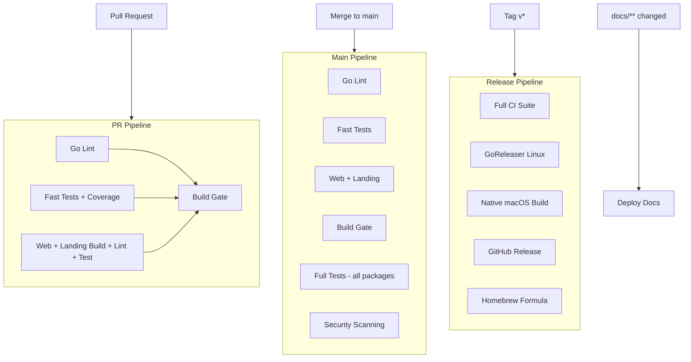
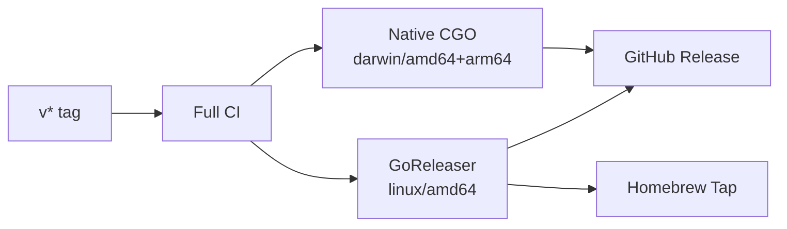

# CI/CD Pipeline Architecture

## Pipeline Overview

## PR Pipeline (blocking, ~90s)

| Job | Duration | What | Blocks merge? |
|-----|----------|------|---------------|
| Lint | ~35s | `golangci-lint` (new issues only) | Yes |
| Test | ~90s | Fast packages + race + 35% coverage threshold | Yes |
| Web / Landing | ~45s | `bun lint + test + build` for each | Yes |
| Build | ~15s | `make release-local-mycel` + verify binary runs | Yes |
| PR Quality | ~5s | Title/description/issue checks | No |

### Excluded from PR (speed optimization)
- `pkg/tmux` (live tmux sessions)
- `pkg/secret` (PBKDF2 crypto)
- `pkg/doctor` (system checks)
- `internal/cmd` (slow E2E command suite)
- Security scanning (govulncheck + gitleaks)

## Main Pipeline (after merge, ~5m)

Includes everything from PR pipeline plus:

| Job | Duration | Blocking |
|-----|----------|----------|
| Full Tests | ~5m | No (independent) |
| Security | ~3m | No (continue-on-error) |

## Release Pipeline (tag push)

| Platform | Architecture | CGO | Method |
|----------|-------------|-----|--------|
| Linux | amd64 | Yes | GoReleaser |
| macOS | amd64 + arm64 | Yes | Native build |

## Deployment

| Target | Trigger | Platform |
|--------|---------|----------|
| Docs | `docs/**` push to main | GitHub Pages (MkDocs) via `pages.yml` |
| Landing (with embedded docs) | Every push to main | Cloudflare Pages via `wrangler` in `cd-main.yml` (not the Pages GitHub-app builder) |
| Docker image | Every push to main | GHCR: `ghcr.io/rpuneet/mycel:main` (+ `:main-<sha>`) via `cd-main.yml` |
| npm package | After a successful release (or manual) | npm via `cd-npm.yml` |

## Test Strategy

| Tier | Packages | When | Duration |
|------|----------|------|----------|
| Fast unit | All except slow | Every PR | ~90s |
| Web / Landing | TypeScript tests (vitest) | Every PR | ~45s |
| Full | All packages | Main only | ~5m |
| Security | govulncheck + gitleaks | Main only | ~3m |
| E2E | Live agents (future) | Main only | ~10m |

### Coverage

| Metric | Value |
|--------|-------|
| Current threshold | 35% (fast test subset) |
| Target | 90%+ |
| Measured on | Fast tests (PR pipeline); full suite runs on main |
| Reporting | Codecov |

## Caching

| Cache | Key | Mechanism |
|-------|-----|-----------|
| Go modules | `go.sum` hash | `setup-go cache: true` |
| golangci-lint | Config + source hash | Built-in action cache |
| Bun deps | `bun.lock` hash | Future: `actions/cache` |

## Secrets

| Secret | Used By | Purpose |
|--------|---------|---------|
| `GITHUB_TOKEN` | All workflows | Checkout, releases, GHCR push, gitleaks |
| `HOMEBREW_TAP_TOKEN` | Release | Push formula to tap repo |
| `CLOUDFLARE_API_TOKEN` / `CLOUDFLARE_ACCOUNT_ID` | CD (main), Cloudflare Pages git controls | `wrangler pages deploy` for the landing site; optional `workflow_dispatch` to disable Pages GitHub-app preview builds (`cloudflare-pages-git.yml`, see #3452) |
| `NPM_TOKEN` | CD (npm) | Publish the npm package |

## Workflow Files

| File | Trigger | Purpose |
|------|---------|---------|
| `ci.yml` | Push main, PRs | Core CI pipeline (lint, tests, web/landing, build; full tests + security + container scan on main) |
| `pr-quality.yml` | PRs | Advisory quality checks |
| `cd-main.yml` | Every push to main | Publish Docker `:main` images to GHCR + deploy landing (with embedded docs) to Cloudflare Pages via `wrangler` |
| `cloudflare-pages-git.yml` | Manual (`workflow_dispatch`) | Patch Pages project: turn off GitHub-app preview/production git builds so PRs stop getting a red "Cloudflare Pages" check (#3452). Wrangler CD unchanged. |
| `cd-npm.yml` | After a successful Release run, or manual dispatch | Publish the npm package |
| `release.yml` | Tag `v*` or manual dispatch | Build + publish releases (Linux GoReleaser, native macOS, Homebrew formula, SBOM) |
| `pages.yml` | Push main (docs paths) | Build MkDocs site and deploy to GitHub Pages |
| `security-nightly.yml` | Nightly schedule (2 AM UTC) or manual | govulncheck, gitleaks, CodeQL, Trivy |