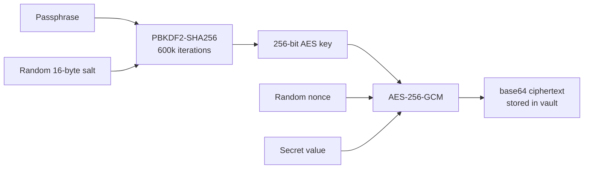

# Database Architecture

## Overview

mycel uses two storage backends behind a single abstraction:

- **SQLite** (default) — zero-configuration, local-first. The shared workspace database lives at `<workspace>/.bc/bc.db`.
- **TimescaleDB** (Postgres 17) — implemented and shipping as the `mycel-bcdb` Docker image (`timescale/timescaledb:2.19.1-pg17`). Selected via config or environment (see below).

There is deliberately no single global database. Data is split by scope:

| Scope | Location | Contents |
|-------|----------|----------|
| Workspace | `<workspace>/.bc/bc.db` | Shared workspace DB: notifications, cron, MCP servers, tools, events, roles |
| Per-workspace runtime | `~/.mycel/workspaces/<id>/` | Agent state dirs, per-workspace `costs.db` |
| User-global | `~/.mycel/` | `secrets.vault` (SQLite vault), `costs.db` (cross-workspace ledger), `workspaces.json` registry, `mcps.json`, `tools.json`, `daemon.{pid,log,addr}` |

`~/.mycel/` is resolved by `pkg/workspace.MycelHome()`: `MYCEL_HOME` env var, then `BC_HOME` (deprecated), then `~/.mycel/`, with a one-time migration from a legacy `~/.bc/` tree. Known consolidation work is tracked in issues #3237 and #3238 (folding the remaining per-concern DB files into the shared workspace DB).

## Backend Selection

`pkg/db/unified.go` (`OpenWorkspaceDBWithConfig`) picks the backend at startup:

1. **`DATABASE_URL` env var** — Postgres/TimescaleDB override for Docker and CI.
2. **`settings.json` `storage.default`** — `"timescale"` (legacy value `"sql"` also accepted) connects using `storage.timescale.{host,port,user,password,database}`; the password falls back to `BC_DB_PASSWORD`. If TimescaleDB is unreachable, the daemon logs a warning and falls back to SQLite rather than starting with nil stores.
3. **SQLite default** — `<workspace>/.bc/bc.db` (path overridable via `storage.sqlite.path`).

## Shared Connection

One connection is opened at startup and registered via `db.SetShared(db, driver)`; the driver string is `"sqlite"` or `"timescale"`. Stores (`pkg/notify`, `pkg/cron`, `pkg/mcp`, `pkg/tool`, `pkg/events`, `pkg/workspace` roles, `pkg/cost`) retrieve it with `db.Shared()` / `db.SharedWrapped()` and never open the same file twice. Stores fall back to opening a dedicated file only when no shared connection is set (e.g., short-lived CLI paths).

```mermaid
graph LR
    subgraph "mycel process"
        S["db.SetShared() at startup"]
        N[notify store]
        C[cron store]
        M[mcp store]
        T[tool store]
        E[events store]
        R[role store]
    end
    S --> DB["<workspace>/.bc/bc.db (SQLite WAL)<br/>or TimescaleDB"]
    N & C & M & T & E & R -->|db.Shared()| S
```

## SQLite Connection Settings

From `pkg/db/db.go` (`Open` + pragmas):

| Setting | Value | Rationale |
|---------|-------|-----------|
| Journal mode | WAL | Concurrent readers + single writer |
| Foreign keys | ON (connection string) | Referential integrity |
| Busy timeout | 30,000 ms | Handle concurrent agent access |
| Synchronous | NORMAL | Safe with WAL; avoids unnecessary fsync |
| Cache size | 2,000 KB (2 MB) | Reasonable for local workload |
| Temp store | MEMORY | Faster temp table operations |
| mmap_size | 268435456 (256 MB) | Memory-mapped reads |
| Connection pool | `MaxOpenConns=1`, `MaxIdleConns=1` | SQLite's single-writer model — one connection, no separate read pool |

## Schema Management

There is no migration framework. Every store owns its schema and creates it idempotently at startup with `CREATE TABLE IF NOT EXISTS` (each store's `InitSchema()`), with driver-appropriate column types — e.g. `TIMESTAMPTZ DEFAULT NOW()` on TimescaleDB vs `TEXT`/`INTEGER` timestamps on SQLite. Schema changes are additive; column additions use guarded `ALTER TABLE` where needed.

The TimescaleDB image additionally seeds `docker/bcdb/init.sql` (relational tables plus hypertables) on first container start.

## Roles: JSON Columns, Not Join Tables

Roles are a single table (`pkg/workspace/role_store.go`). List- and map-valued fields are JSON-encoded TEXT columns — there are no `role_mcp_servers` / `role_secrets` join tables:

```
roles(
  name PRIMARY KEY, description, prompt,
  mcp_servers '[]', parent_roles '[]', secrets '[]', plugins '[]', cli_tools '[]',
  settings '{}', rules '{}', agents '{}', skills '{}', commands '{}',
  prompt_create, prompt_start, prompt_stop, prompt_delete, review,
  created_at, updated_at
)
```

The same JSON-column pattern applies elsewhere (provider settings, tool metadata). This keeps reads single-row and writes atomic at the cost of not being able to query membership relationally — acceptable at workspace scale.

## Main Table Groups

| Group | Store | Tables (representative) |
|-------|-------|------------------------|
| Notifications | `pkg/notify` | `notify_subscriptions`, `notify_messages`, `notify_delivery_log`, `notify_gateways`, `notify_channels` |
| Cron | `pkg/cron` | `cron_jobs`, `cron_logs` |
| MCP | `pkg/mcp` | `mcp_servers` |
| Tools | `pkg/tool` | tool registry tables |
| Events | `pkg/events` | event log |
| Roles | `pkg/workspace` | `roles` |
| Costs | `pkg/cost` | cost records (shared DB on TimescaleDB; dedicated `costs.db` fallback on SQLite) |
| Secrets | `pkg/secret` | encrypted secret rows in `~/.mycel/secrets.vault` |

Timestamp conventions vary by store: most tables use `INTEGER` Unix milliseconds; the notification tables use `TEXT` ISO 8601 on SQLite and `TIMESTAMPTZ` on TimescaleDB.

## TimescaleDB Backend

Postgres support is not planned — it exists:

- `pkg/db/postgres.go` — connection handling, `DATABASE_URL` / DSN construction.
- Per-store Postgres implementations: `pkg/cost/store_postgres.go`, `pkg/cron/store_postgres.go`, `pkg/events/store_postgres.go`, `pkg/mcp/store_postgres.go`, `pkg/secret/store_postgres.go`, `pkg/tool/store_postgres.go`; the role store switches dialect on the shared driver string.
- `docker/Dockerfile.bcdb` builds `mycel-bcdb` from `timescale/timescaledb:2.19.1-pg17` (`POSTGRES_USER=bc`, `POSTGRES_DB=bc`, password injected at runtime; `pg_isready` healthcheck baked in).
- Time-series data (costs, events) uses TimescaleDB hypertables; relational tables are plain Postgres.

## Filesystem Layout

```
~/.mycel/                       # MycelHome (MYCEL_HOME overrides; legacy ~/.bc/ honored)
  workspaces.json               # Workspace registry
  secrets.vault                 # User-global secret vault (SQLite, encrypted values)
  costs.db                      # Cross-workspace cost ledger (records tagged workspace_id)
  mcps.json                     # User-global MCP server config
  tools.json                    # User-global tool registry
  templates/                    # User-global templates
  daemon.pid / daemon.log / daemon.addr   # Server process state
  workspaces/<id>/              # Per-workspace runtime dir (pkg/workspace.DataDir)
    agents/<name>/
      claude/                   # Provider state (mounted into containers as ~/.claude)
      claude.json               # Provider app config (auth persistence)
    costs.db                    # Per-workspace cost data (SQLite mode)

<workspace>/.bc/                # Workspace sidecar (checked-out project)
  settings.json                 # Workspace config (v2 JSON)
  bc.db                         # Shared workspace database
  templates/                    # Workspace-scoped templates
```

## Secret Encryption



`pkg/secret/crypto.go`: PBKDF2-SHA256 with 600,000 iterations (OWASP 2023 guidance) derives an AES-256 key; values are sealed with AES-256-GCM, nonce prepended, base64-encoded. Secrets are layered by scope, with the user-global vault at `~/.mycel/secrets.vault`.

## Cost Data Pipeline

```mermaid
graph LR
    CLAUDE[Claude Code<br/>JSONL sessions] --> IMPORT[Cost Importer]
    IMPORT --> PARSE[Parse tokens<br/>+ model pricing]
    PARSE --> DB[(cost records)]
    DB --> API[/api/costs/*]
    API --> WEB[Web/TUI dashboards]
```

The importer scans agent provider state for session JSONL files, extracts token usage, applies model pricing, and inserts with watermark dedup. On TimescaleDB, cost records go to the shared DB (hypertable); on SQLite they live in the per-workspace `costs.db`, with the user-global `~/.mycel/costs.db` serving cross-workspace rollups.
