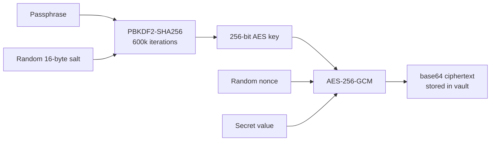

# Database Architecture

## Overview

mycel uses two storage backends behind a single abstraction:

- **SQLite** (default) — zero-configuration, local-first. The single global database lives at `~/.mycel/mycel.db`.
- **TimescaleDB** (Postgres 17) — implemented and shipping as the `mycel-bcdb` Docker image (`timescale/timescaledb:2.19.1-pg17`). Selected via config or environment (see below).

There is one global database. Isolation between repos comes from data keys (agent name, repo path), not from separate files:

| Scope | Location | Contents |
|-------|----------|----------|
| Global database | `~/.mycel/mycel.db` | Agents, roles, notifications, MCP servers, tools, events |
| Secrets | `~/.mycel/secrets.vault` | SQLite vault with encrypted values |
| Agent entities | `~/.mycel/agents/<name>/` | Worktree, session state, logs, tmp — everything one agent owns |

Costs are **not** stored in any database — they are computed on demand from provider session files (see [Cost Data Pipeline](#cost-data-pipeline)).

`~/.mycel/` is resolved by `pkg/home.MycelHome()`: the `MYCEL_HOME` env var when set, otherwise `~/.mycel/`.

## Backend Selection

`pkg/db/unified.go` (`OpenGlobalDBWithConfig`) picks the backend at startup:

1. **`DATABASE_URL` env var** — Postgres/TimescaleDB override for Docker and CI.
2. **`prefs.json` `storage.default`** — `"timescale"` connects using `storage.timescale.{host,port,user,password,database}`; the password falls back to `MYCEL_DB_PASSWORD`. If TimescaleDB is unreachable, the daemon logs a warning and falls back to SQLite rather than starting with nil stores.
3. **SQLite default** — `~/.mycel/mycel.db`. One process, one file: the `storage.sqlite.path` field is accepted for parsing but the database always lives at the global path.

## Shared Connection

`db.Global(cfg)` opens the process-wide handle lazily on first use and returns it together with the driver string (`"sqlite"` or `"timescale"`). Stores (`pkg/notify`, `pkg/mcp`, `pkg/tool`, `pkg/events`, roles, `pkg/cost`) all share this handle and never open the same file twice; the connection is cached for the life of the process and torn down only by `db.CloseGlobal()` at shutdown.

```mermaid
graph LR
    subgraph "mycel process"
        S["db.Global() — lazy, cached"]
        N[notify store]
        M[mcp store]
        T[tool store]
        E[events store]
        R[role store]
    end
    S --> DB["~/.mycel/mycel.db (SQLite WAL)<br/>or TimescaleDB"]
    N & C & M & T & E & R -->|db.Global()| S
```

## SQLite Connection Settings

From `pkg/db/db.go` (`Open` + pragmas):

| Setting | Value | Rationale |
|---------|-------|-----------|
| Journal mode | WAL | Concurrent readers + single writer |
| Foreign keys | ON (connection string) | Referential integrity |
| Busy timeout | 30,000 ms | Handle concurrent agent access |
| Synchronous | NORMAL | Safe with WAL; avoids unnecessary fsync |
| Cache size | 2,000 KB (2 MB) | Reasonable for local workload |
| Temp store | MEMORY | Faster temp table operations |
| mmap_size | 268435456 (256 MB) | Memory-mapped reads |
| Connection pool | `MaxOpenConns=1`, `MaxIdleConns=1` | SQLite's single-writer model — one connection, no separate read pool |

## Schema Management

There is no migration framework. Every store owns its schema and creates it idempotently at startup with `CREATE TABLE IF NOT EXISTS` (each store's `InitSchema()`), with driver-appropriate column types — e.g. `TIMESTAMPTZ DEFAULT NOW()` on TimescaleDB vs `TEXT`/`INTEGER` timestamps on SQLite. Schema changes are additive; column additions use guarded `ALTER TABLE` where needed.

The TimescaleDB image additionally seeds `docker/bcdb/init.sql` (relational tables plus hypertables) on first container start.

## Roles: JSON Columns, Not Join Tables

Roles are a single table (`pkg/home/role_store.go`). List- and map-valued fields are JSON-encoded TEXT columns — there are no `role_mcp_servers` / `role_secrets` join tables:

```
roles(
  name PRIMARY KEY, description, prompt,
  mcp_servers '[]', parent_roles '[]', secrets '[]', plugins '[]', cli_tools '[]',
  settings '{}', rules '{}', agents '{}', skills '{}', commands '{}',
  prompt_create, prompt_start, prompt_stop, prompt_delete, review,
  created_at, updated_at
)
```

The same JSON-column pattern applies elsewhere (provider settings, tool metadata). This keeps reads single-row and writes atomic at the cost of not being able to query membership relationally — acceptable at single-user scale.

## Main Table Groups

| Group | Store | Tables (representative) |
|-------|-------|------------------------|
| Notifications | `pkg/notify` | `notify_subscriptions`, `notify_messages`, `notify_delivery_log`, `notify_gateways`, `notify_channels` |
| MCP | `pkg/mcp` | `mcp_servers` |
| Tools | `pkg/tool` | tool registry tables |
| Events | `pkg/events` | event log |
| Roles | `pkg/home` | `roles` |
| Secrets | `pkg/secret` | encrypted secret rows in `~/.mycel/secrets.vault` |

Timestamp conventions vary by store: most tables use `INTEGER` Unix milliseconds; the notification tables use `TEXT` ISO 8601 on SQLite and `TIMESTAMPTZ` on TimescaleDB.

## TimescaleDB Backend

Postgres support is fully implemented:

- `pkg/db/postgres.go` — connection handling, `DATABASE_URL` / DSN construction.
- Per-store Postgres implementations: `pkg/cost/store_postgres.go`, `pkg/events/store_postgres.go`, `pkg/mcp/store_postgres.go`, `pkg/secret/store_postgres.go`, `pkg/tool/store_postgres.go`; the role store switches dialect on the shared driver string.
- `docker/Dockerfile.bcdb` builds `mycel-bcdb` from `timescale/timescaledb:2.19.1-pg17` (`POSTGRES_USER=bc`, `POSTGRES_DB=bc`, password injected at runtime; `pg_isready` healthcheck baked in).
- Time-series data (costs, events) uses TimescaleDB hypertables; relational tables are plain Postgres.

## Filesystem Layout

```
~/.mycel/                       # MycelHome (MYCEL_HOME overrides)
  prefs.json                    # The one config file mycel reads
  mycel.db                      # THE database: agents, roles, events, notify, mcp, tools
  secrets.vault                 # Secret vault (SQLite, encrypted values)
  mcps.json                     # Global MCP server config
  tools.json                    # Global tool registry
  templates/                    # Global agent templates
  agents/<name>/                # Agent entity dir — delete it, the agent's files are gone
    worktree/                   # Git worktree checkout
    session/                    # Provider session state (mounted into containers)
    logs/                       # Agent logs
    tmp/                        # Scratch space
  apps/<name>/                  # Per-app-instance state (e.g. WhatsApp pairing data)
  logs/                         # Server logs
  run/                          # daemon.pid / daemon.log / daemon.addr
```

## Secret Encryption



`pkg/secret/crypto.go`: PBKDF2-SHA256 with 600,000 iterations (OWASP 2023 guidance) derives an AES-256 key; values are sealed with AES-256-GCM, nonce prepended, base64-encoded. Secrets are layered by scope, with the user-global vault at `~/.mycel/secrets.vault`.

## Cost Data Pipeline

```mermaid
graph LR
    CLAUDE[Claude Code<br/>JSONL sessions] --> READER[Provider CostReader]
    READER --> PARSE[Parse tokens<br/>+ model pricing]
    PARSE --> SVC[pkg/cost Service<br/>60s cache]
    SVC --> API[/api/costs/*]
    API --> WEB[Web dashboard / CLI]
```

There is no cost database. `pkg/cost.Service` computes analytics directly from provider session files: providers that implement the `CostReader` capability (Claude Code today) scan their own session JSONL under the user home and under `~/.mycel/agents/<name>/session/`, extract token usage, and apply model pricing. Results are cached briefly (60 s TTL) and re-scanned on demand — nothing is imported, so there is no ledger to migrate and deleting an agent does not erase its history while the session files exist.
