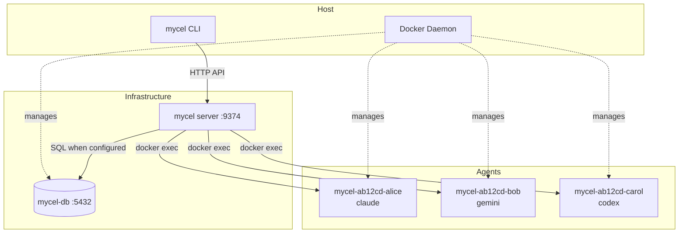
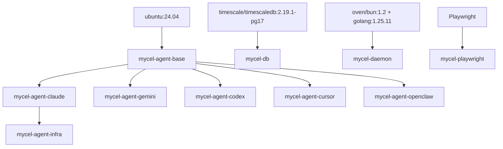
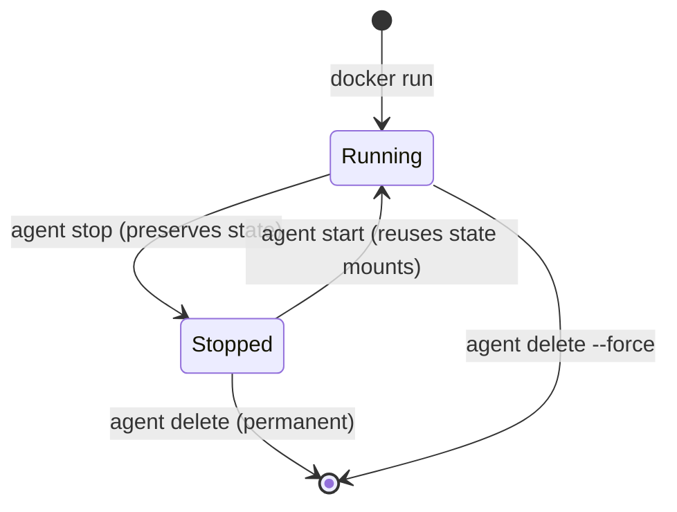

# Deployment Architecture

This document is the source of truth for how mycel's infrastructure is deployed. It covers the full stack: the server, the database (bcdb), agent containers, networking, volumes, and resource management.

## System Overview

A deployment has up to three tiers coordinated by the host's Docker daemon:

1. **mycel server** — `mycel up` serving the HTTP API and embedded web UI (host process, or the `mycel-daemon` container image)
2. **bcdb** — optional TimescaleDB database (`mycel-db`); SQLite is the default and needs no container
3. **Agent containers** — one per agent, each running a provider CLI inside tmux



## Docker Image Hierarchy

All agent images share a common base. Provider-specific images add only the CLI tool. Ground truth: `docker/` and the Makefile (`REGISTRY ?= mycel`, `AGENT_PROVIDERS := claude gemini codex cursor openclaw`).



| Image | Dockerfile | Purpose |
|-------|-----------|---------|
| `mycel-agent-base` | `docker/Dockerfile.base` | Shared developer tooling for all agents |
| `mycel-agent-claude/gemini/codex/cursor/openclaw` | `docker/Dockerfile.<provider>` | Base + one provider CLI |
| `mycel-agent-infra` | `docker/Dockerfile.infra` | Extends claude with infra tooling |
| `mycel-daemon` | `docker/Dockerfile.daemon` | Multi-stage: bun builds the web UI, Go 1.25.11 builds the binary |
| `mycel-db` | `docker/Dockerfile.db` | TimescaleDB (`POSTGRES_USER=mycel`, `POSTGRES_DB=mycel`, password at runtime), seeds `docker/db/init.sql` |
| `mycel-playwright` | `docker/Dockerfile.playwright` | Playwright MCP server (built separately) |

### Base Image (`docker/Dockerfile.base`)

| Component | Purpose |
|-----------|---------|
| Go 1.25.11 (`ARG GOVERSION`, SHA256-verified) | Build tools, Go-based tooling |
| Bun 1.2.15 (also symlinked as `node`/`npx`) | JS runtime for provider CLIs and tooling |
| tmux | Session management inside containers |
| git, gh, openssh-client | Version control, GitHub CLI |
| make, sqlite3, jq, curl, unzip | Utilities |
| locales, ncurses-term | UTF-8 + terminal support (`TERM=xterm-256color`, `COLORTERM=truecolor`) |

Runs as non-root user `agent` with `WORKDIR /workspace`.

### Container Naming

```
mycel-<repo-hash6>-<agent>
```

`repo-hash6` is the first 6 hex characters of the SHA-256 of the agent's repo path (`pkg/container/container.go`). Example: `mycel-a1b2c3-alice`.

### Container Lifecycle



## Volume Mounts

Ground truth: `pkg/container/container.go`. Agent state lives at `~/.mycel/agents/<name>/` on the host.

| Mount | Container path | Purpose |
|-------|---------------|---------|
| Agent's repo | `/workspace` | Full repo mounted so git worktrees resolve (`-w` is set to the agent's worktree subdirectory) |
| `<agent-dir>/claude/` | `/home/agent/.claude` | Persistent provider state across restarts |
| `<agent-dir>/claude.json` | `/home/agent/.claude.json` | Provider app config (OAuth account — auth persistence) |
| Named volume `mycel-shared-tmp` | `/tmp/mycel-shared` | Cross-container file exchange (e.g. Playwright screenshots) |
| `runtime.docker.extra_mounts` | as specified | User-defined mounts, validated against the repo root |

When the server itself runs in Docker (Docker-in-Docker), `MYCEL_HOST_WORKSPACE` supplies the host-side path so `-v` mounts resolve correctly.

## Network Topology

Default: the **`mycel-net`** Docker network (`runtime.docker.network` in prefs.json; the backend falls back to `bridge` when unset).

| Service | Port | Protocol |
|---------|------|----------|
| mycel server | 9374 (default `127.0.0.1`) | HTTP (REST + SSE + MCP) |
| bcdb | 5432 | PostgreSQL |

## Resource Limits

Defaults from `pkg/home/config.go`:

| Resource | Default | Config Key |
|----------|---------|-----------|
| CPUs | 2.0 | `runtime.docker.cpus` |
| Memory | 4096 MB | `runtime.docker.memory_mb` |
| Network | `mycel-net` | `runtime.docker.network` |
| Image | `mycel-agent-claude:latest` | `runtime.docker.image` |

## Health Checks

| Service | Method |
|---------|--------|
| mycel server | `GET /health` → `{"status":"ok"}` |
| bcdb | `pg_isready -U bc -d bc` (baked into the image) |
| Agents | `docker inspect` + `docker exec tmux list-sessions` |

## Local Dev (tmux mode)

Set `runtime.default = "tmux"` in prefs.json — agents run as tmux sessions on the host (prefix `mycel-`), no Docker needed, SQLite for all storage. This is the local development fallback; `docker` is the default runtime.
