# MCP Server Architecture

## Overview

mycel exposes a Model Context Protocol (MCP) server so AI agents can read system state and communicate through app channels. The server is built on the official Go MCP SDK and speaks streamable HTTP.

## Transport

```mermaid
graph LR
    subgraph "Agent session"
        CC[Claude Code / other provider]
    end
    subgraph "mycel server"
        HTTP["/_mcp/{agent}<br/>streamable HTTP"]
        MCP_S[Per-agent MCP server]
    end
    CC -->|.mcp.json| HTTP
    HTTP --> MCP_S
```



The MCP endpoint is mounted at `/_mcp/{agent}` — one path per agent, served by a lazily built per-agent `sdk.Server` whose tool closures capture the agent identity. The transport is **stateless** (every POST is self-contained, JSON responses), so long-running daemons never accumulate abandoned sessions from agents that were killed mid-flight. Unknown paths return a JSON 404 before reaching the protocol layer.

## Sender Identity

The sender identity for outbound tools (`send_message`, `send_file`) is derived server-side from the `{agent}` path segment. A client-supplied `sender` value is advisory only: if it disagrees with the path identity, the server overrides it (spoofing fix, issue #2967).

## Tools

### Communication

| Tool | Args | Description |
|------|------|-------------|
| `send_message` | channel, message, sender? | Send text to an app channel (e.g., `slack:eng`); sender defaults to the authenticated agent identity |
| `send_file` | channel, file_path, comment? | Upload a file (max 50MB, path must be under the repo root or /tmp) to an app channel |
| `list_channels` | — | List all app channels with platform |
| `read_channel` | channel, limit? | Read recent messages (default 20) |

### Identity, Status & Costs

| Tool | Args | Description |
|------|------|-------------|
| `whoami` | — | Current agent's identity: name, `display_name`, role, state, `provider`/`model`, its `avatar_url` (AgentCharacter), and a `slack` hint for posting as itself |
| `list_agents` | role? | List agents with status and role, optionally filtered by role |
| `report_status` | task | Update the agent's current task line |
| `query_costs` | agent? | Token usage and cost, for one agent or the whole fleet |

Tool arguments have per-field length caps enforced at handler entry (64KB for message/comment, 256B for channel/sender/role, 4KB for file_path, 1KB for task) since the `/_mcp/*` routes are exempt from the global body-size middleware.

## Agent Identity & Avatar

Every agent has a deterministic **AgentCharacter** — the mycelium creature the web UI draws, derived purely from its name (same name → same creature). It is rendered server-side and served at:

- `GET /api/agents/{name}/avatar.png` — raster, for Slack and anywhere a bitmap is needed
- `GET /api/agents/{name}/avatar.svg` — vector, for the UI

`whoami` returns this as `avatar_url`. When a **public avatar base** is configured (env `MYCEL_AVATAR_PUBLIC_BASE`, e.g. `https://bc-infra.com/avatars`), `avatar_url` is the public `…/<name>.png` URL; otherwise it honestly falls back to the daemon-local endpoint (which works in the mycel UI but is not reachable from the public internet). Publish the PNGs with `mycel agent avatar --out landing/public/avatars`, deploy the landing site, then set the env var.

### Posting to Slack as yourself

To appear in Slack as *you* — your name and your AgentCharacter avatar — call the Slack Web API **directly** with the bot token; do not route through the gateway send path. Use the `slack` hint from `whoami`:

```
chat.postMessage
  channel:  <target channel>
  text:     <your message>
  username: <whoami.slack.username>   # your agent name
  icon_url: <whoami.slack.icon_url>   # your avatar (present only when a public base is set)
```

The bot token must hold the **`chat:write.customize`** scope for `username`/`icon_url` to take effect; without it Slack ignores them and posts under the app's identity. If `icon_url` is empty (no public base configured yet), post with `username` only — never a hardcoded emoji. The mycel Slack gateway's own `send` path applies the same per-agent avatar automatically via `icon_url`.

## External MCP Server Management

mycel manages MCP servers that agents connect to (Playwright, GitHub, etc.):

- Managed via `mycel mcp add|list|show|remove|enable|disable`
- Layered registry: the user-global `~/.mycel/mcps.json` plus a DB-backed store (`mcp_servers` table); DB entries win on name collision
- Referenced by roles via the `mcp_servers` JSON column on the `roles` table
- Env vars support `${secret:NAME}`
- Written to agent `.mcp.json` during role setup

MCP servers declared in a role's `mcp_servers` list are automatically written to the agent's `.mcp.json` on spawn — no manual registration step is needed.

## Code Map

| File | Purpose |
|------|---------|
| `server/mcp/server.go` | Per-agent server construction, streamable HTTP mount |
| `server/mcp/tools.go` | Tool definitions + implementations |
| `internal/cmd/mcp.go` | `mycel mcp` CLI (add, list, show, remove, enable, disable) |
| `pkg/mcp/global.go` | User-global registry + layered view |
| `pkg/mcp/store.go` | DB-backed MCP config storage |
