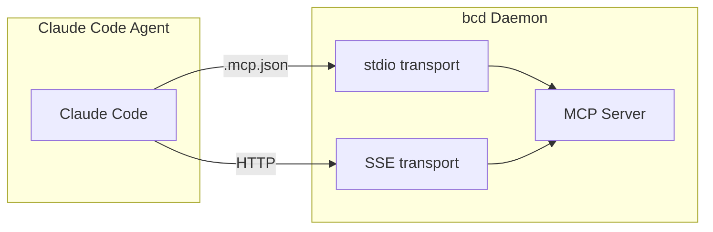

# MCP Server Architecture

## Overview

mycel exposes a Model Context Protocol (MCP) server so AI agents can read workspace state and communicate through gateway channels. Protocol version: `2024-11-05`.

## Transports

| Transport | Entry | Limit | Use Case |
|-----------|-------|-------|----------|
| stdio | `mycel mcp serve` | 4MB/line | Claude Code direct via .mcp.json |
| SSE (bcd) | `/_mcp/sse` + `/_mcp/message` | 4MB body | Browser clients, remote |
| SSE (agent-scoped) | `/_mcp/{agent}/sse` + `/_mcp/{agent}/message` | 4MB body | Agents with server-side identity |
| SSE (standalone) | `mycel mcp serve --sse` (default `:8811`) | 4MB body | Without a running bcd |

## Sender Identity

The sender identity for outbound tools (`send_message`, `send_file`) is derived server-side from the authenticated SSE connection — either the agent-scoped path `/_mcp/{agent}/...` or the `?agent=` query param on the SSE URL. A client-supplied `sender` value is advisory only: if it disagrees with the connection's agent identity, the server logs a warning and overrides it (spoofing fix, issue #2967). Only unauthenticated legacy connections fall back to the client value.

## Resources (read-only)

| URI | Description |
|-----|-------------|
| `bc://workspace/status` | Workspace name, path, state dir, agents dir |
| `bc://agents` | All agents with state, role, tool, team, worktree, session |
| `bc://channels` | Channels (currently returns an empty list — channels are managed by pkg/notify) |
| `bc://costs` | Workspace + per-agent cost/token breakdown |
| `bc://roles` | Available roles with MCP server and secret associations |
| `bc://tools` | AI tools (claude, gemini, cursor, codex) with PATH availability check |

## Tools

### Communication

| Tool | Args | Description |
|------|------|-------------|
| `send_message` | channel, message, sender? | Send text to a gateway channel (e.g., `slack:eng`); sender defaults to the authenticated agent identity |
| `send_file` | channel, file_path, comment? | Upload a file (max 50MB, path must be under the workspace root or /tmp) to a gateway channel |
| `list_channels` | — | List all gateway channels with platform |
| `read_channel` | channel, limit? | Read recent messages (default 20) |

### Identity & Agents

| Tool | Args | Description |
|------|------|-------------|
| `whoami` | — | Current agent's identity, workspace, role, state, and task |
| `list_agents` | role? | List workspace agents with status and role, optionally filtered by role |

Tool arguments have per-field length caps enforced at handler entry (64KB for message/comment, 256B for channel/sender/role, 4KB for file_path) since the `/_mcp/*` routes are exempt from the global body-size middleware.

## Notifications

| Method | Trigger |
|--------|---------|
| `notifications/message` | New channel message (channel, sender, message, time) |

Delivery is push-based: the notify service's `OnMessage` callback publishes directly to the SSE broker — there is no polling loop.

## External MCP Server Management

mycel manages MCP servers that agents connect to (Playwright, GitHub, etc.):

- Managed via `mycel mcp add|list|show|remove|enable|disable`
- Stored in the `mcp_servers` table
- Referenced by roles via the `mcp_servers` list in role metadata (`.bc/roles/*.md`)
- Env vars support `${secret:NAME}`
- Written to agent `.mcp.json` during role setup

`mycel mcp register` adds mycel itself as an MCP server in the workspace preferences so agents automatically get the tools above (stdio by default, `--sse` for the SSE endpoint).

## Code Map

| File | Purpose |
|------|---------|
| `server/mcp/server.go` | Server, dispatcher, notifications |
| `server/mcp/protocol.go` | JSON-RPC 2.0 types |
| `server/mcp/tools.go` | Tool definitions + implementations |
| `server/mcp/resources.go` | Resource readers |
| `server/mcp/sse.go` | SSE transport + broker, agent-scoped routing |
| `server/mcp/stdio.go` | stdio transport |
| `internal/cmd/mcp.go` | `mycel mcp` CLI (add, serve, register, ...) |
| `pkg/mcp/store.go` | External MCP config storage |
