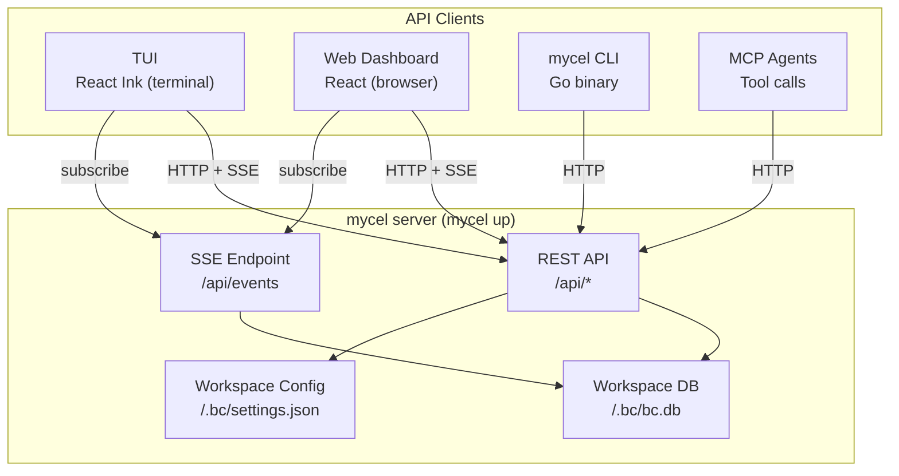
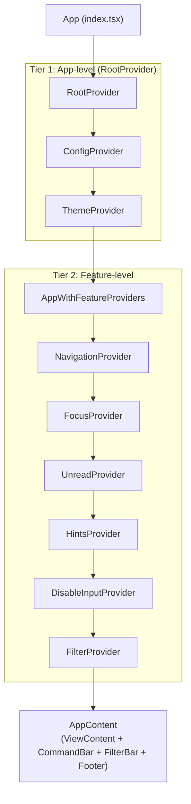
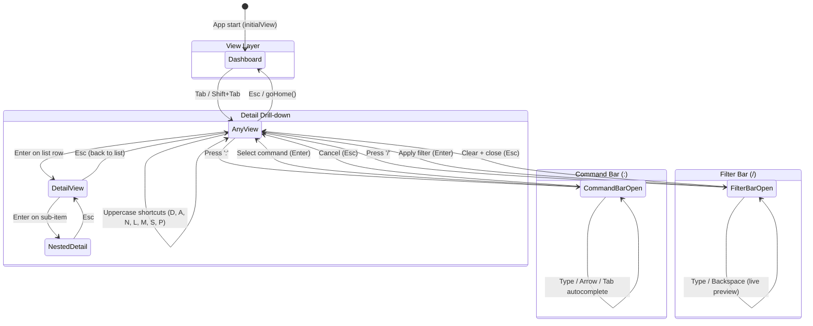
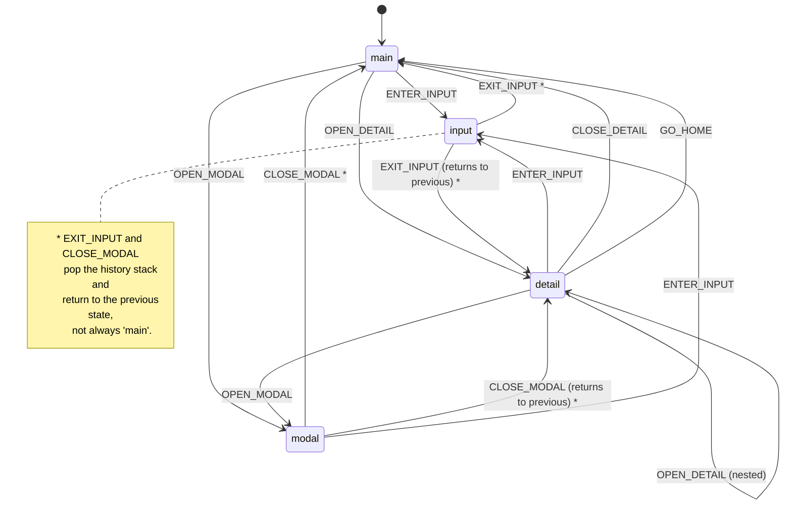

# TUI Architecture

## 1. System Context

The TUI is one of four equal API clients of the mycel server. It does not occupy a privileged position in the architecture -- it is a consumer of the same REST and SSE interfaces available to the web dashboard, the CLI, and MCP agent tooling.



**Key architectural invariants:**

- The TUI calls the server, not the CLI. The CLI is a sibling client, not an intermediary.
- All four clients share the same REST contract. A feature available in one client can be built in any other without backend changes.
- Real-time updates (agent state transitions, notifications, cost ticks) arrive via SSE; polling remains as fallback for data without SSE coverage.
- Workspace configuration lives at `<workspace>/.bc/settings.json`. User-global state (daemon address file, registry, templates) lives under `~/.mycel/`.

### Tech Stack

| Layer | Technology |
|-------|-----------|
| Runtime | Bun |
| UI framework | React 18 |
| Terminal renderer | Ink |
| Language | TypeScript (strict) |
| Test runner | bun:test |
| Test utilities | ink-testing-library, @testing-library/react |

**File counts (as of 2026-07):**
- 223 TypeScript source files in `tui/src/`
- 109 test files in `tui/src/**/__tests__/`

**Entry point:** `tui/src/index.tsx` -- validates TTY, calls `render(<App />)` via Ink.

**Key directories:**

| Directory | Contents |
|-----------|----------|
| `tui/src/views/` | 12 view components (one per screen) plus agent detail drill-down |
| `tui/src/hooks/` | Data fetching, polling, navigation, keybinding hooks |
| `tui/src/components/` | Shared UI components (Panel, DataTable, CommandBar, FilterBar, etc.) |
| `tui/src/navigation/` | NavigationContext, FocusContext, TabBar, Breadcrumb, keyboard handling |
| `tui/src/services/` | `bc.ts` -- HTTP client, `fetch()` calls to the server REST API |
| `tui/src/theme/` | ThemeContext, dark/light themes, terminal color detection |
| `tui/src/config/` | ConfigContext for performance and theme settings |
| `tui/src/constants/` | Centralized timing, cache, dimension, and color constants |
| `tui/src/types/` | TypeScript interfaces for all API response shapes |

---

## 2. Provider Architecture

The app uses a nested context provider tree. `RootProvider` wraps config and theme (app-level concerns), then feature providers handle navigation, focus, unread tracking, hints, input gating, and filtering.



### Provider Responsibilities

| Provider | File | Purpose |
|----------|------|---------|
| `RootProvider` | `providers/RootProvider.tsx` | Groups ConfigProvider + ThemeProvider into a single wrapper |
| `ConfigProvider` | `config/ConfigContext.tsx` | Fetches config via `GET /api/config`, provides performance intervals and theme settings |
| `ThemeProvider` | `theme/ThemeContext.tsx` | Dark/light mode, color accessor, theme cycling, auto-detection |
| `NavigationProvider` | `navigation/NavigationContext.tsx` | Current view, history stack with back/forward, tab cycling, breadcrumbs |
| `FocusProvider` | `navigation/FocusContext.tsx` | Focus area tracking across 7 areas |
| `UnreadProvider` | `hooks/UnreadContext.tsx` | Per-source unread notification counts |
| `HintsProvider` | `hooks/useHintsContext.tsx` | View-specific keyboard hints for the global footer |
| `DisableInputProvider` | `hooks/useDisableInput.tsx` | Global input gating (replaces prop drilling for `disableInput`) |
| `FilterProvider` | `hooks/useFilter.tsx` | Global `/filter` query state shared across all views |

---

## 3. Design Tokens and Shared Logic

The TUI is self-contained -- there is no shared cross-frontend component library. Ink components live in `tui/src/components/`, and web components live in `web/src/components/`; the two do not share code.

What *is* shared across frontends is the palette: `packages/design-tokens` (`@bc/design-tokens`) defines the Solar Flare colors, semantic mappings, terminal (ANSI) mappings, typography, and spacing as the canonical reference. The TUI's own token layer maps that palette onto terminal capabilities:

- **Design tokens:** `tui/src/constants/colors.ts` (role colors, prefixes, emojis) and `tui/src/theme/themes.ts` (semantic slots → ANSI names).
- **Component interfaces:** implicit in component props; no abstract interface package.
- **Rendering:** directly in `tui/src/components/*.tsx` with Ink primitives (`Box`, `Text`).
- **Shared pure logic:** `tui/src/utils/formatting.ts` (`formatRelativeTime`, `truncateText`, ...) and `tui/src/navigation/viewCommands.ts` (fuzzy command matching).

---

## 4. View System

### Views

12 views (the `View` union in `navigation/NavigationContext.tsx`), rendered by the `ViewContent` switch in `tui/src/app.tsx`. Each is wrapped in a `ViewErrorBoundary` keyed by `currentView`, so errors in one view do not crash the entire TUI. The Agents view drills into a dedicated `AgentDetailView`.

| # | View | File | Data Hook / Service | Primary Display |
|---|------|------|-------------------|-----------------|
| 1 | Dashboard | `views/Dashboard.tsx` | `useDashboard` (aggregates status + notifications + costs) | MetricCards, SystemHealth, CostPanel, ActivityFeed |
| 2 | Agents | `views/AgentsView.tsx` (+ `views/AgentDetailView.tsx`) | `useAgents`, `useAgentGroups`, `useAgentDetails` | Grouped agent list with peek panel, actions, search; drill-down detail |
| 3 | Notifications | `views/NotificationsView.tsx` | `useNotifications` + `UnreadContext` | Notification sources with unread counts, drill into per-source stream |
| 4 | Costs | `views/CostsView.tsx` | `useCosts` | Cost summary, daily/monthly/session breakdowns, sparklines |
| 5 | Roles | `views/RolesView.tsx` | `getRoles()` | Role list with capabilities, agent counts |
| 6 | Logs | `views/LogsView.tsx` | `useLogs` | Event log with severity filtering, agent filtering |
| 7 | Worktrees | `views/WorktreesView.tsx` | `getWorktrees()` | Worktree list with orphan detection, prune action |
| 8 | Tools | `views/ToolsView.tsx` | `getToolList()` | Provider tool status (installed/missing, version) |
| 9 | MCP | `views/MCPView.tsx` | `getMCPList()` | MCP server list with transport and status |
| 10 | Secrets | `views/SecretsView.tsx` | `getSecretList()` | Secret metadata (no values exposed) |
| 11 | Processes | `views/ProcessesView.tsx` | `getProcessList()` | Managed process list with PID, port, status |
| 12 | Help | `views/HelpView.tsx` | Static | Keybinding reference, command list |

The tab order (`DEFAULT_TABS` in `NavigationContext.tsx`) is: Dashboard, Agents, Notifications, Costs, Logs, Roles, Worktrees, Tools, MCP, Secrets, Processes, Help.

### Navigation Model

Navigation uses k9s-style patterns: a `:command` bar with fuzzy matching, `/filter` bar, `Tab` cycling, number keys for direct access, and uppercase letter shortcuts.



### CommandBar

**File:** `tui/src/components/CommandBar.tsx`

Activated by pressing `:`. Renders a fuzzy-matched dropdown above a text input line at the bottom of the screen.

- **Registry:** `tui/src/navigation/viewCommands.ts` defines the view commands with aliases (`:dash`, `:ag`, `:no`, `:co`, ...) and action commands (`:q`, `:q!`).
- **Fuzzy matching:** `searchCommands(query, recentCommands)` scores by exact match, starts-with, contains, and character-by-character fuzzy. An LRU boost favors recently used commands.
- **Interaction:** Arrow keys select, Tab autocompletes, Enter navigates or executes action, Esc cancels.
- **LRU tracking:** `AppContent` maintains a `recentCommandsRef` (max 10) that persists across command bar open/close cycles. Recent commands appear in a `RECENT` section when no query is entered.

### FilterBar

**File:** `tui/src/components/FilterBar.tsx`

Activated by pressing `/`. Sets the global `FilterContext` query which views can read via `useFilter()`.

- Live preview: filter updates on each keystroke via `setFilter()`.
- Enter applies and closes. Esc clears and closes.
- Filter state persists across the FilterBar open/close cycle but resets on view change (known issue).

### Tab Cycling

`NavigationProvider` maintains an ordered tab list (`DEFAULT_TABS` in `NavigationContext.tsx`). `Tab` advances to the next view, `Shift+Tab` goes to the previous.

### Detail Drill-down Pattern

Views that support drill-down (Agents, Notifications, Roles) follow a consistent pattern:

1. View maintains a `viewMode` state (`'list' | 'detail'`).
2. `useListNavigation` handles j/k/Enter on the list.
3. Enter on a row sets `viewMode = 'detail'` and renders the detail component.
4. Detail component handles Esc to return to list mode.
5. `NavigationProvider.setBreadcrumbs()` updates the breadcrumb trail during drill-down.

### Number Key Mappings

Defined in `tui/src/hooks/useKeybindings.ts` (`DEFAULT_VIEW_NUMBERS`):

```
1 = Dashboard    2 = Agents     3 = Notifications  4 = Costs   5 = Roles
6 = Logs         7 = Worktrees  8 = Tools          9 = MCP     0 = Secrets
- = Processes
```

Uppercase letter shortcuts: `D` = Dashboard, `A` = Agents, `N` = Notifications, `L` = Logs, `M` = MCP, `S` = Secrets, `P` = Processes.

---

## 5. Data Layer

The TUI fetches all data from the server REST API over HTTP and receives real-time updates via SSE. This is the same data layer pattern used by the web dashboard.

### Service Layer: `tui/src/services/bc.ts`

The service layer is an HTTP client that calls the REST API using `fetch()`. The base URL comes from the `BC_DAEMON_ADDR` environment variable, defaulting to `http://127.0.0.1:9374`.

**Key characteristics:**

- Standard `fetch()` for all HTTP requests (GET for reads, POST/PUT/DELETE for writes).
- JSON request and response bodies with typed return values.
- Error handling maps HTTP status codes to typed error results consumed by hooks.
- Client-side caching utilities with per-data-type TTLs (`constants/cache.ts`).

Exported convenience functions cover status, notifications, costs, logs, roles, worktrees, tools, MCP servers, secrets, processes, and agent session attachment (e.g. `getStatus`, `getCostSummary`, `getLogs`, `getRoles`, `getWorktrees`, `getToolList`, `getMCPList`, `getSecretList`, `getProcessList`).

### SSE: Real-Time Event Stream

An `EventSource` connection to `GET /api/events` receives server-pushed events. Event types include agent state changes, notification deliveries, cost updates, and log entries. SSE events trigger React state updates, which cause hooks to re-render their consumers with fresh data. Polling is retained as a fallback for data types without SSE coverage.

### How Data Flows Through the System

1. **Initial load:** Hook calls a service function (e.g., `getStatus()`), which issues a `fetch()` against the REST API. The JSON response is parsed, typed, and returned to the hook, which sets React state.
2. **Real-time updates:** The SSE client receives a pushed event, parses it, and dispatches it to registered callbacks. The callback updates React state, triggering a re-render.
3. **Write operations:** Hook calls a service function that issues a POST/PUT/DELETE. On success, the SSE stream delivers the resulting event to all connected clients, keeping the UI in sync without manual cache invalidation.

---

## 6. Hook Architecture

### Hook Inventory

| Hook | File | Purpose |
|------|------|---------|
| `useAgents` | `hooks/useAgents.ts` | Fetches agent status with working-to-idle debounce to prevent UI flicker |
| `useAgentsByState` / `useAgentsByRole` / `useAgent` | `hooks/useAgents.ts` | Filtered/single-agent views of the agent list |
| `useAgentGroups` | `hooks/useAgentGroups.ts` | Groups agents by role, computes per-group state counts |
| `useAgentDetails` | `hooks/useAgentDetails.ts` | Per-agent cost breakdown and activity log |
| `useNotifications` | `hooks/useNotifications.ts` | Notification sources and per-source stream |
| `UnreadContext` | `hooks/UnreadContext.tsx` | Per-source unread counts (provider + consumer hook) |
| `useCosts` | `hooks/useCosts.ts` | Fetches cost summary data |
| `useLogs` | `hooks/useLogs.ts` | Fetches event logs with severity and agent filtering |
| `useStatus` | `hooks/useStatus.ts` | Workspace status summary with agent counts by state |
| `useDashboard` | `hooks/useDashboard.ts` | Aggregates status + notifications + costs in parallel |
| `usePolling` | `hooks/usePolling.ts` | Message/agent change detection, coordinated dashboard tick |
| `useAdaptivePolling` | `hooks/useAdaptivePolling.ts` | 4-mode adaptive intervals: fast/normal/slow/backoff |
| `useListNavigation` | `hooks/useListNavigation.ts` | Vim-style j/k/g/G/Enter/Esc navigation for all list views |
| `useFocusStateMachine` | `hooks/useFocusStateMachine.ts` | Formal state machine for focus: main/input/detail/modal |
| `useKeybindings` | `hooks/useKeybindings.ts` | 3-tier keybinding system, status bar hint generation |
| `useFilter` | `hooks/useFilter.tsx` | Global filter query context |
| `useDisableInput` | `hooks/useDisableInput.tsx` | Global input gating |
| `useHintsContext` | `hooks/useHintsContext.tsx` | Footer hint registration |
| `useDebounce` | `hooks/useDebounce.ts` | Value debounce, callback debounce, debounced search |
| `useLoadingTimeout` | `hooks/useLoadingTimeout.ts` | Tracks elapsed seconds during loading for timeout UX |

Data hooks depend on service function signatures, not transport details. The hooks call typed functions like `getStatus()` which return `Promise<StatusResponse>`. Whether the service layer uses `fetch()` against the REST API or receives a push via SSE is invisible to the hook consumer.

---

## 7. Keyboard Navigation

### 3-Tier Keybinding System

Defined in `tui/src/hooks/useKeybindings.ts`. The three tiers form a priority hierarchy: context bindings override view-local bindings, which override global bindings.

| Tier | Scope | Keys | When Active |
|------|-------|------|-------------|
| **1. Global** | Always (unless in input mode) | `:` command bar, `/` filter, `?` help, `Tab`/`Shift+Tab` cycle views, `1-0,-` direct view, uppercase shortcuts, `q` quit, `Esc` home, `Ctrl+R` refresh | `FocusArea` is not `input`, `command`, or `filter` |
| **2. View-local** | Within a specific view | `j/k` up/down, `g/G` top/bottom, `Enter` select, `r` refresh, view-specific custom keys | `FocusArea` is `main` or `detail` |
| **3. Context** | Modal/input overlays | `Esc` cancel/close, `Enter` confirm/submit, all text input | `FocusArea` is `input`, `modal`, `command`, or `filter` |

### Implementation

Global keyboard handling lives in `tui/src/navigation/useKeyboardNavigation.ts`. It uses Ink's `useInput` hook with an `isActive` guard that checks the current `FocusArea`:

```typescript
useInput((input, key) => {
  if (isFocused('input') || isFocused('command') || isFocused('filter')) return;
  // ... handle global keys
}, { isActive: !disabled });
```

View-local handling lives in `tui/src/hooks/useListNavigation.ts`, which also checks `FocusContext` to disable itself when overlays are open:

```typescript
const isOverlayActive = focusedArea === 'command' || focusedArea === 'filter' || focusedArea === 'modal';
useInput(handler, { isActive: !disabled && isActive && !isOverlayActive && navLength > 0 });
```

### Focus State Machine

`tui/src/hooks/useFocusStateMachine.ts` defines a formal state machine to prevent key leaks between contexts. It has 4 states and 7 transition events.



### Key Permission Matrix

Each focus state allows a specific set of key categories. The `canHandle(category)` method checks this at runtime.

| Key Category | `main` | `input` | `detail` | `modal` |
|-------------|--------|---------|----------|---------|
| `global_nav` (Tab, ?, view shortcuts) | Yes | -- | Yes | -- |
| `global_quit` (q) | Yes | -- | -- | -- |
| `list_nav` (j, k, g, G) | Yes | -- | Yes | Yes |
| `selection` (Enter) | Yes | Yes | Yes | Yes |
| `escape` (Esc) | Yes | Yes | Yes | Yes |
| `text_input` (printable chars) | -- | Yes | -- | -- |
| `refresh` (r, Ctrl+R) | Yes | -- | Yes | -- |

Note that `global_quit` is only allowed in `main` state. Pressing `q` in a detail view does not quit the application -- it is either ignored or handled as a view-local key.

### Focus Context vs Focus State Machine

Two complementary focus systems coexist:

1. **FocusContext** (`navigation/FocusContext.tsx`) -- lightweight context with 7 focus areas (`main`, `detail`, `input`, `modal`, `view`, `command`, `filter`). Used by `AppContent` to gate global keyboard navigation when CommandBar or FilterBar is open. The `command` and `filter` areas are specific to the global overlays.

2. **useFocusStateMachine** (`hooks/useFocusStateMachine.ts`) -- formal state machine with 4 states, typed transition events, history stack, and `canHandle(category)` checks. Used within individual views for drill-down/input/modal patterns. The history stack enables correct back-navigation (e.g., returning to `detail` instead of `main` when exiting `input` that was opened from a detail view).

The `useListNavigation` hook consults `FocusContext` directly to disable itself when `focusedArea` is `command`, `filter`, or `modal`.

---

## 8. Theme System

### ANSI Terminal Colors

Defined in `tui/src/theme/`:

**Type system (`types.ts`):**
- `TerminalColor` -- union type of 16 standard ANSI color names (`black`, `red`, `green`, `yellow`, `blue`, `magenta`, `cyan`, `white`, plus 8 bright variants like `redBright`, `cyanBright`).
- `ThemeColors` -- interface with semantic color slots organized into groups: primary/secondary/accent, text (text, textMuted, textInverse), status (success, warning, error, info), agent state (agentIdle, agentWorking, agentDone, agentStuck, agentError), UI elements (border, borderFocused, selection, highlight), and component-specific slots.
- `ThemeMode` -- `'dark' | 'light' | 'auto'`.
- `Theme` -- `{ name: string, mode: 'dark' | 'light', colors: ThemeColors }`.

**Theme definitions (`themes.ts`):**

Built-in dark and light themes map semantic slots to ANSI names:

| Slot | Dark Theme | Light Theme |
|------|-----------|-------------|
| `primary` | cyan | blue |
| `secondary` | blue | cyan |
| `accent` | magenta | magenta |
| `text` | white | black |
| `textMuted` | gray | gray |
| `success` | green | green |
| `warning` | yellow | yellow |
| `error` | red | red |
| `info` | cyan | blue |
| `border` | gray | gray |
| `borderFocused` | cyan | blue |
| `selection` | cyan | blue |
| `highlight` | yellow | yellow |

**Theme context (`ThemeContext.tsx`):**
- Auto-detection via `detectColorScheme.ts` which reads the `COLORFGBG` env var to determine if the terminal background is dark or light.
- `useTheme()` hook provides: `theme` object, `mode`, `themeName`, `isDark` flag, `color(key)` accessor, `toggleTheme()`, `cycleTheme()`, `setMode()`, `setThemeName()`.
- `useThemeColor(key)` for single color access, `useThemeColors(keys)` for batch access.
- `applyOverrides(theme, overrides)` merges custom color patches from workspace config.

**Hardcoded color constants (`constants/colors.ts`):**
- `ROLE_COLORS` -- maps role names to ANSI colors (root=magenta, engineer=green, tech-lead=cyan, manager=yellow, pm=yellow, ux=blue, qa=red).
- `ROLE_PREFIXES` -- prefix-matching rules for agent name to role resolution (e.g., `eng-` maps to `engineer`).
- `ROLE_EMOJIS` -- role-based emoji prefixes for visual distinction.
- Helper functions: `getColorForName(name)`, `getEmojiForName(name)`, `getRoleFromName(name)`.

### Terminal Color Capability

The canonical Solar Flare palette lives in `packages/design-tokens` (including `terminal.ts`, the ANSI mapping of the palette). Terminals support three color modes with different capabilities:

| Mode | Colors | Detection | Strategy |
|------|--------|-----------|----------|
| Basic (4-bit) | 16 ANSI names | Default assumption | Map each token to nearest ANSI name |
| 256-color (8-bit) | 256 indexed colors | `TERM` contains `256color` | Map to closest indexed color |
| Truecolor (24-bit) | 16M RGB values | `COLORTERM=truecolor` | Use exact hex values |

Ink's `<Text color="">` prop accepts hex color strings when the terminal supports truecolor, and the agent Docker images set `COLORTERM=truecolor`, so exact palette colors render inside containers. On less capable terminals the theme falls back to the nearest ANSI names defined in `themes.ts`.

---

## 9. Testing

### Framework

| Tool | Purpose |
|------|---------|
| `bun:test` | Test runner and assertion library |
| `ink-testing-library` | Renders Ink components to string output for snapshot and behavior testing |
| `@testing-library/react` | DOM-like queries (though limited in terminal context) |

### Test Commands

```bash
# Full TUI test suite
make test-tui

# Individual test groups
bun test src/__tests__ src/hooks/__tests__ src/components/__tests__ src/views/__tests__  # UI tests
bun test src/services/__tests__                                                           # Service layer
bun test src/config/__tests__/config.test.tsx                                              # Config context
bun test src/__tests__/viewport-ci.test.tsx src/__tests__/80x24-terminal.test.tsx          # Viewport compat
```

### Test File Organization

| Directory | Contents |
|-----------|---------|
| `src/__tests__/` | View tests, integration tests (keybind-focus, view-state-transitions, realtime-updates), e2e workflows, regression tests, benchmarks |
| `src/__tests__/e2e/` | End-to-end suites: tmux-integration, data-consistency, state-transitions, error-scenarios |
| `src/__tests__/benchmarks/` | Render performance benchmarks |
| `src/components/__tests__/` | Core component tests (BarChart, LoadingIndicator, ProgressBar, Sparkline, StatusBadge, Table, ...) |
| `src/services/__tests__/` | Service layer tests with mock `fetch` |
| `src/config/__tests__/` | Config context tests |
| `src/navigation/__tests__/` | FocusContext, viewCommands |

### Test Patterns

**Mock infrastructure:**
- `src/__tests__/setup.ts` -- sets `NODE_ENV=test`, `NO_COLOR=1`
- Mock data factories and shared fixtures for API responses
- Mock `fetch` for controlling HTTP responses in tests

**Patterns in use:**
- **Table-driven tests** -- preferred for hooks and utility functions with multiple input/output cases
- **Exported helper testing** -- Ink hooks cannot be tested without a render context; exported pure functions (`categorizeKey`, `fuzzyScore`, `formatHintsForStatusBar`, `countAgentStates`, `groupAgentsByRole`, ...) are tested directly
- **Viewport tests** -- verify rendering at the minimum standard terminal size (80 columns, 24 rows)
- **Render benchmarks** -- measure render time for performance regression detection
- **E2E workflow tests** -- multi-step user interactions; tmux integration tests require live tmux sessions
- **Regression tests** -- reproduce and guard against specific bug recurrences

### Known Testing Gaps

| Gap | Reason | Mitigation |
|-----|--------|-----------|
| Ink hooks cannot be unit-tested in isolation | Ink's `useInput` requires a running render context | Test exported pure functions; integration-test hooks via rendered components |
| E2E tests require live tmux | tmux sessions not available in all CI environments | E2E tests gated behind an env var |
| No visual regression tests | Terminal output is text-based, not pixel-based | Snapshot tests via `ink-testing-library` provide partial coverage |
| Theme color rendering | Cannot programmatically verify ANSI/truecolor output | Manual testing + snapshot comparison of rendered strings |
| Adaptive polling timing | Real timer behavior hard to test deterministically | Tests use fake timers where possible |

---

## 10. Constants and Configuration

The TUI centralizes magic numbers into `tui/src/constants/`:

| File | Key Constants |
|------|--------------|
| `timings.ts` | `POLL_INTERVALS` per data type, `DURATIONS` (toast, search debounce, animation, loading delay), `PERFORMANCE` (target FPS, virtualization threshold), `TIMEOUTS` (command, request) |
| `cache.ts` | `CACHE_TTLS` per data type, `CACHE_LIMITS` (max entries, size, age), `CACHE_KEYS` prefix constants |
| `dimensions.ts` | `BREAKPOINTS` (xs=60 through large=160 cols), pane/table dimensions, `SPACING`, `TERMINAL_DEFAULTS` (80x24, reserved lines), `DATA_LIMITS` |
| `limits.ts` | `TRUNCATION` lengths, `DISPLAY_LIMITS`, `COLUMN_WIDTHS` |
| `colors.ts` | `ROLE_COLORS`, `ROLE_PREFIXES`, `ROLE_EMOJIS`, helper functions |

**Runtime-configurable values** come from the server via `ConfigContext` (`GET /api/config`) and can be tuned in the workspace `settings.json` performance section: per-data-type poll intervals plus the adaptive polling tiers (fast/normal/slow/max backoff).

---

## 11. Known Issues

| Summary |
|---------|
| TUI performance degradation with >50 agents |
| Filter bar does not persist across view changes |
| Unread counts can desync when notifications arrive during view switch |
| Theme toggle does not update TabBar highlight color immediately |
| CommandBar fuzzy matching ranks short aliases too high for partial inputs |
| 80x24 terminal: footer hints overlap with view content on small screens |
| Adaptive polling backoff does not resume fast mode on user interaction |
| ErrorBoundary does not provide retry mechanism for transient API failures |
