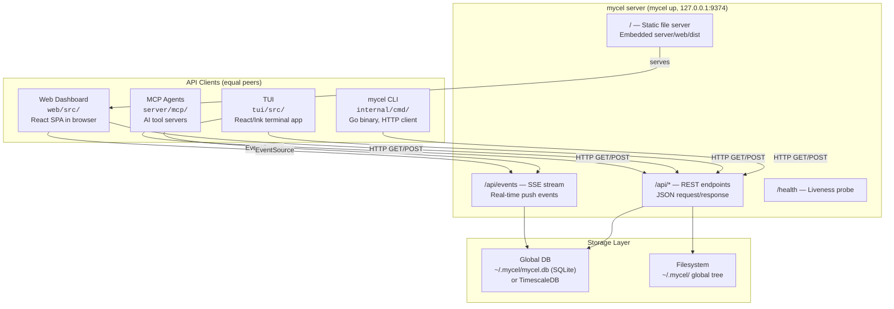
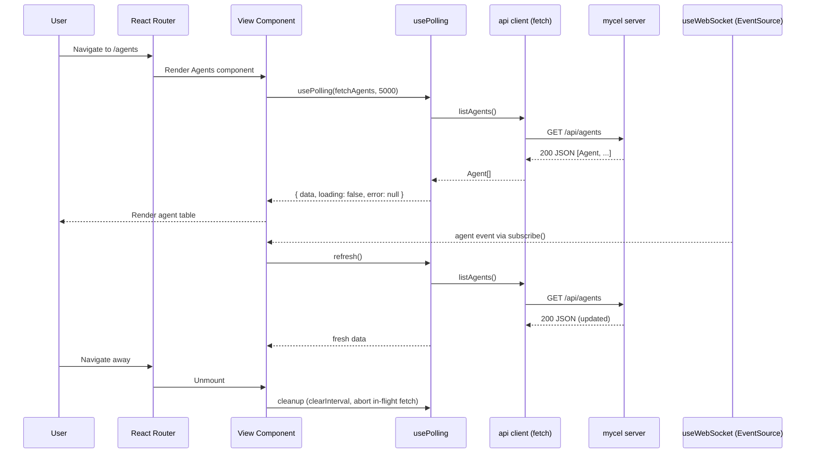

# Web Dashboard Architecture

Architecture of the mycel web dashboard — a standalone React SPA served by the mycel server and one of four equal API clients (CLI, TUI, web, MCP agents).

---

## 1. System Context

The web dashboard is one of four equal API consumers of the mycel server. It has no special access, no elevated privileges, and no server-side rendering. Every operation available in the web UI is available through the same REST + SSE API that the CLI, TUI, and MCP agents use.



**Key principle:** The web dashboard is a thin view layer. All business logic, persistence, agent orchestration, and event publishing live in the server. The dashboard only renders state received over HTTP and SSE.

**Key structure:** `web/` is a standalone Vite application — its own `package.json`, its own build, no monorepo UI framework. The only shared package under `packages/` relevant to the UI is `packages/design-tokens` (`@bc/design-tokens`), which holds the canonical Solar Flare palette, typography, and spacing values.

### Tech Stack

| Layer | Technology |
|-------|-----------|
| Build | Vite 6 |
| UI framework | React 18 |
| Routing | react-router-dom 6 |
| Styling | Tailwind CSS + CSS custom properties |
| Language | TypeScript |
| Tests | vitest (`make test-web`) |

---

## 2. Component Architecture

### 2.1 Provider and Route Tree

`web/src/App.tsx` composes the app:

```
ErrorBoundary
└── ThemeProvider            (3 themes, localStorage persistence)
    └── BrowserRouter
        └── Routes
            └── Layout    (sidebar + header + <Outlet/>)
                └── per-route: Suspense → ErrorBoundary → lazy view
```

Every view is lazy-loaded (`React.lazy`) and wrapped in its own `Suspense` + `ErrorBoundary` via the `wrap()` helper, so a crash in one view does not take down the shell. A root-level `ErrorBoundary` wraps everything as a last resort.

Routes are flat (`/agents`, not `/w/<id>/agents`) — the repo is a property of each agent, not a URL segment.

### 2.2 Route Map

Ground truth: `web/src/App.tsx`.

| Route | View | Purpose |
|---|---|---|
| `/` (index) | `Live` | Live activity feed (default view) |
| `/live` | `Live` | Same as index |
| `/agents` | `Agents` | Agent list, grouped by repo, with actions |
| `/agents/:name`, `/agents/:name/*` | `AgentDetail` | Terminal, activity, cost, files per agent |
| `/notifications` | `Notifications` | Inbound notification stream |
| `/notifications/:sourceName` | `Notifications` | Filtered to one source |
| `/templates` | `Templates` | Agent/role templates |
| `/tools` | `Tools` | Provider tooling on the host |
| `/tools/:provider` | `ProviderDetail` | Single provider detail |
| `/secrets` | `Secrets` | Secret metadata |
| `/stats` | `Stats` | Metrics and usage statistics |
| `/metrics` | `Stats` | Alias for `/stats` |
| `/costs` | `CostsGlobal` | Cost rollup across agents and repos |
| `/code`, `/code/*` | `Code` | Repository/code browsing |
| `/settings` | `Settings` | Server and UI settings |
| `/about` | `About` | Version and build info |
| `*` | `NotFound` | 404 page |

### 2.3 Navigation

Navigation is defined statically in `web/src/components/Layout.tsx`:

- `MAIN_NAV_ITEMS`: **Live, Agents, Notifications, Code, Templates, Tools, Secrets, Metrics (`/stats`), Costs**
- `UTIL_NAV_ITEMS`: **Settings**
- `/about` lives in the sidebar footer (next to the theme toggle), not in a nav list; `TITLE_ITEMS` extends the nav lists so it still resolves a document title.

The sidebar is collapsible (state persisted to `localStorage`) and responsive (`useMediaQuery`).

### 2.4 Shared Components

All components are local to `web/src/components/` — there is no shared cross-frontend component library.

| Component | Purpose |
|---|---|
| `Layout.tsx` | Shell: sidebar nav + header + `<Outlet/>` |
| `Header.tsx` | Top bar |
| `ErrorBoundary.tsx` | Class component; catches render errors, shows retry UI |
| `StatusBadge.tsx` | Colored pill for agent states |
| `Table.tsx` | Generic typed table |
| `Toast.tsx` | Transient notifications |
| `WebTerminal.tsx`, `InlineTerminal.tsx` | Terminal rendering for agent sessions |
| `AgentPeekPanel.tsx` | Quick agent inspection panel |
| `CommandPalette.tsx` (+ `useCommandPalette`) | Keyboard-driven navigation/actions |
| `CreateAgentModal.tsx` | Agent creation flow — required Repo field with known-repos dropdown and a Browse picker (`POST /api/repos/discover/local`) |
| `EmptyState.tsx`, `LoadingSkeleton.tsx`, `CopyButton.tsx`, `MessageContent.tsx` | Presentation utilities |
| `ProviderCard.tsx`, `ProvidersTable.tsx`, `StatsTab.tsx` | Feature-specific pieces |
| `agent-ui/`, `live/`, `notifications/`, `settings/`, `shared/` | Feature-scoped component subdirectories |

---

## 3. Data Layer

### 3.1 API Client

`web/src/api/client.ts` exports typed functions built on a `request<T>()` helper that:

- prepends `/api` to every path,
- sets `Content-Type: application/json`,
- on non-2xx responses, extracts `body.error` from the JSON body when present (falls back to `API error: <status> <statusText>`),
- returns `res.json()` cast to `T`.

No auth headers are attached — the dashboard assumes same-origin access to a loopback server (API key auth, when enabled, applies to remote clients).

Response and event types live in `web/src/api/types.ts`. The full endpoint surface is documented in the REST API reference; the client mirrors it one function per endpoint.

### 3.2 Real-Time Updates: `useWebSocket`

`web/src/hooks/useWebSocket.ts` is the SSE hook (the name is historical — it uses `EventSource`, not WebSocket):

- Opens a single `EventSource` on `/api/events`.
- Exposes `subscribe(type, listener)` so views register per-event-type callbacks; incoming messages are parsed and dispatched to the listeners registered for `event.type`.
- Tracks `connected` / `reconnecting` state and reconnects automatically after 3 seconds on error.

### 3.3 Polling: `usePolling`

`web/src/hooks/usePolling.ts` is the generic fetch-and-refresh hook:

- `usePolling(fetcher, intervalMs = 5000)` returns `{ data, loading, error, refresh, timedOut }`.
- An `AbortController` cancels any in-flight request before starting a new one and on unmount.
- A 10-second timeout flags slow responses via `timedOut` for loading UX.
- `refresh()` allows event-driven refetch (e.g., an SSE event triggers an immediate poll).

Other hooks in `web/src/hooks/`: `useAgentActivity`, `useAgentRoles`, `useCommandPalette`, `useMediaQuery`.

### 3.4 Data Flow: Typical View Load



---

## 4. State Management

There is no global data store (no Redux/Zustand/react-query). State falls into three buckets:

| Category | Location | Rationale |
|---|---|---|
| **Server state** (agents, notifications, costs, stats, ...) | Per-view `usePolling` + SSE-triggered refresh | Server is source of truth; no client cache beyond the current fetch |
| **UI state** (selected row, expanded sections, form input, filters) | Local `useState` in views | Ephemeral, resets on navigation |
| **Infrastructure state** | Contexts: `ThemeProvider` (theme, `localStorage`), `HeaderSlotContext` (per-view header content), react-router (route params), sidebar collapsed (`localStorage`) | Cross-cutting, survives navigation |

Views that mutate data (start/stop agent, create template, ...) refetch after the mutation or rely on the resulting SSE event.

---

## 5. Styling and Theme

### 5.1 Three Themes

Ground truth: `web/src/context/ThemeContext.tsx` and `web/src/theme/tokens.css`.

The dashboard ships **three themes**:

| Theme | Description |
|---|---|
| `solar-flare` (default) | Warm charcoal + neon tangerine; elevated surfaces, subtle glow |
| `dark` | Neutral dark |
| `light` | Light |

- `ThemeMode = "solar-flare" | "dark" | "light"`; the toggle cycles through all three (`CYCLE` array).
- Preference persists to `localStorage("bc-theme")`.
- `applyTheme()` swaps a theme class on the document root; all colors resolve through CSS custom properties.

### 5.2 Token Layer

`web/src/theme/tokens.css` defines the design tokens as `--mycel-*` CSS custom properties, one block per theme:

```css
:root {                      /* Solar Flare (default) */
  --mycel-bg: #0c0a09;
  --mycel-surface: #1c1917;
  --mycel-border: #44403c;
  --mycel-text: #fafaf9;
  --mycel-muted: #a8a29e;
  --mycel-accent: #f97316;
  --mycel-success: #4ade80;
  --mycel-warning: #fbbf24;
  --mycel-error: #f87171;
  --mycel-live: #ef4444;
  --mycel-info: #22d3ee;
  /* ... surface-hover, text-2, accent-hover, shadows */
}
```

The Tailwind config maps `mycel-*` color names to these variables, so components use classes like `bg-mycel-surface`, `text-mycel-accent`, `border-mycel-border` and pick up the active theme automatically.

The canonical palette also lives in `packages/design-tokens` (`@bc/design-tokens`) — colors, semantic mappings, terminal mappings, typography, and spacing — as the shared source for all mycel frontends. The web app's `tokens.css` is the web-side expression of that palette.

---

## 6. Build and Embedding

The dashboard is compiled into the server binary — a single binary serves the API and the UI.

```
web/src/  --vite build-->  web/dist/  --cp-->  server/web/dist/  --go:embed-->  mycel binary
```

- `make build-local-web` runs `bun run build` in `web/` and copies `web/dist` to `server/web/dist/`.
- `server/embed.go` embeds it: `//go:embed web/dist`.
- `make build-local-bc` builds the web UI first, then the Go binary — always build the web UI before shipping the binary, or the embedded frontend goes stale.
- At runtime, `mycel up` serves the SPA at `/`, with API routes under `/api/` taking precedence. Unknown paths fall through to `index.html` so client-side routing works on refresh.

**Dev mode:** `make run-web` starts the Vite dev server with hot reload; `web/vite.config.ts` proxies `/api` to a locally running server (`http://localhost:9375` by default in the proxy config — point a dev server instance there, or adjust).

---

## 7. File Reference

| File | Role |
|---|---|
| `web/src/main.tsx` | Entry point: mounts `<App />` |
| `web/src/App.tsx` | Provider tree, lazy route definitions, 404 |
| `web/src/components/Layout.tsx` | App shell: sidebar nav (`MAIN_NAV_ITEMS`, `UTIL_NAV_ITEMS`) + content outlet |
| `web/src/components/ErrorBoundary.tsx` | React error boundary with retry UI |
| `web/src/context/ThemeContext.tsx` | 3-theme provider, `localStorage("bc-theme")` |
| `web/src/context/HeaderSlotContext.tsx` | Lets views render content into the shared header |
| `web/src/api/client.ts` | REST API client (`request<T>` on `/api`) |
| `web/src/api/types.ts` | API response and SSE event types |
| `web/src/hooks/usePolling.ts` | Polling hook (interval + abort + timeout) |
| `web/src/hooks/useWebSocket.ts` | SSE hook (EventSource on `/api/events`; misnamed) |
| `web/src/views/*.tsx` | 14 view components |
| `web/src/theme/tokens.css` | `--mycel-*` custom properties for all three themes |
| `web/tailwind.config.*` | Maps `mycel-*` classes to CSS vars |
| `web/vite.config.ts` | Dev proxy, build output |
| `packages/design-tokens/` | `@bc/design-tokens` — shared Solar Flare palette |
| `server/embed.go` | `//go:embed web/dist` |
| `server/server.go` | Route registration, static serving, middleware |
| `server/ws/hub.go` | SSE hub: subscriber management, event broadcast |
| `docs/explanation/design-system.md` | Solar Flare design system specification |
| `docs/explanation/tui.md` | TUI architecture (parallel reference) |
