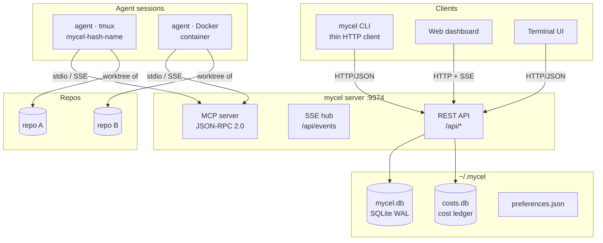
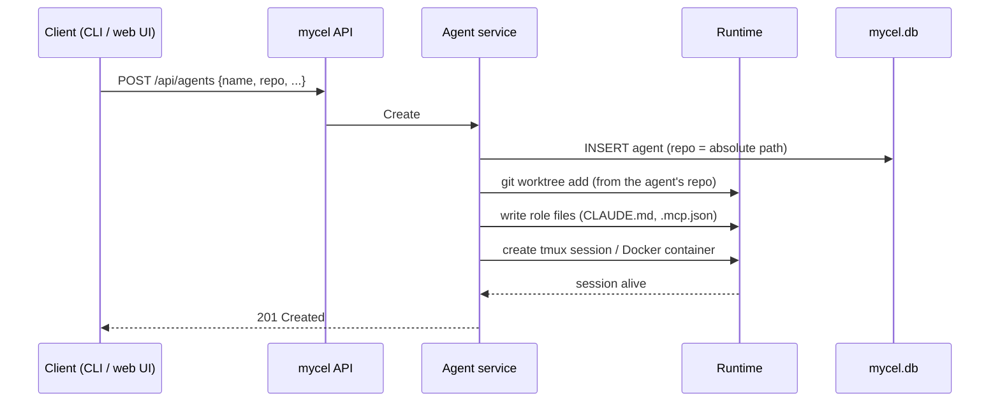
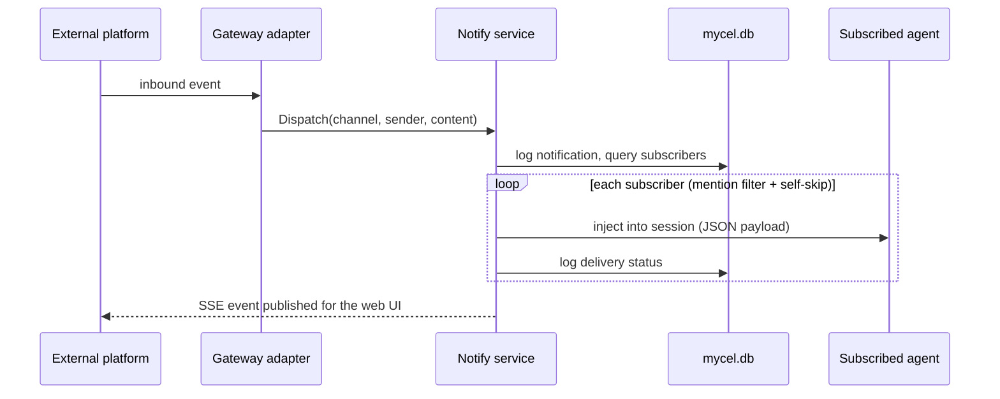

# System Overview

This page gives you a condensed tour of mycel: the components, where state lives, and how the main flows move through the system. For the full treatment, see [Architecture](explanation/architecture.md).

## System design

mycel is a CLI-first orchestration system for teams of AI coding agents. It ships as a single `mycel` binary containing both the CLI and the server: `mycel up` starts the long-running server, and every other command talks to it over HTTP. Agents bind to git repositories — run `mycel up` inside a repo and that repo becomes the anchor; add more repos at any time and place agents on any of them.



Key properties:

- **Single-tenant server** — one instance, flat `/api/<resource>` routes, no per-request scoping.
- **One state home** — everything lives under `~/.mycel`; your repos stay pristine.
- **One database** — `~/.mycel/mycel.db` (SQLite WAL) holds every store: agents, roles, events, notifications, cron, and more. `~/.mycel/costs.db` is a separate cost ledger with per-repo attribution.
- **Repo-bound agents** — each agent carries a `repo` (absolute path) and works in its own git worktree checked out from that repo.
- **Globally unique agent names** — the name is the database primary key across all repos.

## State on disk

```
~/.mycel/
  mycel.db                    # THE database: agents, roles, events, notify, cron, ...
  costs.db                    # cost ledger (per-repo attribution)
  daemon.addr                 # server address, written by `mycel up`
  templates/                  # global agent templates
  workspaces/<id>/            # per-repo runtime state (id = sha256(repo path)[:12])
    preferences.json          # the one config file mycel reads
    agents/<name>/            # agent files + git worktree checkout
    logs/
```

`mycel up` bootstraps all of this on first run — there is no separate init step.

## Components

### CLI (`cmd/mycel`)

Thin HTTP client; commands never touch the database or filesystem state directly. The bare `mycel` command opens the TUI when a server is reachable. Clients discover the server via `MYCEL_DAEMON_ADDR`, then `~/.mycel/daemon.addr`, then the `127.0.0.1:9374` default.

### Server (`server/`)

Long-running HTTP server started by `mycel up` (foreground by default, `-d` for a background daemon).

| Surface | Path | Purpose |
|---------|------|---------|
| REST API | `/api/*` | CRUD for all resources |
| SSE hub | `/api/events` | Real-time event stream |
| MCP server | `/mcp/*` | Agent integration (JSON-RPC 2.0 over SSE + stdio) |
| Web UI | `/` | Embedded React dashboard |
| Health | `/api/health`, `/health/ready` | Liveness + readiness probes |

Middleware chain (outermost first): RateLimit → APIKeyAuth (optional, `--api-key`/`MYCEL_API_KEY`) → RequestID → RequestLogger → Recovery → Gzip → MaxBodySize (1 MB) → CORS → mux.

### Agents

AI coding assistants in isolated sessions. Each agent has:

- a **repo** — the absolute path of the git repository it works on
- a **git worktree** — created and managed by mycel under `~/.mycel/workspaces/<id>/agents/<name>/`
- a **runtime** — a tmux session (`mycel-<hash>-<name>`) or a Docker container
- a **role and template** — prompt, MCP servers, and secrets
- a **provider** — claude, codex, gemini, cursor, or pi

You control the lifecycle from the agent header in the web UI (Start / Stop / Restart) or with `mycel agent start|stop`. See [Agents](explanation/agents.md).

### Repos

The server tracks the repos agents are bound to. `GET /api/repos` lists them; the web UI adds repos via a folder picker, local filesystem discovery, or GitHub clone (`/api/repos/discover/*`, `/api/repos/clone`).

### Notifications

Inbound-only gateway bridging external platforms (Slack, Telegram, Discord, webhooks) to agents. Agents subscribe to sources (`platform:channel`); deliveries are injected into the agent session with mention filtering, self-skip, and delivery logging. See [Notification architecture](architecture-notifications.md).

### Secrets

AES-256-GCM encrypted store. Reference secrets in agent env vars as `${secret:NAME}`; mycel resolves them at runtime.

### Costs

Automatic import from Claude Code JSONL session logs, recorded in the global ledger with per-repo and per-agent attribution. Budgets enforce spending limits; `GET /api/global/costs` rolls costs up per repo.

### Cron, stats, and tools

Scheduled commands with execution history (`/api/cron`), system and per-agent metrics (`/api/stats/*`, `/api/system/*`), and a registry of MCP servers and CLI tools agents can use (`/api/mcp`, `/api/tools`).

## Data flow

### Agent creation



### Notification delivery



### Agent state via hooks

Provider hooks report tool activity to the API; the server updates agent state in `mycel.db` and broadcasts `agent.state_changed` over SSE, which keeps the web UI and TUI live without polling.

## Key design decisions

| Decision | Choice | Rationale |
|----------|--------|-----------|
| One state home | Everything under `~/.mycel` | Repos stay pristine; state survives repo moves and clones |
| Single binary | `mycel up` runs the server | CLI stays fast; one process holds state and connections |
| Single-tenant server | Flat routes, no request scoping | One server per machine is simpler to reason about and secure |
| One global database | `mycel.db`, SQLite WAL | Zero-config, local-first, concurrent reads |
| Separate cost ledger | `costs.db` with repo attribution | Cost history outlives agents and repos |
| Repo-bound agents | `repo` field, globally unique names | An agent's identity and its checkout are unambiguous |
| mycel owns worktrees | All providers, uniform | Avoids nesting; consistent across providers |
| Embedded web UI | Served from the binary | No separate web server; version-locked to the API |
| SSE, not WebSocket | Server-sent events | Simpler protocol; one-way server push is all that's needed |
| Session injection delivery | Runtime send-keys | Hooks are one-way; the session is the only way in |
| Auth optional | Localhost by default | Local-first tool; Bearer auth for anything beyond loopback |
| MCP curated tools | Subset of the API | Agents get key operations, not full admin |

See [Design decisions](explanation/design-decisions.md) for the full reasoning.
