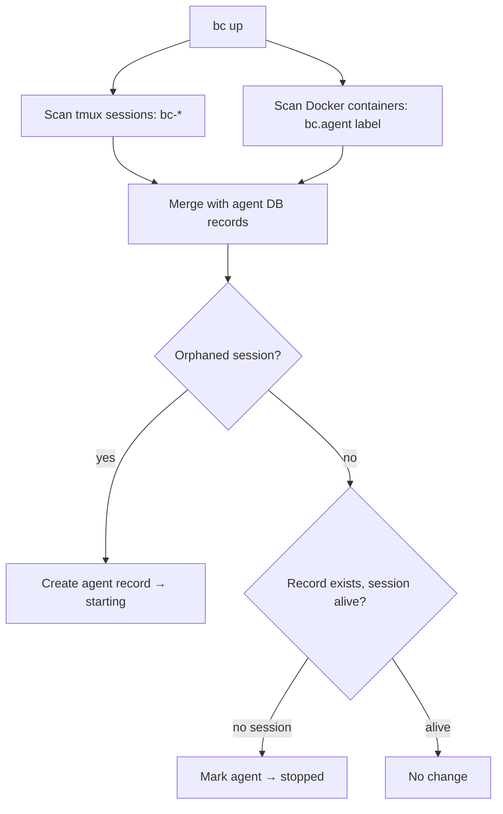

> **Note (2026-04-16):** This proposal is **extended** by
> [`docs/proposals/multi-workspace-and-code-tab.md`](./multi-workspace-and-code-tab.md),
> which introduces multi-workspace support, a `/w/<wsId>/…` URL scheme, a
> shared `Header` component, the new Code tab, an optional dependencies
> manager, and a reorder of the agent detail tabs (see the new section at the
> bottom of this file). Where the two documents disagree, the extension doc wins.

# Proposal: Agents Revamp v2 — Templates, Avatars, and Live Operations

> **Status:** Proposal (v2) &nbsp;|&nbsp; **Author:** zen-zebra &nbsp;|&nbsp; **Date:** 2026-04-13 &nbsp;|&nbsp; **Issue:** [#2979](https://github.com/rpuneet/mycel/issues/2979)

---

## 1. Why v2?

v1 shipped the mechanical layer: bulk select, search, tree view, Info tab merge, keyboard shortcuts, create form. That work is complete on `feat/agents-revamp` (PR #2988).

v2 addresses what v1 deferred: **what it means to be an agent** and how agents are created, configured, observed, and operated.

Four gaps v1 did not solve:

| Gap | v2 Answer |
|-----|-----------|
| Agents have no visual identity | Avatar system: icon variants + accent color + state animations |
| "Create agent" = pick role + provider | Templates: system prompt + MCPs + secrets + plugins + runtime |
| No live operational visibility | Activity tab with hook events + tool icons + task graph |
| Config editing requires CLI | Config tab: edit system prompt, MCPs, secrets in-browser |

**Scope note**: This proposal covers the **backend API + data model + web UI**. The CLI and TUI consume the same API. Web is designed first, then CLI and TUI implementations follow with their own UX adapted to each medium. All three must align on one API.

---

## 2. What Is an Agent?

An agent is an isolated AI collaborator with:

1. **A git worktree** — dedicated filesystem at `.bc/agents/<name>/`, detached HEAD checkout
2. **A template instance** — materialized config: system prompt, MCPs, secrets, plugins
3. **An avatar** — icon variant + accent color, persisted on creation
4. **A runtime** — tmux (local) or Docker (isolated container)
5. **A provider** — Claude, Gemini, Cursor, Codex, or Pi

### 2.1 Templates Replace Roles

**Roles are deleted.** The `.bc/roles/*.md` directory, the `role` field on agent records, and all role-related API endpoints are removed.

Templates are the new creation primitive. A template is a named, reusable configuration bundle:

```text
.bc/templates/
├── feature-dev.json
├── reviewer.json
├── manager.json
└── blank.json
```

Each template file:

```json
{
  "name": "feature-dev",
  "description": "Full-stack feature development agent",
  "system_prompt_file": "feature-dev.md",
  "mcps": ["bc", "github"],
  "secrets": ["GITHUB_TOKEN"],
  "plugins": ["frontend-design"],
  "context_files": ["CLAUDE.md", "docs/ARCHITECTURE.md"],
  "tool_policies": {
    "allowed": ["Bash", "Read", "Write", "Edit", "Glob", "Grep", "Agent"],
    "denied": []
  },
  "max_cost_usd": 50.0,
  "stuck_timeout_min": 5
}
```

System prompt lives in a separate `.md` file at `.bc/templates/<name>.md`. This allows rich markdown editing without JSON escaping.

**Templates are decoupled from provider and runtime.** A template defines *what* the agent knows and can access — not *how* it runs. Provider (claude/gemini/cursor/codex) and runtime (tmux/docker) are chosen at agent creation time, not baked into the template. This means the same "feature-dev" template works with any provider.

Template fields informed by how top coding agents work:

| Field | Purpose | Inspired by |
|-------|---------|------------|
| `system_prompt_file` | Core instructions for the agent | Claude Code CLAUDE.md, Cursor .cursorrules |
| `mcps` | Tool servers the agent connects to | Claude MCP servers, Cursor extensions |
| `secrets` | Env vars injected at runtime | API keys, tokens |
| `plugins` | Skill packages / tool bundles | Claude skills, Cursor plugins |
| `context_files` | Files always loaded into context | Cursor @files, Claude CLAUDE.md includes |
| `tool_policies` | Allowed/denied tool list | Claude --allowedTools, Cursor tool permissions |
| `max_cost_usd` | Budget cap per session | Claude max_turns, cost limits |
| `stuck_timeout_min` | Minutes before stuck detection | Configurable per task type |

**Template API:**

| Method | Path | Purpose |
|--------|------|---------|
| `GET` | `/api/templates` | List all templates |
| `GET` | `/api/templates/{name}` | Get template details + system prompt |
| `POST` | `/api/templates` | Create new template |
| `PUT` | `/api/templates/{name}` | Update template |
| `DELETE` | `/api/templates/{name}` | Delete template |

**CLI equivalents:**

```bash
bc template list
bc template show feature-dev
bc template create --name my-template --from feature-dev
bc template edit my-template        # opens $EDITOR
bc template delete my-template
```

### 2.2 Template vs Agent Instance

```text
Template (reusable)                Agent (running instance)
─────────────────────              ─────────────────────────────
.bc/templates/feature-dev.json →   .bc/agents/curious-otter/
.bc/templates/feature-dev.md       ├── CLAUDE.md  (copied from template, editable)
                                   ├── .mcp.json  (materialized from template MCPs)
                                   ├── secrets.env (resolved from template secrets)
                                   ├── skills/
                                   ├── plugins/
                                   └── worktree/  (git worktree, detached HEAD)
```

The template is a read-only blueprint. The agent instance can diverge (edit system prompt, add MCPs) without affecting the template. The Config tab shows the live instance config and allows editing + restart.

### 2.3 Agent Lifecycle

```mermaid
flowchart LR
    CREATE[create] --> MAT[materialize]
    MAT --> START[start]
    START --> IDLE[idle]
    IDLE --> WORKING[working]
    WORKING --> IDLE
    WORKING --> DONE[done]
    DONE --> IDLE
    IDLE --> STUCK[stuck]
    WORKING --> STUCK
    STUCK --> IDLE
    STUCK --> WORKING
    STUCK --> STOPPED[stopped]
    WORKING --> STOPPED
    IDLE --> STOPPED
    STOPPED --> START
    STOPPED --> DELETED[deleted]
    WORKING --> ERROR[error]
    ERROR --> STOPPED
    IDLE --> WAITING[waiting]
    WAITING --> IDLE
    WAITING --> WORKING

    style WORKING fill:#14532d,stroke:#4ade80
    style IDLE fill:#1e3a5f,stroke:#60a5fa
    style STUCK fill:#78350f,stroke:#fbbf24
    style ERROR fill:#3b0000,stroke:#ef4444
    style WAITING fill:#3b1f78,stroke:#a78bfa
```



| State | Definition | Triggered by |
|-------|-----------|-------------|
| `create` | Agent record created in DB | `POST /api/agents` |
| `materialize` | Template files written to worktree | Automatic after create |
| `start` | tmux session / Docker container launching | Start action |
| `idle` | Running, no tool use for > 30s | Timeout after last tool event |
| `working` | Provider CLI actively using tools | `PreToolUse` / `ToolUse` hook |
| `done` | Task completed, waiting for next prompt | `TaskCompleted` hook |
| `stuck` | No tool use or output for > 5 min | Timeout (configurable per-template) |
| `waiting` | Permission request pending user approval | `PermissionRequest` hook |
| `error` | Exited with non-zero or crashed | Process exit / container crash |
| `stopped` | Session or container exited cleanly | Stop action / process exit |
| `deleted` | Worktree removed | Delete action |

**New: `waiting` state.** When a `PermissionRequest` hook fires, the agent transitions to `waiting`. The web UI shows an approve/deny prompt. This works identically to `stuck` detection — the hook endpoint receives the event and updates state.

### 2.4 Session Sync on Startup

On `bc up`, the server reconciles agent records with runtime state:

1. **Discovery**: Scan tmux sessions matching `bc-*` prefix and Docker containers with `bc.agent` label. For any session/container that exists but has no agent record, create a record in `starting` state.
2. **Reconciliation**: For each agent record, check if its tmux session / Docker container is still running. If the session is gone, mark the agent as `stopped`.
3. **Sync runs periodically** (every 30s) to catch sessions that crash between polls.



**API endpoint:**

| Method | Path | Purpose |
|--------|------|---------|
| `POST` | `/api/agents/sync` | Trigger manual session sync |

### 2.5 No Hierarchy

Agents are flat. No parent/children relationships. No agent can create sub-agents.

**Removed:**
- `parent_id` field from agent records
- `children` field from agent responses
- `SubagentStart` / `SubagentStop` hook event handling (events still logged if received, but no UI or state change)
- `create_agent` MCP tool
- Hierarchy section from all UI views
- AgentPill parent/children navigation

---

## 3. Avatar System

Each agent has a persistent **avatar**: an icon variant and an accent color. "Avatar" replaces the term "personality" throughout code and docs.

### 3.1 Icon Variants

Three variants ship in v2:

| Variant | Description | Inspiration |
|---------|-------------|------------|
| `geometric` | Precise shapes: hexagons, triangles, interlocking polygons | Vercel, Linear |
| `organic` | Fluid blobs and soft curves | Raycast, Notion |
| `monogram` | Bold letter (first char of name) on colored field | GitHub avatars |

### 3.2 Colors

8 accent colors. Default derived from `hash(agentName) % 8`. Override available in create modal.

### 3.3 State Animations

Animations convey state. All durations short. CSS keyframes or Framer Motion on SVG/DOM (no canvas/WebGL). `IntersectionObserver` gates off-screen animations.

| State / Event | Animation | Duration |
|--------------|-----------|----------|
| `idle` | Slow rotation / morph / pulse | 8s loop |
| `working` (ToolUse) | Edge highlight / blob expand / ring flash | 400ms |
| `TaskCreate` | Ring expansion / ripple / letter scale | 600ms |
| `TaskUpdate` | Edge trace / color shift / ring tick | 300ms |
| `PermissionRequest` | Purple pulse + "?" overlay | 1s loop |
| `stuck` | Amber wash + slow wobble | 2s loop |
| `error` | Red shake / jitter 3x | 800ms |
| `stopped` | Desaturate to grayscale, opacity 60% | instant |
| `waiting` | Purple glow + slow pulse | 2s loop |

### 3.4 Avatar Persistence

Stored in agent record as JSON field:

```json
{
  "avatar": {
    "variant": "organic",
    "color": 3
  }
}
```

Written once at creation. Never changes. Returned in `GET /api/agents` and `GET /api/agents/{name}`.

### 3.5 Component Library (`web/src/components/agent-ui/`)

| Component | Props | Purpose |
|-----------|-------|---------|
| `AgentIcon` | `name, avatar, state, event?, size?` | Animated icon. Subscribes to SSE events internally. |
| `AgentStatusBadge` | `state, size?` | Color-coded pill |
| `AgentAvatarPicker` | `value, onChange` | 3x8 grid in create modal |
| `AgentHeroCard` | `agent, event?` | Large icon + name + state. Detail page header. |
| `AgentRow` | `agent, selected, onSelect, onAction` | Table row with icon |

---

## 4. Hook Event Taxonomy (Exhaustive)

### 4.1 All 22 Hook Event Types

| # | Event | Icon | Description | State transition | UI effect |
|---|-------|------|-------------|-----------------|-----------|
| 1 | `SessionStart` | `▶` | Agent session started | → `idle` | Lifecycle badge update |
| 2 | `SessionEnd` | `⏹` | Session ended cleanly | → `stopped` | Lifecycle badge update |
| 3 | `UserPromptSubmit` | `✉` | Prompt sent to agent | — | Icon "breathe in" animation |
| 4 | `PreToolUse` | `⚡` | About to call a tool | → `working` | Icon dim pulse |
| 5 | `PostToolUse` | `✓` | Tool returned successfully | — | Tool icon update in list |
| 6 | `PostToolUseFailure` | `✗` | Tool returned error | — | Red flash on tool icon |
| 7 | `PermissionRequest` | `🔐` | Permission prompt shown | → `waiting` | Purple pulse + approve/deny UI |
| 8 | `Notification` | `🔔` | Agent sent a notification | — | Toast in web UI |
| 9 | `SubagentStart` | `↗` | (legacy) Child agent started | — | Logged only, no UI |
| 10 | `SubagentStop` | `↙` | (legacy) Child agent stopped | — | Logged only, no UI |
| 11 | `Stop` | `⏹` | Stop signal sent | → `stopped` | Lifecycle badge update |
| 12 | `StopFailure` | `⚠` | Stop failed | — | Error toast |
| 13 | `TeammateIdle` | `💤` | Teammate went idle | — | Logged only |
| 14 | `TaskCompleted` | `✅` | Task finished | → `done` | Task graph update |
| 15 | `InstructionsLoaded` | `📋` | CLAUDE.md loaded by provider | — | Logged only |
| 16 | `ConfigChange` | `⚙` | Agent config modified | — | Config tab refresh |
| 17 | `WorktreeCreate` | `🌿` | Git worktree created | — | Logged only |
| 18 | `WorktreeRemove` | `🗑` | Git worktree removed | — | Logged only |
| 19 | `PreCompact` | `⬡` | Context compaction starting | — | Activity log entry |
| 20 | `PostCompact` | `⬡` | Context compaction done | — | Activity log entry |
| 21 | `Elicitation` | `❓` | Agent asking user a question | → `waiting` | Show question in UI |
| 22 | `ElicitationResult` | `💬` | User answered question | → `working` | Resume indicator |

### 4.2 Tool Use Events (Expanded)

The `PreToolUse` and `PostToolUse` events carry a `tool_name` field. These map to icons in the UI:

**Built-in tools:**

| tool_name | Icon | Category |
|-----------|------|----------|
| `Bash` | Terminal icon + first word of command as label | CLI |
| `Read` | File icon | File |
| `Write` | Pencil icon | File |
| `Edit` | Diff icon | File |
| `Glob` | Search icon | File |
| `Grep` | Search icon | File |
| `Agent` | Bot icon | Orchestration |
| `TaskCreate` | Plus-circle icon | Task |
| `TaskUpdate` | Check-circle icon | Task |
| `WebSearch` | Globe icon | Web |
| `WebFetch` | Download icon | Web |

**MCP tools:** Any tool starting with `mcp__` displays the MCP server name (strip `mcp__` prefix, take segment before next `__`) with a plug icon.

**Bash CLI detection:** For `Bash` tool use, extract the first word of the command:
- `git` → git icon
- `npm` / `bun` / `yarn` → package icon
- `docker` → Docker icon
- `make` → gear icon
- `go` → Go gopher icon
- `python` / `python3` → Python icon
- `curl` / `wget` → download icon
- Default → terminal icon

### 4.3 Hook Endpoint Enhancement

Current: `POST /api/agents/{name}/hook` accepts `{ "event": "..." }` only.

New payload:

```json
{
  "event": "PreToolUse",
  "tool_name": "Bash",
  "tool_input": { "command": "go test ./..." },
  "task_id": "task-123",
  "task_title": "Run tests",
  "error": null,
  "metadata": {}
}
```

All fields except `event` are optional. The hook handler:
1. Writes to event store (SQLite `events` table)
2. Pushes to SSE subscribers
3. Runs state transition if applicable (`StateForHookEvent()`)

### 4.4 State Fallback

When hook events are unavailable (agent started outside bc, or provider doesn't support hooks), fall back to runtime state detection:

| Runtime | Detection method | Polling interval |
|---------|-----------------|-----------------|
| tmux | `tmux capture-pane` + pattern matching on output | 5s |
| Docker | `docker stats` + `docker exec tmux capture-pane` | 5s |

Pattern matching checks for provider-specific indicators:
- Claude: `Waiting for input`, `Thinking...`, rate limit messages
- Gemini: `quota` errors
- Cursor: auth errors

---

## 5. List Page

### 5.1 Columns

| Column | Width | Source |
|--------|-------|--------|
| Checkbox (bulk) | 32px | local state |
| Agent icon (animated) | 36px | `AgentIcon` component |
| Agent name | 160px | double-click to inline rename |
| Runtime badge | 72px | `tmux` / `docker` |
| Provider badge | 80px | `claude` / `codex` / `gemini` / `cursor` |
| Current task | flex | hook event stream (priority: active task > last tool > last state) |
| Recent tools | 80px | Last 3 tool icons (LRU), derived from ToolUse events |
| Actions | 96px | icon buttons: Start / Stop / Delete |

**Removed from list:** CPU%, Memory%, Tokens, MCP, Role. These live in the Stats tab and Config tab.

### 5.2 Recent Tools Column

Shows the last 3 distinct tools used by this agent as small icons (16px). Derived from `PostToolUse` events. Updates live via SSE.

Example: `[git] [Read] [Bash]` — showing the agent recently ran git commands, read files, and used bash.

If no tool events exist, shows `—`.

### 5.3 Action Buttons

| Icon | Action | Visible when |
|------|--------|-------------|
| ▶ | Start agent | `stopped` / `error` |
| ⏸ | Stop agent | `idle` / `working` / `stuck` / `waiting` |
| 🗑 | Delete (confirm modal) | always |

### 5.4 Filters

Existing: Search, State. New: Runtime, Provider (dropdowns).

---

## 6. Detail Page

### 6.1 Header

```text
← Agents / curious-otter
[64px animated avatar]  curious-otter         ● working
                        docker · claude       Updated 3s ago
                        [▶ Start]  [⏸ Stop]
```

Breadcrumb navigation. No role badge (roles are deleted). Live activity indicator. Avatar animates based on current state.

### 6.2 Tab Order (4 tabs)

```text
[ Terminal 1 ]  [ Activity 2 ]  [ Config 3 ]  [ Stats 4 ]
```

Terminal is the default tab. Keyboard shortcuts: `1`=Terminal, `2`=Activity, `3`=Config, `4`=Stats.

### 6.3 Keyboard Shortcuts

| Key | Action |
|-----|--------|
| `1` | Terminal tab |
| `2` | Activity tab |
| `3` | Config tab |
| `4` | Stats tab |
| `s` | Toggle start / stop |
| `Esc` | Back to agent list |

---

## 7. Terminal Tab

Full-screen xterm. No bottom input bar. No chrome. Takes up the complete screen of the tab.

### 7.1 Running, Not Attached

```text
┌────────────────────────────────────────────────────────────────────────┐
│                                                                        │
│                    [animated agent icon 48px]                          │
│                       curious-otter is running                        │
│                                                                        │
│                   [ Click to attach terminal ]                        │
│                                                                        │
│                Last activity: Read file · 23s ago                     │
│                                                                        │
└────────────────────────────────────────────────────────────────────────┘
```

Click connects the xterm WebSocket. Overlay disappears. Terminal fills the entire tab area.

### 7.2 Attached

```text
┌────────────────────────────────────────────────────────────────────────┐
│ ● curious-otter — attached                             [Detach ×]     │
├────────────────────────────────────────────────────────────────────────┤
│                                                                        │
│  > Analyzing PR diff...                                                │
│  > Read file: src/server/handler.go                                    │
│  > Bash: golangci-lint run ./...                                       │
│  $                                                                     │
│                                                                        │
└────────────────────────────────────────────────────────────────────────┘
```

### 7.3 Stopped

Shows last captured pane from `GET /api/agents/{name}/last-terminal` with a [Start agent] button.

### 7.4 Waiting (Permission Request)

```text
┌────────────────────────────────────────────────────────────────────────┐
│ 🔐 curious-otter — waiting for permission                             │
├────────────────────────────────────────────────────────────────────────┤
│                                                                        │
│  Agent wants to run:                                                   │
│  Bash: rm -rf /tmp/build-cache                                        │
│                                                                        │
│           [ Approve ]    [ Deny ]                                     │
│                                                                        │
│  (last captured output below)                                         │
│  > Building project...                                                │
│  > Analyzing dependencies...                                          │
│                                                                        │
└────────────────────────────────────────────────────────────────────────┘
```

---

## 8. Activity Tab

Live, filterable event stream of all hook events for this agent.

### 8.1 Layout

```text
┌────────────────────────────────────────────────────────────────────────┐
│ Activity                 [/] Filter...  [Type ▼] [Tool ▼]  [Live ●]  │
├────────────────────────────────────────────────────────────────────────┤
│                                                                        │
│ ACTIVE TASKS                                                           │
│ ┌── PR #428 review ─────────────────────────────────────────────┐    │
│ │  ├── Read files (4 files)                           done ✓    │    │
│ │  ├── Run linter                                     done ✓    │    │
│ │  └── Write review comment                           active ●  │    │
│ └───────────────────────────────────────────────────────────────┘    │
│                                                                        │
│ EVENT STREAM                                                           │
│ 10:45:32  🔧 ToolUse        Bash · golangci-lint run           [↓]  │
│ 10:45:28  ✓  PostToolUse    Bash · exit 0, 3 warnings          [↓]  │
│ 10:45:15  🔧 ToolUse        Read · src/server/handler.go       [↓]  │
│ 10:44:58  ↻  TaskUpdate     PR #428 review · 2/3 complete      [↓]  │
│ 10:44:20  🔧 ToolUse        Read · src/server/routes.go        [↓]  │
│ 10:43:55  ◎  TaskCreate     PR #428 review                     [↓]  │
│ 10:43:40  ✉  PromptSubmit   Review PR #428 and post comments   [↓]  │
│ 10:43:38  ▶  SessionStart   curious-otter                      [↓]  │
│                                                                        │
└────────────────────────────────────────────────────────────────────────┘
```

`[↓]` expands to show raw hook payload. `[Live ●]` toggles auto-scroll.

### 8.2 Task Graph

Built from `TaskCreate` and `TaskUpdate` events. Shows only current session tasks. Historical tasks collapse under "Previous sessions".

### 8.3 Event Stream API

```text
GET /api/agents/{name}/events   (SSE)
```

Each event:

```json
{
  "id": "1744282532001",
  "type": "ToolUse",
  "timestamp": "2026-04-13T10:45:32Z",
  "data": {
    "tool_name": "Bash",
    "tool_input": { "command": "golangci-lint run ./..." }
  }
}
```

On connect: replay last 100 events, then tail. Reconnect via `Last-Event-ID`. Backed by `pkg/events` SQLite store.

---

## 9. Config Tab

The agent's live configuration. Editable. Changes apply on restart (or soft MCP reconnect for Docker agents).

### 9.1 Layout

```text
┌────────────────────────────────────────────────────────────────────────┐
│ Config                                        [Restart to apply]      │
├────────────────────────────────────────────────────────────────────────┤
│                                                                        │
│ ─── SYSTEM PROMPT ─────────────────────────────────────────────────   │
│ (editable textarea — reads/writes CLAUDE.md in agent worktree)        │
│ You are a feature-dev agent. Your role is to implement...             │
│                                                     [Save]  [Reset]  │
│                                                                        │
│ ─── TEMPLATE ──────────────────────────────────────────────────────   │
│ Created from: feature-dev                         [View template]    │
│                                                                        │
│ ─── MCP SERVERS ───────────────────────────────────────────────────   │
│ bc       /_mcp/curious-otter/sse        ● connected     [🗑]         │
│ github   /api/github/mcp              ● connected     [🗑]         │
│                                                                        │
│ Available commands:                                                    │
│   bc: create_agent, send_message, report_status, query_costs          │
│   github: authenticate, create_pr, list_issues                        │
│                                                                        │
│ [+ Add MCP server]                                                    │
│                                                                        │
│ ─── SECRETS ───────────────────────────────────────────────────────   │
│ GITHUB_TOKEN       ••••••••••••                   [Edit]  [🗑]       │
│ ANTHROPIC_API_KEY  ••••••••••••                   [Edit]  [🗑]       │
│ [+ Add secret]                                                        │
│                                                                        │
│ ─── PLUGINS ───────────────────────────────── (docker only) ───────   │
│ frontend-design    v2.1    ● enabled                    [🗑]         │
│ [+ Add plugin]                                                        │
│                                                                        │
│ ─── RUNTIME ───────────────────────────────────────────────────────   │
│ Runtime:   docker                                                     │
│ Provider:  claude                                                     │
│ Image:     bc-agent-claude:latest                                     │
│ CPUs:      2                                                          │
│ Memory:    4096 MB                                                    │
│ Volumes:                                                              │
│   .bc/agents/curious-otter/worktree → /workspace (rw)                │
│   . → /project (ro)                                                  │
│                                                                        │
│ ─── METADATA ──────────────────────────────────────────────────────   │
│ Created    2026-04-04 14:33    Worktree   .bc/agents/curious-otter/  │
│ Started    2026-04-04 14:34    Session    curious-otter              │
│ Raw logs   [View →]                                                   │
│                                                                        │
│ ─── DANGER ZONE ───────────────────────────────────────────────────   │
│ [Archive]  [Clone →]  [Delete]                                        │
│                                                                        │
└────────────────────────────────────────────────────────────────────────┘
```

### 9.2 Runtime-Gated Sections

| Config section | tmux agent | docker agent |
|----------------|-----------|-------------|
| System prompt (CLAUDE.md) | shown, editable | shown, editable |
| MCP servers | shown (bc runs detection via provider CLI) | shown, editable |
| MCP available commands | shown (bc runs `--help` on provider) | shown |
| Secrets (env vars) | shown | shown, editable |
| Plugins | **hidden** | shown, editable |
| Runtime details | shown (read-only) | shown (read-only) |

For **tmux agents**: MCP servers are detected by bc running provider-specific commands (e.g., `claude mcp list`). Add/delete operations are proxied through bc to the provider CLI. The user doesn't need to edit JSON files manually.

For **Docker agents**: MCP config is written to `.mcp.json` in the worktree. Future: agent-sdk manages this natively.

### 9.3 Config API

| Method | Path | Purpose |
|--------|------|---------|
| `GET` | `/api/agents/{name}/config` | Get full config (system prompt, MCPs, secrets, runtime) |
| `PATCH` | `/api/agents/{name}/config` | Update config fields |
| `GET` | `/api/agents/{name}/mcps` | List MCP servers + available commands |
| `POST` | `/api/agents/{name}/mcps` | Add MCP server |
| `DELETE` | `/api/agents/{name}/mcps/{mcp}` | Remove MCP server |

---

## 10. Stats Tab

Dedicated tab with graphs and timeframes. Composes the existing `StatsTabComponent` with enhancements.

### 10.1 Layout

```text
┌────────────────────────────────────────────────────────────────────────┐
│ Stats                                    [1h] [6h] [12h] [24h] [7d]  │
├────────────────────────────────────────────────────────────────────────┤
│                                                                        │
│ ┌─────────┐ ┌─────────┐ ┌─────────┐ ┌─────────┐                     │
│ │ CPU     │ │ MEMORY  │ │ TOKENS  │ │ COST    │                     │
│ │ 12.3%   │ │ 340 MB  │ │ 925,480 │ │ $1,469  │                     │
│ │ max 45% │ │ max 1GB │ │ In/Out  │ │         │                     │
│ └─────────┘ └─────────┘ └─────────┘ └─────────┘                     │
│                                                                        │
│ ┌──────────────────────────────┐ ┌──────────────────────────────┐    │
│ │ CPU (%)                      │ │ MEMORY (MB)                  │    │
│ │ ▁▂▃▅▆▇█▇▅▃▂▁▂▃▅▆▇          │ │ ▁▁▂▃▃▄▅▅▆▆▇▇█▇▆▅            │    │
│ │                              │ │                              │    │
│ └──────────────────────────────┘ └──────────────────────────────┘    │
│                                                                        │
│ ┌──────────────────────────────┐ ┌──────────────────────────────┐    │
│ │ TOKEN USAGE                  │ │ COST ($)                     │    │
│ │ ▁▂▃▅▆▇█▇▅▃▂▁                │ │ ▁▁▂▂▃▃▄▅▆▇                  │    │
│ │                              │ │                              │    │
│ └──────────────────────────────┘ └──────────────────────────────┘    │
│                                                                        │
│ Agent is not running. Stats show last known values.                   │
│                                                                        │
└────────────────────────────────────────────────────────────────────────┘
```

Stats are timeseries data from `pkg/stats`. Decoupled from config — they are observational, not configurable.

---

## 11. Create Agent Modal

**A simple modal, not a wizard.** Opens with smart defaults pre-filled. User changes what they want and hits Create.

### 11.1 Layout

```text
┌────────────────────────────────── Create Agent ──────────────────────┐
│                                                                       │
│  Name    ┌─────────────────────────┐  [↻]                           │
│          │ curious-lynx            │                                 │
│          └─────────────────────────┘                                 │
│  (auto-generated, editable. [↻] regenerates random name)            │
│                                                                       │
│  Avatar  [●] [●] [●] [●] [●] [●] [●] [●]   Variant: [geometric ▼] │
│  (auto-selected, click to change)                                    │
│                                                                       │
│  Template    [feature-dev    ▼]                                      │
│  Provider    [claude         ▼]                                      │
│  Runtime     [docker         ▼]                                      │
│                                                                       │
│  Initial task (optional)                                             │
│  ┌──────────────────────────────────────────────────────────────┐   │
│  │                                                              │   │
│  └──────────────────────────────────────────────────────────────┘   │
│                                                                       │
│                              [Cancel]    [Create agent →]            │
│                                                                       │
└───────────────────────────────────────────────────────────────────────┘
```

### 11.2 Defaults

| Field | Default | Behavior |
|-------|---------|----------|
| Name | Random `verb-animal` | Pre-filled. [↻] button regenerates. Editable. |
| Avatar color | `hash(name) % 8` | Auto-updates when name changes |
| Avatar variant | Random | Pre-selected, click to change |
| Template | First template in list | Dropdown |
| Provider | Template's default provider | Dropdown, can override |
| Runtime | Template's default runtime | Dropdown, can override |
| Initial task | Empty | Optional textarea |

### 11.3 Name Generation

Client-side only. ~200 verbs x ~200 animals = ~40,000 combinations. No server endpoint needed.

```text
1. Load existing agent names from React state
2. Pick random verb + animal, join with "-"
3. If collision, resample (max 50 retries)
4. If exhausted, append 2-digit suffix
5. Pre-fill name field
```

When the name field is empty or has a generated name, the [↻] button is visible. If the user types a custom name, [↻] hides.

### 11.4 On Create

1. `POST /api/agents` with `{ name, template, provider, runtime, avatar, task? }`
2. Server materializes worktree from template
3. If `task` provided: agent starts immediately with that task
4. If no `task`: agent created in `stopped` state
5. Redirect to agent detail page (Terminal tab)

### 11.5 Fork Flow

Fork = create modal pre-filled with source agent's config. Available from the Config tab's [Clone →] button.

`POST /api/agents/{source}/fork` copies CLAUDE.md, .mcp.json, secrets, skills, plugins from source agent's worktree into a new agent. Forked agent starts `stopped`.

---

## 12. API Summary

### 12.1 New Endpoints

| Method | Path | Purpose |
|--------|------|---------|
| `GET` | `/api/templates` | List templates |
| `GET` | `/api/templates/{name}` | Get template + system prompt |
| `POST` | `/api/templates` | Create template |
| `PUT` | `/api/templates/{name}` | Update template |
| `DELETE` | `/api/templates/{name}` | Delete template |
| `GET` | `/api/agents/{name}/events` | SSE hook event stream |
| `GET` | `/api/agents/{name}/config` | Get agent config |
| `PATCH` | `/api/agents/{name}/config` | Update agent config |
| `GET` | `/api/agents/{name}/mcps` | List MCP servers + commands |
| `POST` | `/api/agents/{name}/mcps` | Add MCP server |
| `DELETE` | `/api/agents/{name}/mcps/{mcp}` | Remove MCP server |
| `GET` | `/api/agents/{name}/last-terminal` | Last captured terminal pane |
| `POST` | `/api/agents/{name}/fork` | Fork agent config into new agent |
| `POST` | `/api/agents/sync` | Trigger runtime session sync |

### 12.2 Modified Endpoints

| Method | Path | Change |
|--------|------|--------|
| `POST` | `/api/agents` | Add `template`, `avatar` fields. Remove `role`. |
| `GET` | `/api/agents` | Add `avatar`, `recent_tools` fields. Remove `role`, `parent_id`, `children`. |
| `GET` | `/api/agents/{name}` | Same field changes as list. |
| `POST` | `/api/agents/{name}/hook` | Accept rich payload: `tool_name`, `tool_input`, `task_id`, etc. |

### 12.3 Removed Endpoints

| Method | Path | Reason |
|--------|------|--------|
| `GET` | `/api/roles` | Roles deleted, replaced by templates |
| `GET` | `/api/roles/{name}` | Roles deleted |

### 12.4 CLI Commands

New:
```bash
bc template list|show|create|edit|delete
bc agent create --template feature-dev --provider claude --runtime docker
bc agent sync                          # manual runtime sync
```

Modified:
```bash
bc agent create   # --role removed, --template added
bc agent list     # role column removed, template column added
```

Removed:
```bash
bc role list|show|create|edit|delete   # entire role command group
```

---

## 13. Frontend Component Map

```text
web/src/
├── views/
│   ├── Agents.tsx                     (list page)
│   ├── AgentDetail.tsx                (detail: 4 tabs)
│   └── Templates.tsx                  (new: template management page)
├── components/
│   ├── agent-ui/
│   │   ├── index.ts
│   │   ├── AgentIcon.tsx              (animated, 3 variants)
│   │   ├── AgentStatusBadge.tsx
│   │   ├── AgentAvatarPicker.tsx      (create modal)
│   │   ├── AgentHeroCard.tsx          (detail header)
│   │   ├── AgentRow.tsx               (list table row)
│   │   ├── ToolIcon.tsx               (maps tool_name → icon)
│   │   ├── RecentTools.tsx            (LRU tool icon strip)
│   │   ├── hooks/useAgentEvents.ts    (SSE subscription)
│   │   ├── animations/geometric.css
│   │   ├── animations/organic.css
│   │   ├── animations/monogram.css
│   │   └── utils/colorFromName.ts
│   ├── CreateAgentModal.tsx           (simple modal, not wizard)
│   ├── AgentTerminal.tsx              (fullscreen xterm, overlay states)
│   ├── AgentActivity.tsx              (event stream + task graph)
│   ├── AgentConfig.tsx                (runtime-gated config editor)
│   └── StatsTab.tsx                   (existing, promoted to own tab)
```

---

## 14. Build Sequence

Each phase is a separate PR. Phases in the same row can parallelize.

| Phase | Scope | Depends on | Size |
|-------|-------|-----------|------|
| 1a | Templates: data model, API (`/api/templates`), CLI, migration from roles | — | Medium |
| 1b | Avatar system: `AgentIcon` (3 variants + CSS animations), `AgentStatusBadge`, `AgentAvatarPicker` | — | Medium |
| 1c | Hook endpoint enhancement: rich payload, all 22 event types, SSE `/events` | — | Medium |
| 2a | Session sync: runtime discovery + reconciliation on `bc up` + periodic | 1a | Small |
| 2b | List page: new columns (avatar, runtime, provider, recent tools, actions) | 1b, 1c | Medium |
| 3a | Terminal tab: fullscreen xterm, 4 overlay states (running/attached/stopped/waiting) | 1c | Medium |
| 3b | Activity tab: event stream, task graph, filters, tool icons | 1c | Medium |
| 4a | Config tab: system prompt editor, MCP management, secrets, runtime-gated | 1a, 1c | Medium |
| 4b | Stats tab: promote to own tab, timeframe selector, graphs | — | Small |
| 5 | Create modal + name generator + fork flow | 1a, 1b | Medium |
| 6 | Detail header: `AgentHeroCard`, breadcrumbs, 4-tab layout, keyboard shortcuts | 1b, 3a, 3b, 4a, 4b | Small |
| 7 | Permission request UI: waiting state, approve/deny in Terminal tab | 1c, 3a | Small |
| 8 | MCP command detection: `--help` / provider CLI integration for tmux agents | 4a | Small |
| 9 | CLI + TUI alignment: port web UI patterns to CLI commands and TUI views | all | Medium |
| 10 | Polish: IntersectionObserver animation gate, tooltips, responsive, a11y | all | Small |

**Total**: ~13 PRs. Phases 1a, 1b, 1c are independent and unlock all downstream work.

---

## 15. Migration

### 15.1 Roles → Templates Migration

On first `bc up` after upgrade:

1. Scan `.bc/roles/*.md` for existing role files
2. For each role, create a template at `.bc/templates/<name>.json` with:
   - `system_prompt_file` pointing to a copy of the role markdown
   - Default provider/runtime from workspace settings
   - Empty MCPs, secrets, plugins
3. Update all agent records: `role` field → `template` field
4. Log migration summary
5. Do NOT delete `.bc/roles/` — leave for manual cleanup

### 15.2 v1 → v2 Feature Migration

| v1 feature | v2 status |
|-----------|----------|
| Bulk select + action bar | Keep |
| Search + filters | Keep + add Runtime / Provider filters |
| Tree view / Flat toggle | **Remove** (no hierarchy) |
| Info tab (merged) | Split into Config + Stats tabs |
| Logs tab | **Removed** — replaced by Activity tab; raw logs link in Config |
| Terminal tab | Redesign: fullscreen, overlay states |
| Bottom message input bar | **Removed** — use bulk message or attach terminal |
| Keyboard shortcuts | Keep, renumber for 4 tabs |
| Create form | Replaced by simple modal |
| Hierarchy (parent/children) | **Removed** |

---

## 16. Non-Goals

Out of scope for v2:

- **Cost enforcement / budgets**: Stats surfaced; shutdown on overage is a separate proposal.
- **Multi-workspace agent view**: Agents page is workspace-scoped.
- **Agent marketplace**: Templates are local. Publishing/sharing is not in scope.
- **Canvas or WebGL**: All animations are CSS/Framer Motion on SVG/DOM.
- **Plugin / skill marketplace**: Adding plugins is manual. Browsable marketplace not in scope.
- **Real-time collaborative editing**: Two users editing CLAUDE.md simultaneously is last-write-wins.
- **Replay / time-travel debugging**: Activity tab is append-only.
- **Agent-to-agent messaging from UI**: Agents don't create sub-agents. Inter-agent communication uses channels.

---

## Appendix A — v1 vs v2 Comparison

| Dimension | v1 (shipped) | v2 (this proposal) |
|-----------|-------------|-------------------|
| Creation primitive | Roles (`.bc/roles/*.md`) | Templates (system prompt + MCPs + secrets + plugins) |
| What agents ARE | Named processes with a role | Named entities: worktree + template instance + avatar |
| Visual identity | None | Avatar: 3 variants, 8 colors, state animations |
| Detail tabs | Logs / Terminal / Info | Terminal / Activity / Config / Stats |
| Terminal tab | xterm + input bar | Fullscreen xterm, 4 overlay states |
| Activity | Section in Info tab | Dedicated tab with task graph + 22 event types |
| Config editing | Not supported in UI | Runtime-gated config editor (system prompt, MCPs, secrets) |
| Stats | Section in Info tab | Dedicated tab with graphs + timeframes |
| Create flow | Single form with role picker | Simple modal with template + avatar + smart defaults |
| Hierarchy | Parent / children | **Removed** — flat agent model |
| Hook events | Not surfaced in UI | Live event stream, tool icons, task graph, avatar animations |
| Permission requests | Suppressed | `waiting` state + approve/deny UI |
| Session sync | Manual | Auto-discovery + reconciliation on startup |
| Fork agent | Not supported | Fork flow via create modal |
| MCP management | Not in UI | Config tab: list, add, delete, show commands |
| Tool visibility | None | Recent tools column + Bash CLI icon detection |
| New API endpoints | 0 | 15 endpoints |
| Breaking changes | None | Roles removed (auto-migrated to templates) |

---

## Addendum (2026-04-16) — Agent detail tab reorder + Code tab

The extension proposal
[`multi-workspace-and-code-tab.md`](./multi-workspace-and-code-tab.md)
supersedes the agent detail tab layout defined earlier in this document. The
authoritative order is now:

| # | Tab | URL suffix | Notes |
|---|-----|-----------|-------|
| 1 | **Attach** | `/w/:wsId/agents/:name` (default) or `/attach` | tmux terminal, **new default tab** |
| 2 | **Live** | `/live` | live events for this agent |
| 3 | **Config** | `/config` | system prompt, MCPs, secrets |
| 4 | **Metrics** | `/metrics` | graphs + timeframes |
| 5 | **Code** | `/code` | **new** — agent's worktree in Monaco diff view vs main |

### Changes from the earlier version of this proposal

- **Default tab is now Attach.** The earlier revision opened `Live` by default.
  Rationale: the most common operator action is to look at or interact with
  the tmux session; `Live` is read-only and can be selected explicitly.
- **Code is added as tab #5.** It reuses the shared Code tab components
  defined in the extension proposal (`FileTree`, `CodeViewer`,
  `MonacoDiffEditor`, `WorktreeDropdown`) and defaults to the agent's worktree
  rendered in diff mode against the main worktree's `HEAD`.
- **All agent routes are namespaced** under `/w/:wsId/agents/:name/*`. Legacy
  `/agents/:name/*` routes 301-redirect to the active workspace for one major
  version via the legacy-scope middleware.
- **MCP SSE endpoint** moves from `/_mcp/<agent>/sse` to
  `/_mcp/<wsID>/<agent>/sse`, with a compat redirect.

See the extension proposal §8 ("Agent Page Tab Reorder") and §6 ("Code Tab")
for the full component hierarchy, API shapes, and verification checklist.
